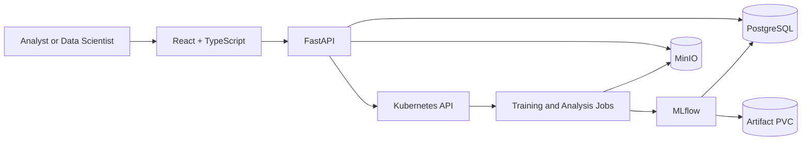

# Sceptre

<p align="center">
  
</p>

<p align="center">
  <strong>From tabular data to a governed model endpoint—without building an MLOps department.</strong>
</p>

<p align="center">
  Train, compare, validate, explain, register, and deploy models from one
  Kubernetes-native workspace.
</p>

<p align="center">
  <a href="#quick-start-on-local-kubernetes"><strong>Run Sceptre locally</strong></a>
  ·
  <a href="#platform-workflow">See the workflow</a>
  ·
  <a href="docs/production-readiness/README.md">Plan for production</a>
</p>

<p align="center">
  <a href="https://github.com/CharlesMaponya/sceptreAI/actions/workflows/ci.yml">
    
  </a>
  <a href="https://www.python.org/downloads/">
    
  </a>
  <a href="#quality-engineering">
    
  </a>
  <a href="https://kubernetes.io/">
    
  </a>
</p>

## Overview

Most AutoML products finish at a leaderboard. That is where the difficult part
usually begins: proving the model on new data, explaining its decisions,
controlling compute, preserving lineage, promoting the right version, and
serving it safely.

Sceptre closes that gap. It gives small and growing teams one governed path from
an uploaded table to a reviewable, deployable model. Dataset management,
full-dataset profiling, resource-aware training, experiment tracking, external
validation, SHAP explainability, model promotion, drift analysis, and Kubernetes
serving all live in one project-isolated workspace.

The result is less platform assembly, fewer hand-offs, and a much clearer answer
to the question every serious ML project eventually faces: **why should we trust
this model, and can we operate it?**

Sceptre runs on infrastructure you control. Compute-heavy work is isolated in
disposable Kubernetes Jobs, while PostgreSQL, MinIO, and MLflow retain the
operational record. It is designed for shared environments where auditability,
resource fairness, and reproducibility matter as much as raw model performance.

> **Current maturity:** The working platform and provider-neutral Helm chart are
> ready for local development, evaluation, and compatibility testing. The current
> release is not production certified; shared or production environments require
> the controls and qualification evidence documented below.

The environment boundary, current blockers, promotion contract, and production
acceptance gates are documented in the
[Local Development and Production Readiness Guide](docs/production-readiness/README.md).
The implemented local-cluster boundary is documented in the
[Kubernetes Portability Contract](docs/architecture/kubernetes-portability.md).

## Why Teams Choose Sceptre

| What teams usually piece together | What Sceptre provides |
| --- | --- |
| Upload scripts, notebooks, and shared folders | Project-scoped datasets, immutable versions, hashes, access roles, and durable object storage |
| Manual profiling and preparation guesses | Full-dataset statistics, quality flags, temporal inference, relationships, and preparation recommendations |
| One opaque “best model” score | Progressive leaderboards with task-specific metrics, diagnostics, parameters, and experiment history |
| Cluster requests based on intuition | Preflight CPU, memory, and duration estimates with admission limits and adaptive deadlines |
| Validation and explainability as follow-up work | External validation and on-demand SHAP for current or historical candidates |
| Model files passed between people | A project registry with staged promotion, explicit fallback, drift checks, and artifact protection |
| A bespoke serving service for every model | Generated model packaging and Kubernetes deployments with online and offline prediction APIs |

### The business case

- **Ship sooner:** move from raw data to ranked, validated candidates in one
  workflow instead of integrating separate tools first.
- **Make defensible model choices:** evaluate more than a headline score with
  diagnostics, holdout results, external validation, and feature contributions.
- **Protect shared infrastructure:** estimate demand before launch, cap each Job,
  limit concurrency, and let higher-priority business workloads win.
- **Keep evidence attached:** preserve dataset versions, parameters, metrics,
  artifacts, model lineage, and operational status by project.
- **Turn experiments into an operating process:** promote, deploy, monitor, stop,
  and clean up models through explicit governed actions.

### Built for

- Small ML and data teams that need production discipline without a dedicated
  platform group.
- Organizations running Kubernetes that want model workloads to coexist fairly
  with business services.
- Consultancies and internal analytics teams that need isolated, reviewable
  project workspaces.
- Regulated or approval-driven environments that value traceability and human
  review over one-click automation.

## Product Capabilities

| Stage | What Sceptre delivers |
| --- | --- |
| Secure the workspace | Registration, 24-hour access sessions, refresh-token rotation, project RBAC, and share links |
| Bring the data | CSV, Parquet, Excel, JSON, and JSONL ingestion; immutable versions; content hashes; MinIO persistence |
| Understand it | Full-dataset statistics, five-number summaries, distributions, missingness, quality flags, temporal inference, relationships, and Dask fallback |
| Frame the problem | Classification, regression, clustering, and time-series inference with target reprofiling and reusable feature statistics |
| Train efficiently | Up to 20 models per run, dynamic scikit-learn discovery, Bayesian tuning, adaptive resource requests, and isolated Kubernetes Jobs |
| Choose with evidence | Progressive results, task-specific metrics, diagnostics, ranking, and additional candidates without retraining completed models |
| Reproduce the work | MLflow parent and candidate runs backed by PostgreSQL, with candidate models mirrored to MinIO |
| Challenge the model | External dataset validation with persisted metrics and diagnostic artifacts |
| Explain the outcome | On-demand SHAP, cached historical explanations, legacy model reconstruction, and support for non-predictive clustering estimators |
| Operate the winner | Project registry, staged promotion, explicit fallback, Evidently drift Jobs, generated model Dockerfiles, Kubernetes inference deployments, health reporting, and guarded cleanup |

## Supported Machine-Learning Tasks

| Task | Ranking and review metrics |
| --- | --- |
| Classification | Balanced accuracy, accuracy, precision, recall, F1, ROC-AUC, average precision, log loss, Brier score, MCC, Cohen's kappa, specificity, and Gini |
| Regression | RMSE, MAE, MAPE, median absolute error, explained variance, and R-squared |
| Time series | Chronological holdout plus regression metrics and time-aware error diagnostics |
| Clustering | Silhouette, Davies-Bouldin, and Calinski-Harabasz; optional ARI, NMI, AMI, Fowlkes-Mallows, and homogeneity |

The estimator catalog is discovered from scikit-learn using the task-appropriate
`ClassifierMixin`, `RegressorMixin`, or `ClusterMixin`. XGBoost, LightGBM, and
CatBoost candidates are included when their optional dependencies are installed.

## Platform Workflow

1. Create a project and assign access.
2. Upload a dataset; Sceptre creates an immutable version in MinIO.
3. Profile the complete dataset and select or revise the target.
4. Review inferred types, distributions, quality findings, and preparation steps.
5. Select up to 20 compatible models and estimate cluster resources.
6. Launch an isolated Kubernetes training job.
7. Review the progressive leaderboard and MLflow experiment.
8. Add individual models without rerunning completed candidates.
9. Run external validation and SHAP analysis for current or historical models.
10. Register approved candidates, select a fallback, run drift checks, and
    deploy or stop models from the Operations workspace.

## Architecture



| Component | Responsibility |
| --- | --- |
| React + TypeScript | Authenticated, responsive workflows and progressive result rendering |
| FastAPI | Business rules, authorization, metadata APIs, and Kubernetes admission |
| PostgreSQL | Users, RBAC, projects, datasets, runs, metrics, and MLflow metadata |
| MinIO | Dataset versions, profiles, diagnostics, SHAP output, and durable model mirrors |
| MLflow | Experiment, candidate, metric, parameter, and model tracking |
| Kubernetes Jobs | Isolated training, validation, and explainability execution |
| Inference runtime | Generic FastAPI prediction service deployed from registered model artifacts |

Project UUIDs are the tenant isolation boundary. Every dataset version, run,
metric, artifact, and registry record carries a `project_id`, and backend queries
enforce project access before returning data.

## Resource Governance

Sceptre is built for shared clusters:

- PostgreSQL advisory locks serialize admission decisions.
- The default global limit is two active compute Jobs.
- Each project may hold one active training slot.
- Helm-configured CPU and memory requests/limits describe each training Job;
  Kubernetes scheduling and namespace quotas make the final admission decision.
- Jobs are not pinned to node names. Optional selectors or scheduling policy can
  be added by cluster owners without changing application behavior.
- NVIDIA and Intel device-plugin resources are detected explicitly; supported
  estimators use the matching accelerator and retry on CPU when GPU execution fails.
- NVIDIA Jobs run on the RAPIDS 26.06 CUDA 12 image and enable `cuml.accel`
  before sklearn is imported. RAPIDS-supported sklearn estimators use cuML;
  unsupported operations retain the CPU fallback.
- PriorityClass support is optional and omitted by default.
- Stale database state is reconciled against Kubernetes before admission.
- Planned duration drives cost estimates; the safety deadline ranges from six to
  24 hours and is displayed separately.
- Completed Kubernetes Jobs are removed automatically.

Increasing `MAX_CONCURRENT_JOBS` permits more application-level parallelism;
Kubernetes ResourceQuota and the scheduler remain the final resource guardrails.

## Quick Start on Local Kubernetes

This section is written for a data analyst who has not operated Kubernetes
before. Follow either the Windows path or the Linux path from top to bottom. You
do **not** need to install Python, Node.js, PostgreSQL, MinIO, or MLflow on your
computer. Kubernetes pulls the published Sceptre images and one Helm command
installs the complete application.

### What you are installing

The few infrastructure words used below mean:

| Term | Plain-language meaning |
| --- | --- |
| Docker image | A packaged application component |
| Kubernetes cluster | The local service that runs and restarts those components |
| `kubectl` | The command used to inspect the cluster |
| Helm | The installer that creates the complete Sceptre application |
| Pod | One running application component |
| PVC | Local disk space retained for application data |

The Helm release creates PostgreSQL, MinIO, MLflow, the API, the React UI,
namespace-scoped permissions, training configuration, and persistent volumes.
It also creates the `automl` and `mlflow` databases, applies every Alembic
migration, creates all 13 application tables, and prevents the API from starting
against an incomplete schema.

### Choose a Kubernetes version

`infra/helm/sceptre/Chart.yaml` accepts Kubernetes 1.27 or newer for API
compatibility. That does not mean an end-of-life version should be installed.
Kubernetes maintains only its three newest minor releases.

As of **13 July 2026**, the supported upstream minors are 1.34, 1.35, and 1.36.
For a new local installation:

- choose the newest stable patch offered for 1.35 or 1.36;
- do not choose an alpha, beta, release-candidate, or nightly build;
- keep `kubectl` within one minor version of the cluster;
- check the [official Kubernetes release table](https://kubernetes.io/releases/)
  if this guide is more than a few months old.

The Windows beginner path lets Docker Desktop select a supported Kubernetes
patch. The Linux path below pins K3s/Kubernetes 1.35.6 so every command is
repeatable; update the kubectl and K3s version pins together when upgrading.

Choose the local Kubernetes distribution separately from its version:

| Your situation | Recommended local cluster | Why |
| --- | --- | --- |
| Windows analyst | Docker Desktop Kubernetes with one kubeadm node | GUI-managed Docker, Kubernetes, networking, and storage |
| Linux analyst | k3d with one K3s server and one worker | Lightweight, version-pinned, and includes local storage |
| An existing local cluster | Keep it if it is supported and has a default StorageClass | The Helm chart is provider-neutral; use its matching thin profile |

Do not install `kubeadm` or K3s manually for the two beginner paths. Docker
Desktop and k3d create and manage them for you.

### Computer and network requirements

The guide targets an x86-64/AMD64 laptop or workstation. Start with CPU training;
GPU setup adds host drivers and a Kubernetes device plugin and is deliberately
left out of the first installation.

| Resource | Practical local recommendation |
| --- | --- |
| CPU | 6 or more logical cores; 4 is the practical minimum |
| Memory | 16 GiB host RAM, with 10–12 GiB available to the cluster |
| Disk | At least 50 GiB free; defaults reserve 20 GiB of PVCs plus image and training-cache space |
| Network | Internet access to Docker Hub and upstream container registries during installation |

The first installation downloads several large machine-learning images and can
take a while. Closing memory-heavy programs before installation and training helps.

### Windows 10 or 11: Docker Desktop path

Use current Windows with WSL 2 and hardware virtualization enabled in BIOS/UEFI.
This guide uses ordinary PowerShell; commands marked **Administrator** require an
elevated PowerShell window.

#### Windows 1: Install WSL, Git, Docker Desktop, and Helm

In **Administrator PowerShell**, install or update WSL and then restart Windows
if requested:

```powershell
wsl --install
wsl --update
wsl --version
```

In PowerShell, install Git and Helm:

```powershell
winget install --exact --id Git.Git
winget install --exact --id Helm.Helm
```

Install the current
[Docker Desktop for Windows](https://docs.docker.com/desktop/setup/install/windows-install/),
select the WSL 2 backend, and start Docker Desktop. Use Linux containers; the
Kubernetes view is not available in Windows-container mode. If Docker Desktop
shows a resource allocation control, allow approximately 6 CPUs, 10–12 GiB RAM,
and at least 50 GiB disk.

Open Docker Desktop and make these selections:

1. In **Settings → General**, use the WSL 2 engine and keep the containerd image
   store enabled.
2. Open **Kubernetes → Create cluster**.
3. Choose the single-node **kubeadm** provisioner. It is the simplest option for
   this published-image setup, and Docker Desktop manages its Kubernetes patch.
4. Create the cluster and wait until Docker Desktop reports it as running.

The newer `kind` provisioner is also supported, but it uses a separate
containerd-based image path. Use it only when you specifically need its version
selector or multiple nodes; select the chart's `values-kind.yaml` profile in
that case.

Close and reopen PowerShell after installing command-line tools, then verify the
host and cluster:

```powershell
docker version
docker info --format '{{.OSType}}'
kubectl config use-context docker-desktop
kubectl get nodes
kubectl version
kubectl get storageclass
helm version
```

Continue only when the node is `Ready`, Docker reports `linux`, and one
StorageClass is marked as the default. If Kubernetes is older than the supported
range described above, update Docker Desktop and reset/recreate its local
cluster before installing Sceptre.

#### Windows 2: Download Sceptre

Choose a folder with plenty of free disk space:

```powershell
git clone https://github.com/CharlesMaponya/sceptreAI.git
Set-Location .\sceptreAI
```

Sceptre's versioned `linux/amd64` images are public in
`maponyacharles/sceptreai` on Docker Hub and are pulled automatically by Docker
Desktop's Linux-container backend. The same immutable images are used on x86-64
Linux and Windows hosts. Run every remaining command from the repository
root—the directory containing `README.md`.

#### Windows 3: Generate local-only secrets

The following creates a small Helm values file with random local credentials.
Its `.env.*` name is ignored by Git. Keep the same file for later upgrades; do
not share or commit it.

```powershell
function New-SceptreSecret {
  ([guid]::NewGuid().ToString('N') + [guid]::NewGuid().ToString('N'))
}

$JwtSecret = New-SceptreSecret
$DatabasePassword = New-SceptreSecret
$MinioPassword = New-SceptreSecret

@"
auth:
  jwtSecret: "$JwtSecret"
postgresql:
  auth:
    password: "$DatabasePassword"
minio:
  auth:
    rootPassword: "$MinioPassword"
"@ | Set-Content -Encoding utf8 .\.env.sceptre-local.yaml
```

#### Windows 4: Install the entire application

```powershell
helm upgrade --install sceptre .\infra\helm\sceptre `
  --namespace sceptre `
  --create-namespace `
  --values .\infra\helm\sceptre\values-local.yaml `
  --values .\.env.sceptre-local.yaml `
  --wait --wait-for-jobs --timeout 30m

helm status sceptre --namespace sceptre
kubectl --namespace sceptre get pods,jobs,pvc
helm test sceptre --namespace sceptre
```

All long-running pods should become `Running`, migration/bootstrap Jobs should
be `Complete`, and the PostgreSQL, MinIO, and MLflow PVCs should be `Bound`.

#### Windows 5: Open Sceptre

Run this command and leave its PowerShell window open:

```powershell
kubectl --namespace sceptre port-forward service/sceptre-ui 8080:80
```

Open [http://127.0.0.1:8080](http://127.0.0.1:8080). Press `Ctrl+C` when you want
to stop the port-forward; this does not delete or stop Sceptre.

### Linux: k3d/K3s path

This path is intended for Ubuntu, Debian, Fedora, Rocky/AlmaLinux, Arch, and
similar systemd-based distributions. It runs K3s inside Docker through k3d and
includes a default local StorageClass. Commands use Bash.

#### Linux 1: Install basic packages and Docker

On Ubuntu or Debian:

```bash
sudo apt-get update
sudo apt-get install --yes ca-certificates curl git openssl
```

On Fedora, Rocky Linux, or AlmaLinux:

```bash
sudo dnf install --assumeyes ca-certificates curl git openssl
```

For those distributions, the official Docker convenience installer is suitable
for this local development workstation. Managed or production machines should
instead follow the matching
[Docker Engine repository instructions](https://docs.docker.com/engine/install/).

```bash
curl --fail --silent --show-error --location \
  https://get.docker.com --output /tmp/get-docker.sh
sudo sh /tmp/get-docker.sh
rm /tmp/get-docker.sh
sudo systemctl enable --now docker
sudo usermod --append --groups docker "$USER"
```

On Arch Linux or Manjaro, use distribution packages instead:

```bash
sudo pacman -Syu --needed ca-certificates curl git openssl docker docker-buildx
sudo systemctl enable --now docker
sudo usermod --append --groups docker "$USER"
```

Log out of Linux and log back in after adding yourself to the `docker` group.
Membership grants administrator-equivalent access to Docker, so only add trusted
users. Then verify:

```bash
docker version
docker run --rm hello-world
```

#### Linux 2: Install kubectl, k3d, and Helm

Install the Kubernetes 1.35.6 client for an AMD64 machine and verify its
checksum:

```bash
KUBECTL_VERSION=v1.35.6
curl --fail --location --remote-name \
  "https://dl.k8s.io/release/${KUBECTL_VERSION}/bin/linux/amd64/kubectl"
curl --fail --location --remote-name \
  "https://dl.k8s.io/release/${KUBECTL_VERSION}/bin/linux/amd64/kubectl.sha256"
echo "$(cat kubectl.sha256)  kubectl" | sha256sum --check
sudo install --owner root --group root --mode 0755 kubectl /usr/local/bin/kubectl
rm kubectl kubectl.sha256
```

Install current k3d and Helm 4 using their official installers:

```bash
curl --silent --show-error --location \
  https://raw.githubusercontent.com/k3d-io/k3d/main/install.sh \
  --output /tmp/install-k3d.sh
bash /tmp/install-k3d.sh
rm /tmp/install-k3d.sh

curl --fail --silent --show-error --location \
  https://raw.githubusercontent.com/helm/helm/main/scripts/get-helm-4 \
  --output /tmp/get-helm.sh
chmod 700 /tmp/get-helm.sh
/tmp/get-helm.sh
rm /tmp/get-helm.sh

kubectl version --client
k3d version
helm version
```

#### Linux 3: Create the local Kubernetes cluster

This creates one control-plane node and one worker. K3s supplies local storage
and Metrics Server, while Sceptre remains portable standard Kubernetes code.

```bash
k3d cluster create sceptre-local \
  --image rancher/k3s:v1.35.6-k3s1 \
  --servers 1 --agents 1 \
  --servers-memory 4g --agents-memory 8g \
    --wait --timeout 5m

kubectl config current-context
kubectl get nodes
kubectl version
kubectl get storageclass
```

The context should be `k3d-sceptre-local`, both nodes should become `Ready`, and
the `local-path` StorageClass should be the default.

#### Linux 4: Download Sceptre

```bash
set -euo pipefail

git clone https://github.com/CharlesMaponya/sceptreAI.git
cd sceptreAI
```

The chart pulls the pinned `0.1.4` application images from the public
`maponyacharles/sceptreai` Docker Hub repository. No local build, image import,
or private registry is required.

#### Linux 5: Generate local-only secrets and install everything

```bash
umask 077
JWT_SECRET="$(openssl rand -hex 32)"
DATABASE_PASSWORD="$(openssl rand -hex 32)"
MINIO_PASSWORD="$(openssl rand -hex 32)"

cat > .env.sceptre-local.yaml <<EOF
auth:
  jwtSecret: "${JWT_SECRET}"
postgresql:
  auth:
    password: "${DATABASE_PASSWORD}"
minio:
  auth:
    rootPassword: "${MINIO_PASSWORD}"
EOF

unset JWT_SECRET DATABASE_PASSWORD MINIO_PASSWORD

helm upgrade --install sceptre infra/helm/sceptre \
  --namespace sceptre \
  --create-namespace \
  --values infra/helm/sceptre/values-k3d.yaml \
  --values .env.sceptre-local.yaml \
  --wait --wait-for-jobs --timeout 30m

helm status sceptre --namespace sceptre
kubectl --namespace sceptre get pods,jobs,pvc
helm test sceptre --namespace sceptre
```

#### Linux 6: Open Sceptre

Run this command and leave the terminal open:

```bash
kubectl --namespace sceptre port-forward service/sceptre-ui 8080:80
```

Open [http://127.0.0.1:8080](http://127.0.0.1:8080). Press `Ctrl+C` to stop only
the port-forward.

### First use for an analyst

There is no preconfigured application login.

1. Select **Create account**, enter an email address, optional full name, and a
   password of at least eight characters.
2. After registration, sign in with that account.
3. Create a project and upload a CSV, Parquet, Excel, JSON, or JSONL dataset.
4. Select the target column. Sceptre immediately reports the provisional task
   type and target visualization.
5. Start profiling when ready, review feature summaries, and then move to model
   selection.
6. Keep GPU acceleration off for the first run, select a small model set, review
   the resource estimate, and start training.

The UI will show the Kubernetes job, current phase, model progress, resource
telemetry when available, and progressive leaderboard results.

Each leaderboard model includes a **Pipeline** evidence tab. It shows the
candidate's immutable-data input, leakage gate, validation design, executable
feature processing, mutual-information selection, tuning and fit, evaluation,
and persistence state. The operational run-level **Logs** tab remains available
for troubleshooting, while model-level logs are replaced by this pipeline view.

Use **Audit document** on any model pipeline to download a printable HTML
evidence package, or **JSON evidence** for automated review. The package includes
the target distribution, profiling recommendations, the preprocessing branch
actually used by training, removed leakage features, hyperparameters, model
mathematics, metrics and diagnostics, normalized global SHAP contributions, and
a directional sample waterfall. If SHAP or another source was not calculated
for that specific model, the document marks the evidence as partial; it never
substitutes evidence from a different candidate. Historical SHAP artifacts that
predate persisted feature ordering require a SHAP recalculation before Sceptre
will render a trustworthy waterfall.

### Starting Sceptre again later

On Windows, start Docker Desktop, wait for its Kubernetes status to turn green,
and run the port-forward command again.

On Linux:

```bash
k3d cluster start sceptre-local
kubectl get nodes
kubectl --namespace sceptre port-forward service/sceptre-ui 8080:80
```

To release Linux memory without deleting data, press `Ctrl+C` on the
port-forward and run `k3d cluster stop sceptre-local`.

### Troubleshooting the first installation

Start with these read-only diagnostics on either operating system:

```bash
kubectl config current-context
kubectl get nodes
kubectl get storageclass
kubectl --namespace sceptre get pods,jobs,pvc
kubectl --namespace sceptre get events --sort-by=.lastTimestamp
kubectl --namespace sceptre logs deployment/sceptre-api --tail=200
```

| Symptom | What it usually means | What to do |
| --- | --- | --- |
| `helm` is not recognized after `winget install` | PowerShell has not loaded WinGet's updated user `PATH` | Reopen PowerShell; if it still fails, ensure `%LOCALAPPDATA%\Microsoft\WinGet\Links` is in the user `PATH`, then run `helm version` |
| Kubernetes is unreachable at `127.0.0.1:<port>` | `kubectl` points to a stopped or stale local-cluster context | Run `kubectl config get-contexts`, start Docker Desktop Kubernetes or k3d, select `docker-desktop` or `k3d-sceptre-local`, and require `kubectl get nodes` to show `Ready` before Helm |
| `kubectl` cannot connect | The local cluster is stopped or the wrong context is selected | Start Docker Desktop or k3d, then select `docker-desktop` or `k3d-sceptre-local` |
| `ImagePullBackOff` for `maponyacharles/sceptreai` | Docker Hub is unreachable, rate-limited, or the release tag is unavailable | Confirm internet access and retry `docker pull maponyacharles/sceptreai:api-0.1.4` before reinstalling |
| PVC stays `Pending` | No default dynamic StorageClass is available | Do not continue until `kubectl get storageclass` shows a default; recreate the recommended cluster or configure storage |
| Helm times out | A dependency, migration, image pull, or volume did not become ready | Inspect pods, Jobs, PVCs, and events with the commands above |
| UI stays on `Checking session…` | The API is not ready or the port-forward points at an old/stopped cluster | Check `http://127.0.0.1:8080/health/ready` and API logs |
| Training remains `Pending` | The cluster cannot satisfy the requested CPU or memory | Close other workloads or lower the training request/limit in a local values override |
| Port 8080 is already used | Another program or old port-forward owns it | Use `8081:80` and open `http://127.0.0.1:8081` |

For a specific failing pod, replace `<pod-name>` below with a name shown by
`kubectl get pods`:

```bash
kubectl --namespace sceptre describe pod <pod-name>
kubectl --namespace sceptre logs <pod-name> --all-containers --tail=200
```

### Uninstall, retain data, or reset completely

Remove the application while retaining the default PostgreSQL, MinIO, and MLflow
PVCs:

```bash
helm uninstall sceptre --namespace sceptre
```

Reinstall with the same `.env.sceptre-local.yaml` to reconnect to that retained
data. To permanently delete all local Sceptre data:

```bash
helm uninstall sceptre --namespace sceptre --ignore-not-found
kubectl --namespace sceptre delete pvc sceptre-postgresql sceptre-minio sceptre-mlflow --ignore-not-found
kubectl delete namespace sceptre --ignore-not-found
```

Deleting the `sceptre-local` k3d cluster or resetting Docker Desktop Kubernetes
also permanently deletes cluster-local data.

### Official installation references

- [Supported Kubernetes releases](https://kubernetes.io/releases/)
- [Docker Desktop for Windows](https://docs.docker.com/desktop/setup/install/windows-install/)
- [Docker Desktop Kubernetes](https://docs.docker.com/desktop/use-desktop/kubernetes/)
- [Docker Engine for Linux](https://docs.docker.com/engine/install/)
- [Install kubectl on Linux](https://kubernetes.io/docs/tasks/tools/install-kubectl-linux/)
- [k3d installation and quick start](https://k3d.io/stable/)
- [Install Helm](https://helm.sh/docs/intro/install/)
- [Sceptre Helm configuration guide](infra/helm/sceptre/README.md)

### Deployed model APIs

Each ready model is available through Sceptre's authenticated application
gateway. In **Operations**, choose **API access** to copy the project-scoped URLs.
They use the same scheme, host, and port as the Sceptre UI, so a model does not
need its own ingress, public IP, or `kubectl port-forward` process. The modal also
shows the current session's access token, masked by default, with explicit reveal
and copy controls for the token and `Authorization` header value.

Every gateway request requires a Sceptre access token and at least viewer access
to the project:

```bash
export SCEPTRE_ORIGIN="http://127.0.0.1:8080"
export PROJECT_ID="<project-id>"
export DEPLOYMENT_RUN_ID="<deployment-run-id>"
export SCEPTRE_TOKEN="<access-token>"

export MODEL_GATEWAY="$SCEPTRE_ORIGIN/api/v1/projects/$PROJECT_ID/operations/deployments/$DEPLOYMENT_RUN_ID/inference"

curl --fail-with-body \
  --header "Authorization: Bearer $SCEPTRE_TOKEN" \
  "$MODEL_GATEWAY/v1/metadata"
```

| Gateway route | Method and workload |
| --- | --- |
| `/v1/predict/online` | `POST` one-record online prediction |
| `/v1/predict` | `POST` online JSON record batch |
| `/v1/predict/offline` | `POST` CSV, JSONL, JSON, or Parquet upload with downloadable CSV predictions |
| `/v1/metadata` | `GET` project, environment, and model metadata |
| `/openapi.json` | `GET` gateway-aware OpenAPI schema |
| `/docs` | `GET` gateway-aware Swagger UI |
| `/health/live` | `GET` model-process liveness |
| `/health/ready` | `GET` model readiness |

The table routes are appended to `MODEL_GATEWAY`. Authentication also protects
the documentation and health routes; opening one in a new browser tab without
an `Authorization` header returns `401`.

Direct per-model Ingress, LoadBalancer, or NodePort exposure remains optional.
When enabled, the Operations view reports those external addresses separately.
They bypass Sceptre's project-authenticated gateway, so the cluster operator
must provide appropriate TLS, authentication, and network policy at the edge.

### Record and review deployment monitoring evidence

Open **Model metrics** in the portfolio navigation to review authorized
deployments across projects. Production metric points are attached to the
deployment run and may be written by an approved collector or administrator:

```bash
curl --fail-with-body \
  --request POST \
  --header "Authorization: Bearer $SCEPTRE_TOKEN" \
  --header "Content-Type: application/json" \
  --data '{
    "name": "accuracy",
    "kind": "performance",
    "value": 0.873,
    "sample_count": 1842,
    "higher_is_better": true,
    "status": "healthy",
    "idempotency_key": "accuracy-2026-07-18",
    "metadata": {"window": "2026-07-18", "label_coverage": 0.91}
  }' \
  "$SCEPTRE_ORIGIN/api/v1/projects/$PROJECT_ID/operations/deployments/$DEPLOYMENT_RUN_ID/monitoring/metrics"
```

In **Governance & audit**, generate an immutable evidence snapshot for a
deployment. Sceptre assembles model and dataset lineage, preprocessing, training,
tuning, validation/explainability, leakage, production metrics, drift, and
retraining evidence. Authorized users can inspect the report in the UI and
download its hashed JSON or HTML representation.

This is an evaluation-stage monitoring surface. A production installation must
still provide the approved inference/ground-truth collector, scheduled durable
monitoring workers, alert delivery, monitoring data store, privacy controls, and
qualification evidence defined in the production-readiness guide.

For cluster troubleshooting only, an operator can bypass the gateway temporarily:

```bash
kubectl -n sceptre port-forward service/automl-model-12345678 8081:8080
```

This exposes the model directly at `http://127.0.0.1:8081` for as long as the
command runs. It is not the normal application flow and does not enforce Sceptre
project membership.

## Configuration

Configuration is supplied through environment variables and Kubernetes Secrets.
The most important operational settings are:

| Variable | Default | Purpose |
| --- | ---: | --- |
| `DATABASE_URL` | Local PostgreSQL forward | Application metadata connection |
| `MLFLOW_TRACKING_URI` | `http://mlflow:5000` | MLflow tracking endpoint |
| `MAX_CONCURRENT_JOBS` | `2` | Global compute Job limit |
| `TRAINING_CPU_REQUEST_CORES` | `1` | CPU requested from the Kubernetes scheduler per training Job |
| `TRAINING_CPU_LIMIT_CORES` | `2` | CPU limit per training Job |
| `TRAINING_MEMORY_REQUEST_MB` | `1024` | Minimum requested memory per training Job |
| `TRAINING_MEMORY_LIMIT_MB` | `4096` | Maximum memory and preflight working-set ceiling |
| `TRAINING_ACTIVE_DEADLINE_SECONDS` | `21600` | Minimum Job safety deadline |
| `TRAINING_MAX_ACTIVE_DEADLINE_SECONDS` | `86400` | Maximum Job safety deadline |
| `TRAINING_DEADLINE_MULTIPLIER` | `6` | Planned-duration safety multiplier |
| `JWT_ACCESS_TOKEN_MINUTES` | `1440` | Access-token lifetime |
| `PUBLIC_APP_URL` | `http://localhost:8080` | Browser URL used in password-reset links |
| `SMTP_HOST`, `SMTP_PORT`, `SMTP_FROM_EMAIL` | Unset, `587`, unset | Optional production password-reset email transport |
| `SMTP_USERNAME`, `SMTP_PASSWORD` | Unset | Optional SMTP credentials; store these in a Kubernetes Secret |
| `OBJECT_STORE_ENDPOINT` | Environment-specific | MinIO or compatible object-store endpoint |
| `OBJECT_STORE_BUCKET` | `automl` | Shared bucket used by the API and Kubernetes Jobs |
| `OBJECT_STORE_ACCESS_KEY` | Environment-specific | MinIO access key |
| `OBJECT_STORE_SECRET_KEY` | Environment-specific | MinIO secret key |
| `INFERENCE_IMAGE` | `docker.io/maponyacharles/sceptreai:inference-0.1.4` | Kubernetes model-serving runtime |
| `INFERENCE_SERVICE_ACCOUNT` | Chart-generated | Service account assigned to model deployments |
| `INFERENCE_SERVICE_TYPE` | `ClusterIP` | Internal Service type used for model APIs |

Use `.env.example` as the local configuration reference. Do not commit production
credentials or reuse the development secrets in `infra/k8s/base`.

## Quality Engineering

Pull requests and pushes to `main` or `dev` must pass all CI gates:

| Gate | Command | Purpose |
| --- | --- | --- |
| Ruff | `ruff check apps packages alembic scripts tests` | Correctness, imports, modernization, and style |
| Tests and coverage | `pytest tests/ -v --tb=short --cov --cov-fail-under=40` | Behavioral, API, UI, training, and analysis verification |
| Syntax | `python -m compileall apps packages alembic scripts tests` | Python 3.11 syntax and import compilation |
| React | `npm test -- --run && npm run lint && npm run build` | UI workflows, types, lint, and production bundle |
| Helm | `helm lint` plus all profile renders | Portable packaging and manifest regressions |

Current quality baseline:

- **133 passing backend tests and 25 passing React tests**
- **2 explicitly disabled compatibility tests**
- **40% enforced coverage floor**
- XML and HTML coverage reports retained by CI for 14 days

The suite covers ingestion, temporal inference, exact and Dask profiling,
authentication, route contracts, React workflows, Kubernetes resource
estimation, adaptive deadlines, task metrics, estimator discovery, leaderboards,
external validation, MinIO model recovery, historical reconstruction, SHAP
percentage contributions, registry fallback, generated Dockerfiles, inference
contracts, drift summaries, deployment manifests, and guarded cleanup.

Run the complete local quality suite:

```bash
ruff check apps packages alembic scripts tests
pytest tests/ -v --tb=short \
  --cov \
  --cov-report=term-missing \
  --cov-report=html \
  --cov-fail-under=40
python -m compileall apps packages alembic scripts tests
```

## Repository Structure

```text
apps/
  api/                 FastAPI service and training runtime
  ui/react_app/        React and TypeScript product application
packages/              Shared Python packages
alembic/               Database migrations
infra/helm/sceptre/    Primary provider-neutral Helm distribution
infra/k8s/base/        Legacy/development Kustomize resources
scripts/               Validation and operational utilities
tests/                 Automated test suite
docs/                  Architecture, schema, and decision records
```

## Operational Considerations

- The current scikit-learn tournaments are single-pod, in-memory workloads.
- Multi-gigabyte datasets may exceed the configured Job memory limit even when
  the raw file fits on disk.
- Horizontal model training requires additional Kubernetes nodes and a
  distributed backend such as Dask or Ray; an HPA cannot divide one in-memory
  scikit-learn fit across nodes.
- Historical models created before MinIO mirroring are reconstructed from the
  immutable source dataset and saved parameters before explainability runs.
- PostgreSQL, MinIO, and MLflow PVCs require environment-specific backup,
  retention, and disaster-recovery policies.
- The default Helm values contain local-development credentials; override them
  or use existing Secrets before sharing a cluster.

## Documentation

- [Implementation plan](docs/architecture/implementation-plan.md)
- [Directory structure](docs/architecture/directory-structure.md)
- [Database schema](docs/architecture/database-schema.md)
- [Architecture decision 0001](docs/decisions/0001-decoupled-smme-automl.md)

## Contributing

Create a feature branch, keep changes scoped, add tests for behavioral changes,
and open a pull request against `dev`. Promote a tested release with a pull
request from `dev` to protected `main`; use `hotfix/*` only for emergencies.
Every merge to `main` publishes the six supported Docker images to
`maponyacharles/sceptreai` using component-and-version tags such as
`api-0.1.4`. Existing tags are never overwritten, and no `latest`, environment,
or commit-SHA tags are created. Add a GitHub Actions repository secret named
`DOCKERHUB_TOKEN` containing a Docker Hub access token before the first release.
