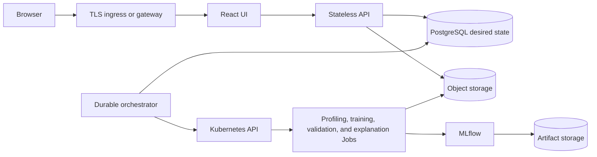

# Sceptre Local Development and Production Readiness

> **Current status (Sceptre 0.1.0):** the provider-neutral Helm chart is the
> supported local Kubernetes and compatibility-test distribution. It is not yet
> a production-certified deployment. Shared non-production use is possible when
> the controls in this guide are supplied by the cluster owner. Internet-facing,
> regulated, or availability-critical production is blocked until the launch
> gates below are satisfied.

A successful `helm install` proves that the application can be packaged and run
on Kubernetes. It does not by itself prove high availability, security,
recoverability, large-dataset safety, or production capacity.

## 1. Purpose and Sources of Truth

This document separates three environments that were previously mixed together:

1. A local product installation for an analyst, developer, or evaluator.
2. A shared non-production installation for integration and acceptance testing.
3. A production-qualified installation with explicit operational ownership and
   evidence.

Use the following documents together:

- [Main README: local Kubernetes quick start](../../README.md#quick-start-on-local-kubernetes)
  is the Windows and Linux installation guide for a complete local Sceptre
  release.
- [Helm chart guide](../../infra/helm/sceptre/README.md) documents chart values,
  image import, external services, GPU profiles, exposure, and upgrades.
- [Kubernetes portability contract](../architecture/kubernetes-portability.md)
  describes the implemented provider-neutral scheduling, RBAC, storage, and
  capability boundary.
- This document defines the promotion contract and the evidence required before
  calling an environment production ready.

### Terminology

- **Local Kubernetes installation** means Sceptre runs inside a Kubernetes
  cluster on one workstation. `http://127.0.0.1:8080` is only the browser address
  created by `kubectl port-forward`.
- **Host-process development** means Vite and/or FastAPI run directly on the
  developer machine for a short edit-test loop. It is not a complete deployment
  model.
- **Production ready** describes a specific application version in a specific
  environment after its required controls and tests pass. It is not an
  application-wide label conferred by Helm.
- **Operator-owned** means the Kubernetes or platform operator must provide and
  validate the capability; the Sceptre chart does not install it.

## 2. Environment Model

| Concern | Local analyst/development | Shared non-production | Production |
| --- | --- | --- | --- |
| Purpose | Learn, develop, and evaluate the complete workflow | Integration, user acceptance, upgrade rehearsal, and realistic workload tests | Approved business workloads with an agreed availability and recovery policy |
| Cluster | Single workstation; one or more local nodes | Shared conformant cluster with namespace isolation | Supported, resilient multi-node cluster with a documented upgrade policy |
| Access | Loopback port-forward over HTTP | Private ingress with TLS and controlled users | Managed TLS ingress or gateway, DNS, authentication, authorization, and traffic policy |
| Values | One local image-distribution profile plus a Git-ignored local secret override | Environment-specific non-secret values and centrally delivered Secrets | Reviewed, version-controlled non-secret production values and externally managed Secrets |
| Images | Locally built and imported images; `pullPolicy: Never` is acceptable | Registry-hosted versioned images | Registry-hosted images pinned by immutable digest, scanned, and signed according to organization policy |
| Data services | Bundled single-replica PostgreSQL, MinIO, and MLflow | Bundled services only for disposable testing; external services for persistent shared data | HA or managed PostgreSQL, object storage, and MLflow with tested backup and recovery |
| Persistence | Local PVCs; retention is convenience, not backup | Explicit retention and backup policy for any important test data | Encryption, retention, backup, point-in-time or equivalent recovery, and restore evidence |
| Scale | One user or a small trusted group; CPU-first | Quotas, metrics, bounded concurrency, and production-like tests | Measured capacity, multi-node failure tolerance, alerts, and documented scaling limits |
| Data | Synthetic, public, or safely de-identified | Synthetic or approved non-production copies | Data classified and governed for the environment |
| Readiness result | Functional local installation | Qualified shared test environment | All launch gates pass with an owner and dated evidence |

### Promotion rules

- Promote the same tested image digests; do not rebuild images per environment.
- Keep local cluster profiles local. `values-local.yaml`, `values-k3d.yaml`,
  `values-kind.yaml`, `values-minikube.yaml`, and `values-microk8s.yaml` change
  image distribution and must never be used as a production base.
- Keep credentials out of values files and source control. Values may name
  existing Secrets, but they must not contain secret material.
- Use a separate release namespace, database, object-store prefix or bucket, and
  MLflow tracking boundary for each environment.
- Do not copy local PVCs into production. Promote immutable datasets and model
  artifacts through an approved, traceable process.
- Do not interpret `ENVIRONMENT=production` as automatic hardening. In the
  current application it only changes a small number of API behaviors; the chart
  does not presently expose this setting correctly.

## 3. What the Current Release Actually Provides

### Implemented baseline

The current compatibility baseline includes:

- A React/Vite UI served by Nginx and a separately containerized FastAPI API.
- One provider-neutral chart at [`infra/helm/sceptre`](../../infra/helm/sceptre)
  with thin local-cluster and accelerator profiles.
- API, UI, MLflow, CPU training, NVIDIA/RAPIDS training, Intel training, and
  generic inference image definitions.
- Bundled single-replica PostgreSQL, MinIO, and MLflow for local use, with
  external PostgreSQL, S3-compatible object storage, and MLflow configuration.
- Revision-specific Alembic migration Jobs, fresh-database bootstrap, a
  13-table schema verifier, and API startup gating on a complete schema.
- Namespace-scoped RBAC, Kubernetes training and analysis Jobs, resource
  requests and limits, adaptive deadlines, job status/log reporting, and
  optional CPU/RAM telemetry.
- CPU-first execution with optional NVIDIA or Intel extended resources and
  cluster-supplied device plugins.
- Optional UI and per-model ingress, optional TLS Secret references, optional
  ResourceQuota and LimitRange, and ClusterIP Services by default.
- Functional React workflows for upload progress, target selection, on-demand
  profiling, training, progressive leaderboards, external validation, SHAP,
  registry promotion, fallback selection, drift analysis, inference deployment,
  deployment status, stopping, and cleanup.
- Model endpoint URLs that remain hidden until the configured exposure mechanism
  reports a usable endpoint.

### Runtime images and responsibilities

| Current image | Current responsibility |
| --- | --- |
| `sceptre-ui` | React static application and same-origin API proxy |
| `sceptre-api` | HTTP API, authentication, profiling threads, admission, Kubernetes workload creation, and reconciliation |
| `sceptre-training-cpu` | CPU training and analysis Jobs |
| `sceptre-training-nvidia` | NVIDIA CUDA/RAPIDS training Jobs |
| `sceptre-training-intel` | Intel-enabled training Jobs |
| `sceptre-inference` | Generic model-serving Deployment |
| `sceptre-mlflow` | Bundled local MLflow server |

There is no separate orchestrator, durable queue service, model-builder image, or
worker control plane in the current release. Those are production target
boundaries, not current components.

### Helm and operator ownership

| Helm release owns | Cluster or platform operator owns |
| --- | --- |
| Sceptre UI, API, training configuration, inference configuration, and namespace RBAC | Kubernetes lifecycle, nodes, CNI, DNS, time synchronization, and control-plane availability |
| Bundled development PostgreSQL, MinIO, and MLflow, when enabled | Production-grade database, object storage, MLflow, encryption, backup, and disaster recovery |
| Application schema migration and verification | Database creation and privileges for external services, plus pre-upgrade backups |
| ClusterIP Services and optional Ingress objects | Ingress/Gateway controller, certificates, public DNS, WAF, load balancer, and traffic policy |
| Resource requests/limits and optional namespace quota objects | Metrics Server, monitoring stack, node capacity, autoscaling, and cost controls |
| Optional GPU resource selection | Host drivers, device plugins, compatible nodes, GPU telemetry, and scheduling policy |
| Existing Secret references and imagePullSecret names | Secret manager/controller, rotation, registry authentication, image policy, scanning, and signing |

PVC retention annotations prevent an ordinary Helm uninstall from deleting some
claims. They do not provide replication, backup, encryption, or recovery.

## 4. Current Production Blockers

The following are code or operational gaps, not configuration suggestions.

| Area | Current baseline | Production implication |
| --- | --- | --- |
| Environment mode | The Helm ConfigMap hard-codes `ENVIRONMENT: kubernetes` | API docs remain enabled and password-reset responses can expose a development reset token; production launch is blocked |
| Identity | Local email/password authentication and self-registration are enabled by default; tokens are stored in browser `localStorage` | Disabling registration is not OIDC/SSO. Identity, account lifecycle, secure token handling, and CSRF/session policy require an approved design |
| Dataset ingestion | The browser reports multipart progress, but FastAPI calls `file.file.read()` and buffers the complete upload before object-store persistence | The former 5 GB or 10 GB goal is not a supported current limit; memory-safe resumable or direct-to-object-store upload is required |
| Training memory | Training reads complete dataset objects before creating in-memory pandas structures | Raw file size is not a memory requirement; large-data claims require a bounded or distributed implementation and load evidence |
| Profiling durability | Profiling runs in a FastAPI-owned thread pool and incomplete jobs are resumed at API startup | API restarts and multiple API replicas do not provide safe exactly-once or leased execution |
| Scheduling | FastAPI performs admission and creates Kubernetes resources directly; capacity exhaustion is rejected instead of queued | There is no durable fair queue or separately scalable orchestrator |
| Failure domain | All selected candidates run in one training Job and process | One candidate or process failure can affect the complete tournament |
| Availability | API and UI default to one replica; bundled PostgreSQL, MinIO, and MLflow are single replica; there are no PDBs or topology rules | A node or voluntary disruption can interrupt the control plane or data services |
| Network security | No NetworkPolicy is installed and not all workloads meet a restricted Pod security posture | Namespace RBAC alone does not isolate network traffic or fully harden Pods |
| Secrets | Defaults contain local JWT, PostgreSQL, and MinIO credentials | Default values are unsafe anywhere shared; static object-store root credentials also exceed least privilege |
| Serving security | Generic inference endpoints have no built-in authentication, authorization, rate limit, or request quota | An external gateway alone must not expose them until protection and tenant isolation are verified |
| Model delivery | A Dockerfile is generated as evidence, but no model builder scans, signs, pushes, resolves, or deploys a model-specific immutable image | Current one-click deployment is a functional baseline, not a governed supply-chain boundary |
| Observability | Health probes, run status, logs, and optional resource telemetry exist | Central logs, metrics, traces, dashboards, alerts, audit export, SLOs, and on-call runbooks are not supplied |
| Recovery | Retained PVCs and migrations exist; backup/restore automation does not | Restore time, restore point, credential continuity, and rollback are unproven |
| Release safety | Unit/frontend/migration/render CI exists | Live cluster upgrade, rollback, disaster recovery, security, performance, and multi-cluster qualification are incomplete |

Relevant implementation evidence:

- [Complete API upload buffering](../../apps/api/automl_api/api/routes/datasets.py)
- [API-owned profiling lifecycle](../../apps/api/automl_api/services/profiling_jobs.py)
- [API startup profiling resumption](../../apps/api/automl_api/main.py)
- [Direct Kubernetes training control](../../apps/api/automl_api/services/kubernetes_training.py)
- [Current Helm defaults](../../infra/helm/sceptre/values.yaml)
- [Current RBAC boundary](../../infra/helm/sceptre/templates/rbac.yaml)
- [Current chart CI](../../.github/workflows/ci.yml)

## 5. Local Development and Evaluation

### Supported complete local path

Use the [main README quick start](../../README.md#quick-start-on-local-kubernetes).
It performs the complete local product installation:

1. Create or select a conformant local cluster.
2. Build the versioned Sceptre images.
3. Import those images into the local cluster.
4. Generate a Git-ignored values file with random local credentials.
5. Install one Helm release and wait for bootstrap and migration Jobs.
6. Verify pods, Jobs, PVCs, and the Helm smoke test.
7. Port-forward the UI and open `http://127.0.0.1:8080`.

The chart creates the bundled data services and schema for a fresh local
installation. A developer should not manually create the 13 application tables.

### What localhost does and does not mean

| Item | Meaning |
| --- | --- |
| `kubectl port-forward service/sceptre-ui 8080:80` | Temporary browser access to a UI running in Kubernetes |
| `npm run dev` | UI-only Vite edit loop; it expects an API on `127.0.0.1:8000` |
| `compose.yaml` | PostgreSQL and database bootstrap convenience only; it is not the complete Sceptre stack |
| `.env.example` | Unsafe host-development defaults and variable reference; not a deployable production configuration |
| Local embedded object storage | Useful only for isolated API development; Kubernetes training Jobs cannot read files that exist only on the host |
| A local Helm profile | Image-import behavior for one local distribution; not a security or availability profile |

For end-to-end behavior, prefer the local Helm installation. Host-process
development is appropriate for focused code changes when the developer also
provides every dependency and a usable Kubernetes context.

### Local acceptance criteria

A local installation is successful when:

- the selected Kubernetes context and default StorageClass are correct;
- PostgreSQL, MinIO, MLflow, API, and UI are ready;
- bootstrap and migration Jobs completed;
- `helm test sceptre -n sceptre` passes;
- registration and login work through the UI;
- upload progress is visible and upload returns to project overview;
- target selection immediately shows task type and target visualization;
- profiling starts only when the user requests it;
- a small CPU training run completes and logs metrics/artifacts to MLflow; and
- uninstall/reinstall behavior matches the intended PVC retention decision.

This proves local functionality only. It does not satisfy a production gate.

### Local data lifecycle

Retained PVCs survive a normal Helm uninstall, but deleting the cluster, resetting
Docker Desktop Kubernetes, or deleting PVCs destroys local data. Preserve the
same generated secret override when reconnecting to retained PostgreSQL and
MinIO claims. Use only disposable or separately backed-up data locally.

## 6. Shared Non-Production

A shared development, integration, or acceptance environment is the bridge
between a workstation and production. At minimum:

- use registry-hosted versioned images, never local `pullPolicy: Never` profiles;
- replace all default credentials with centrally delivered existing Secrets;
- disable open self-registration unless the test explicitly covers it;
- keep the environment on private networking with TLS ingress and controlled
  identity;
- set ResourceQuota, LimitRange, concurrency, and training resource bounds;
- provide Metrics Server and central application/workload logs;
- use a separate database, object-store bucket/prefix, MLflow boundary, and
  namespace;
- establish data classification, expiry, and cleanup rules;
- back up any data that cannot be recreated;
- exercise schema migration, application upgrade, rollback decision-making, and
  restore before a production release;
- test the same ingress, storage, registry, GPU, and secret-delivery classes
  intended for production; and
- record known deviations so a non-production success is not mistaken for
  production evidence.

Bundled PostgreSQL, MinIO, and MLflow are acceptable for disposable shared tests.
They are not a high-availability architecture.

## 7. Production Qualification Target

The following is an acceptance target, not a current performance claim:

- at least 15 concurrently active users;
- datasets around 10 GB without buffering complete uploads in browser or API
  memory;
- durable admission and fair queueing when compute is unavailable;
- four concurrent large compute workloads as an initial measured baseline, with
  additional work queued;
- reproducible models from immutable data, code, configuration, dependencies,
  and images;
- recovery after API, worker, node, database, and object-store disruptions; and
- one versioned Helm release composed of independently scalable runtime
  responsibilities.

Fifteen simultaneous 10 GB in-memory training Jobs are not implied. Feature
expansion and estimator choice can make working memory many times larger than
the raw file. Capacity must be measured with representative datasets and model
selections.

### Target production control boundary

The present API owns HTTP handling, profiling, admission, and Kubernetes
reconciliation. The production target separates those responsibilities:



Required properties of the target boundary:

- PostgreSQL is authoritative for workflow state.
- Object storage is authoritative for datasets and large artifacts.
- API and UI processes do not own durable background work.
- Work is leased, idempotent, recoverable, and queued instead of rejected solely
  because a worker is temporarily unavailable.
- API and orchestrator use separate service accounts and least-privilege
  permissions.
- Training and inference receive workload-specific, narrowly scoped data access.
- Inference traffic is authenticated, authorized, rate-limited, monitored, and
  isolated from the control plane.
- Model promotion and deployment remain explicit governed actions; leaderboard
  rank does not automatically approve production use.

## 8. Production Configuration Contract

There is intentionally no `values-production.yaml` in the repository today.
Shipping one would imply that unresolved organization-specific decisions and
current blockers can be solved by defaults. A production values file must be
created and reviewed for the destination environment after the blockers are
closed.

### Values that production must define

| Concern | Required production decision |
| --- | --- |
| Images | Reachable authenticated registry and immutable digest for every Sceptre runtime image |
| API/UI scale | Replica, disruption, and placement policy proven safe by multi-replica tests |
| PostgreSQL | `postgresql.enabled=false`, external connection Secret, TLS, HA, backup, restore, and migration privileges |
| Object storage | `minio.enabled=false`, pre-provisioned bucket, TLS endpoint, existing Secret or future workload identity, retention, versioning, and recovery |
| MLflow | `mlflow.enabled=false` with an external protected tracking service and durable artifact store |
| Authentication | Open registration policy, approved account provisioning, token/session policy, and identity integration |
| Exposure | UI ingress/gateway class, trusted certificate, DNS, proxy limits/timeouts, and request protection |
| Model serving | Internal-only ClusterIP unless an authenticated gateway and endpoint policy are ready |
| Resources | API/UI requests, training resource classes, namespace quotas, node pools, and bounded concurrency |
| Storage | Explicit StorageClass only for any remaining PVC-backed component; encryption and recovery validated |
| Capabilities | Metrics, ingress, GPU, PriorityClass, and read-only cluster observation enabled only when installed and approved |

### Secret contract

Prefer existing Secrets populated by an external secret-management process:

| Reference | Required keys |
| --- | --- |
| `auth.existingSecret` | `JWT_SECRET_KEY` |
| `platform.existingSecret` | `DATABASE_URL` and, only when bundled MLflow is used, `MLFLOW_DATABASE_URL` |
| `externalObjectStore.existingSecret` | Configured access-key and secret-key fields |
| `global.imagePullSecrets` | Registry credentials in Kubernetes pull-secret format |

Current external object storage is a MinIO/S3-compatible static-key adapter. It
does not yet provide native Azure Blob/GCS adapters, cloud workload identity,
session-token handling, or chart-managed custom CA mounts. Do not claim those
capabilities until their implementation and tests exist.

Pre-create the production bucket and grant only the required object operations.
The current health check attempts to create the bucket when it is absent, so
bucket existence and least-privilege behavior must be verified with the exact
credentials used by Sceptre.

### Identity and environment mode

`auth.simpleAuthEnabled=false` disables self-registration; it does not configure
OIDC, SSO, MFA, user provisioning, or a secure browser session mechanism.
Production identity therefore remains an implementation and security-review
gate.

The chart currently renders `ENVIRONMENT: kubernetes` with no values override.
FastAPI treats only the exact value `production` as production mode. Until this
is corrected and regression-tested, Helm installations can expose development
API documentation and password-reset tokens and must not be internet facing.

### Exposure

- Keep UI, API, dependencies, and model Services as ClusterIP by default.
- Port-forwarding is a local diagnostic method, not production ingress.
- Terminate trusted TLS at an approved ingress or gateway and encrypt upstream
  database, object-store, and MLflow connections.
- Configure upload size, streaming, timeout, and body-buffering behavior at every
  proxy only after the API ingestion path is memory safe.
- Do not expose a generated inference Service until endpoint authentication,
  authorization, request limits, tenant isolation, logging, and abuse controls
  pass.
- Continue to hide endpoint links until Kubernetes and the configured exposure
  mechanism report a usable endpoint.

## 9. Database, Migrations, Upgrade, and Rollback

### Fresh local database

For bundled PostgreSQL, the chart:

1. creates the `automl` database and bootstraps the `mlflow` database;
2. runs `alembic upgrade head` in a revision-specific Job;
3. verifies the Alembic head and all registered application tables; and
4. prevents the API from serving until verification passes.

### External database

The platform operator must create the database, network policy, TLS trust,
credentials, and backup policy before installation. The migration identity must
be able to create and alter application schema objects. Runtime and migration
credentials should be separated in the production target even though the
current chart uses one database Secret.

### Upgrade procedure

For every shared persistent or production-like environment:

1. Record the current chart version, image digests, Alembic revision, values
   commit, and dependency versions.
2. Complete and verify a database backup and object/artifact recovery point.
3. Render the proposed release and inspect image, RBAC, Secret reference,
   Service, Ingress, resource, and migration changes.
4. Rehearse the upgrade against a restored non-production copy.
5. Apply the Helm upgrade and wait for migration Jobs.
6. Verify the schema, API readiness, UI proxy, MLflow connectivity, object-store
   access, and a representative workflow.
7. Hold or roll forward if a schema change is not backward compatible. A Helm
   rollback does not reverse a database migration.

Example inspection commands:

```bash
helm lint infra/helm/sceptre
helm template sceptre infra/helm/sceptre \
  --namespace sceptre \
  --values path/to/environment-values.yaml \
  > /tmp/sceptre-rendered.yaml

helm upgrade --install sceptre infra/helm/sceptre \
  --namespace sceptre \
  --create-namespace \
  --values path/to/environment-values.yaml \
  --wait --wait-for-jobs --timeout 20m

kubectl -n sceptre get deployments,statefulsets,pods,jobs,pvc
kubectl -n sceptre logs job/sceptre-migrate-RELEASE_REVISION
kubectl -n sceptre rollout status deployment/sceptre-api
helm test sceptre -n sceptre
```

The exact generated resource prefix can change with release/name overrides.
Discover the migration Job with `kubectl -n sceptre get jobs` rather than
copying a guessed name into automation.

### Backup and recovery evidence

PVC retention is not a backup. Before production, prove:

- automated PostgreSQL backups and point-in-time or approved equivalent recovery;
- object and MLflow artifact versioning/retention appropriate to the business;
- encrypted backups with independent credentials and lifecycle policy;
- restoration into a clean environment;
- consistency between database metadata, dataset objects, MLflow artifacts, and
  registered models;
- credential and encryption-key recovery;
- documented RPO and RTO achieved during a timed exercise; and
- restore and disaster-recovery runbooks executable by the on-call team.

## 10. Production Launch Gates

Each gate needs a named owner, evidence location, test date, application/chart
version, environment, result, and accepted exception expiry. “Configured” is not
evidence; a test result is.

| Gate | Required evidence | Current 0.1.0 status |
| --- | --- | --- |
| Packaging | Reproducible images, Helm render/install, digest manifest, SBOM, scan, and signature verification | Partial |
| Identity | Approved identity, account lifecycle, disabled dev reset behavior, secure browser tokens/sessions, and authorization tests | **Blocked** |
| Ingestion | Resumable or direct memory-bounded upload through all proxies with interruption/retry tests | **Blocked** |
| Durable work | Leased persistent queue/orchestrator, idempotency, restart recovery, and multi-replica correctness | **Blocked** |
| Availability | Multi-node placement, safe replicas, PDBs, dependency HA, and node/disruption tests | **Blocked** |
| Data protection | Encryption, least privilege, automated backups, successful clean restore, and RPO/RTO evidence | **Blocked** |
| Kubernetes security | Restricted workload posture, service-account isolation, NetworkPolicies, admission policy, and RBAC review | **Blocked** |
| Serving security | Authenticated and authorized inference, rate/request limits, tenant isolation, and safe endpoint lifecycle | **Blocked** |
| Observability | Central logs/metrics/traces, dashboards, alerts, SLOs, audit export, and actionable runbooks | **Blocked** |
| Capacity | Representative 10 GB and concurrency tests with CPU, memory, disk, object-store, DB, and queue measurements | Unqualified |
| Upgrade/recovery | Backward-compatible migration rehearsal, rollback decision test, dependency failure test, and DR exercise | Partial |
| Model governance | Immutable lineage, approval, external validation, explainability, scan/sign/deploy evidence, monitoring, and rollback policy | Partial |

No internet-facing or regulated production launch may proceed while a **Blocked**
gate remains. A lower-risk internal deployment still needs an explicit security
and data-owner decision; renaming it “production” does not remove the gaps.

### Functional acceptance journey

At minimum, a release candidate must prove:

1. Registration policy, login, refresh, logout, authorization, and project
   isolation behave as configured.
2. Upload shows real transfer progress, persists the exact object, and returns to
   project overview without starting profiling.
3. Selecting a target immediately shows the inferred task and appropriate target
   visualization; profiling starts only on explicit user action.
4. Feature profiling renders numeric, categorical, and text diagnostics without
   blocking the API control plane.
5. Every selected model appears in the leaderboard as pending, running,
   succeeded, or failed with stable unique ranks and phase/resource progress.
6. Successful candidates, metrics, parameters, artifacts, and registered models
   are visible and consistent in MLflow.
7. SHAP results are bound to the selected run and model and refresh without a
   manual browser reload.
8. External validation and drift accept uploaded comparison data only after
   schema compatibility checks.
9. Deployment requires the intended approval state, reports its real phase, and
   reveals no endpoint before readiness and exposure succeed.
10. Backup, restore, upgrade, workload retry, cleanup, and failure diagnostics
    preserve or remove state exactly as policy specifies.

### Reliability and failure tests

Test at least:

- API restart during upload, profiling, training, validation, and deployment;
- duplicate user requests and controller retries;
- worker eviction, node loss, unschedulable resources, deadline, and OOM;
- PostgreSQL failover/unavailability and recovery;
- object-store and MLflow latency, denial, and outage;
- ingress/gateway and certificate failure;
- Metrics Server and GPU telemetry absence;
- GPU resource unavailable with expected CPU fallback or explicit rejection;
- stale Kubernetes resources versus database state;
- migration failure before API rollout;
- restore into an empty namespace/cluster; and
- model endpoint failure with rollback or safe traffic removal.

## 11. Validation Commands and Evidence

The repository CI currently supplies useful compatibility evidence, not
production certification:

```bash
ruff check apps packages alembic scripts tests
pytest tests/ -v --tb=short --cov --cov-fail-under=40
python -m compileall apps packages alembic scripts tests

npm --prefix apps/ui/react_app ci
npm --prefix apps/ui/react_app test -- --run
npm --prefix apps/ui/react_app run lint
npm --prefix apps/ui/react_app run build

helm lint infra/helm/sceptre
for profile in infra/helm/sceptre/values*.yaml; do
  helm template sceptre infra/helm/sceptre \
    --namespace sceptre \
    --values "$profile" \
    > /dev/null
done
helm template sceptre infra/helm/sceptre \
  --namespace sceptre \
  --values infra/helm/sceptre/examples/values-external.yaml \
  > /dev/null
helm template sceptre infra/helm/sceptre \
  --namespace sceptre \
  --values infra/helm/sceptre/examples/values-capabilities.yaml \
  > /dev/null
```

Production qualification must add live-cluster tests for the selected Kubernetes
minor, CNI, CSI, ingress/gateway, registry, secret delivery, external services,
and accelerator profiles. Run install, upgrade, failure, rollback-decision,
backup, restore, load, and security tests on the same classes of infrastructure
used in production.

Retain at least:

- chart package and rendered manifest;
- immutable image digest manifest, SBOM, scan, and signature results;
- values commit with Secret names but no secret values;
- database migration and schema verification results;
- functional and authorization reports;
- load-test dataset description and capacity report;
- backup and restore timestamps;
- security review and penetration-test findings;
- dashboards, alert tests, SLO report, and runbook exercise;
- model lineage, approval, validation, explainability, and deployment evidence;
  and
- release approval with owners and exception expiries.

## 12. Prioritized Readiness Roadmap

### P0: production launch blockers

- Make runtime environment explicit in Helm and suppress every development-only
  response in production.
- Implement approved identity and browser-session security; protect inference
  endpoints.
- Replace API-buffered uploads with resumable or direct object-store ingestion.
- Move profiling and workload reconciliation into durable leased execution and
  prove multiple API replicas safe.
- Separate API, orchestrator, training, and inference identities and credentials.
- Add production Pod security, NetworkPolicies, PDBs, topology placement, and
  safe replica controls.
- Qualify external HA data services, backup/restore, encryption, and least
  privilege.
- Add central telemetry, alerts, audit export, SLOs, and runbooks.

### P1: scale and governed delivery

- Isolate candidates or add recoverable candidate checkpoints.
- Build, scan, sign, push, and deploy immutable model-specific artifacts.
- Add canary/traffic policy, automated health rollback, endpoint quotas, and
  prediction monitoring.
- Measure the target dataset/concurrency envelope and define resource classes,
  queue fairness, and cost limits.
- Add live install/upgrade/restore/security/performance qualification to release
  CI.

### P2: extended portability

- Qualify managed-cloud and on-premises profiles with TLS external PostgreSQL.
- Add workload-identity and native object-store adapters where required.
- Add custom CA, private registry, offline bundle, and air-gapped procedures.
- Qualify at least one ingress and one Gateway API implementation if both are
  declared supported.
- Publish a support matrix for Kubernetes minors, CNIs, CSIs, GPUs, and external
  service versions.

## 13. Definition of Production Ready

Sceptre is production ready for a named environment only when:

- all P0 blockers are closed or replaced by formally approved equivalent
  controls;
- every launch gate passes with current evidence;
- the exact release has completed install, upgrade, failure, recovery, security,
  and representative load qualification;
- the restore exercise meets the approved RPO and RTO;
- operations, security, data, and model-risk owners approve the release;
- monitoring, alerts, escalation, rollback, and disaster-recovery runbooks are
  active; and
- no local-only image, credential, port-forward, bundled single-replica data
  service, or unprotected model endpoint remains in the production path.

None of the current local Helm profiles satisfies this definition. Local Sceptre
is ready for development and evaluation; production readiness remains a measured
environment-specific promotion decision.

## 14. External References

- [Kubernetes production environment guidance](https://kubernetes.io/docs/setup/production-environment/)
- [Kubernetes application security checklist](https://kubernetes.io/docs/concepts/security/application-security-checklist/)
- [Kubernetes security checklist](https://kubernetes.io/docs/concepts/security/security-checklist/)
- [Kubernetes supported releases](https://kubernetes.io/releases/)
- [Kubernetes encryption at rest](https://kubernetes.io/docs/tasks/administer-cluster/encrypt-data/)
- [Helm chart tests](https://helm.sh/docs/topics/chart_tests/)
