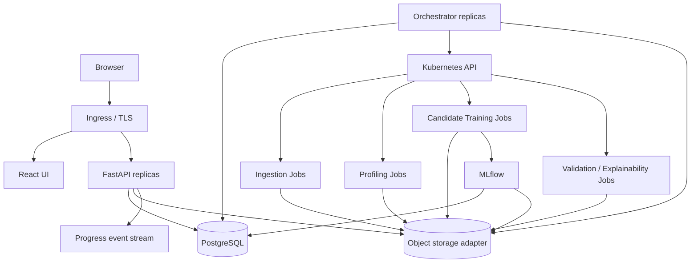
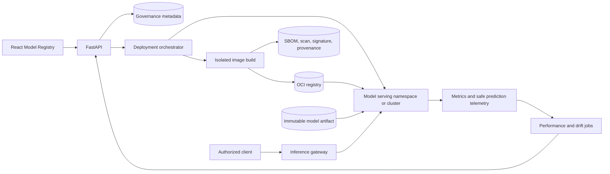

# Sceptre Production Readiness Implementation Guide

## Document Status

This document is the implementation contract for evolving Sceptre from its
current development and Minikube deployment into a secure, observable,
multi-node production platform.

It is written for a senior software engineer or AI engineering agent with
experience in:

- Python, FastAPI, SQLAlchemy, PostgreSQL, and Alembic
- React, TypeScript, accessible design systems, and browser security
- Kubernetes, Helm, workload controllers, and cluster autoscaling
- Distributed data processing and production machine learning
- Object storage, MLflow, model reproducibility, and data governance
- Reliability engineering, security, CI/CD, and zero-downtime delivery

The phases are ordered deliberately. Do not skip a phase because a later phase
appears more visible. Do not declare a phase complete until its exit criteria
and automated validation pass.

> **Production rollout prerequisite:** Before an internet-facing or regulated
> production rollout, add organization-specific identity, TLS, managed secrets,
> backups, monitoring, and multi-node capacity planning.

## 1. Mission and Production Envelope

The target platform must:

- Support at least 15 concurrently active users.
- Accept datasets of approximately 10 GB without proxying the file through the
  React server or loading the complete upload into API memory.
- Accept all valid jobs durably, subject to quotas, and queue work when compute
  is unavailable.
- Run several large profiling or training workloads concurrently without
  destabilizing the API, UI, database, object store, or Kubernetes control
  plane.
- Scale worker nodes according to declared resource requests.
- Preserve project isolation, auditability, reproducibility, and data lineage.
- Recover correctly after API, scheduler, worker, node, and database failover.
- Package the product as one versioned Helm release composed of independently
  scalable services.

The baseline operating policy is four concurrent 10 GB compute workloads, with
additional work queued fairly. Fifteen simultaneous 10 GB training jobs are not
the baseline guarantee. That level of parallel execution may require roughly
1.5-3.75 TiB of worker memory depending on feature expansion and model choice.
Concurrency must therefore be an explicit capacity and cost decision.

## 2. Non-Negotiable Engineering Principles

1. One product release does not mean one container.
2. PostgreSQL is the authoritative source for workflow state.
3. Kubernetes is an execution engine, not the user-facing workflow database.
4. Object storage is the authoritative store for datasets and large artifacts.
5. API and UI processes must never own durable background work.
6. Large files must not pass through application memory as base64 payloads.
7. Resource admission must be based on measured or conservatively estimated
   working sets, not raw file size alone.
8. Every mutation must be authorized, tenant-scoped, auditable, and idempotent.
9. Every model must be reproducible from immutable data, code, configuration,
   dependency, and image references.
10. A failure must produce a durable, actionable diagnosis without requiring a
    Kubernetes Pod to remain present.
11. Database and API changes must support rolling, backward-compatible releases.
12. Security, accessibility, observability, and rollback are completion
    criteria, not follow-up tasks.
13. A trained or top-ranked model is not automatically approved, deployable, or
    safe for production traffic.

## 3. Current-State Constraints

The implementing engineer must verify these observations against the repository
before changing behavior:

- The Streamlit UI buffers uploads and sends base64 content to FastAPI.
- Training reads the complete object into bytes and then creates an in-memory
  pandas DataFrame.
- Large CSV/JSONL profiling can use Dask, but execution is still owned by
  threads inside the API process.
- API startup resumes incomplete profiling jobs, which is unsafe with multiple
  API replicas.
- FastAPI performs Kubernetes capacity checks and creates Jobs directly.
- Admission rejects work when capacity is exhausted instead of retaining a
  durable queue.
- Training candidates run within one Job and one process, so a run has a large
  failure domain.
- PostgreSQL, MinIO, and MLflow are currently single-replica development
  deployments with small persistent volumes.
- MLflow artifacts are stored on a local PVC.
- API and UI production images and deployments do not yet exist.
- The Kubernetes resources are Kustomize-based and are not packaged as Helm.
- The legacy Phase 7 model registry, promotion, production packaging,
  deployment, prediction monitoring, drift monitoring, fallback, and artifact
  reclamation workflows are not implemented.
- There is no governed inference runtime, model image build service, deployment
  controller, production endpoint contract, canary policy, or automated rollback
  path.

Do not remove existing working behavior until its replacement has passed
contract, integration, migration, and rollback tests.

## 4. Target Product and Runtime Architecture

### 4.1 Release Unit

Publish one semantically versioned Helm chart and a release manifest that pins
immutable image digests:

| Image | Responsibility | Kubernetes workload |
| --- | --- | --- |
| `sceptre-web` | React static application | Deployment |
| `sceptre-api` | FastAPI control plane | Deployment |
| `sceptre-orchestrator` | Queue dispatch and reconciliation | Deployment |
| `sceptre-worker` | Ingestion, profiling, training, validation, and explanation | Job |
| `sceptre-inference-*` | Allow-listed model-serving runtimes | Deployment |
| `sceptre-model-builder` | Governed model-image assembly | Job |
| `sceptre-mlflow` | Tracking server, if managed by this release | Deployment |
| `sceptre-migrations` | Alembic migration command using the API image | Job |

Do not place React, FastAPI, orchestration, and training in one container or
Pod. They have different scaling signals, privileges, dependencies, and failure
characteristics.

### 4.2 Control and Data Planes



The API writes desired state to PostgreSQL. The orchestrator leases queued work,
creates Kubernetes Jobs, and reconciles observed state back into PostgreSQL.
Workers never decide user authorization or scheduling policy.

### 4.3 Namespace and Permission Boundaries

Use at least:

- `sceptre-system`: web, API, orchestrator, MLflow, configuration, and monitoring
  integration.
- `sceptre-workloads`: ephemeral ingestion, profiling, training, validation, and
  explainability Jobs.

Use distinct service accounts:

- Web: no Kubernetes token.
- API: no Kubernetes permissions and no mounted service-account token.
- Orchestrator: namespace-scoped Job, Pod, Event, Lease, and log permissions
  required for reconciliation.
- Worker: no Kubernetes API permissions by default.
- Migration: database access only.

### 4.4 Target Repository Directory Structure

Evolve toward the following structure incrementally. Do not move every module in
one change. Preserve imports and deployment compatibility while each ownership
boundary is extracted and tested.

```text
.
|-- apps/
|   |-- web/                         # React and TypeScript application
|   |   |-- src/
|   |   |   |-- app/                 # routing, providers, error boundaries
|   |   |   |-- features/            # project, dataset, profile, run workflows
|   |   |   |-- components/          # product-level reusable components
|   |   |   |-- design-system/       # tokens, primitives, charts, accessibility
|   |   |   |-- api/                 # generated client and transport adapters
|   |   |   `-- observability/       # client telemetry and correlation
|   |   `-- tests/
|   |-- api/
|   |   `-- automl_api/
|   |       |-- api/                 # HTTP and event-stream adapters
|   |       |-- application/         # use cases and transaction boundaries
|   |       |-- domain/              # state machines and business rules
|   |       |-- infrastructure/      # SQL, object store, identity adapters
|   |       `-- main.py
|   |-- orchestrator/
|   |   `-- sceptre_orchestrator/
|   |       |-- admission/           # quotas, fairness, resource classes
|   |       |-- dispatch/            # Job specification and submission
|   |       |-- reconciliation/      # DB and Kubernetes convergence
|   |       `-- leader/              # leases and lifecycle
|   |-- inference/
|   |   `-- sceptre_inference/
|   |       |-- contracts/           # request, response, readiness schemas
|   |       |-- loaders/             # trusted model and preprocessing loaders
|   |       |-- runtime/             # prediction and bounded batching
|   |       |-- telemetry/           # safe inference and drift signals
|   |       `-- main.py              # generic inference HTTP process
|   `-- worker/
|       `-- sceptre_worker/
|           |-- ingestion/
|           |-- profiling/
|           |-- preparation/
|           |-- training/
|           |-- validation/
|           `-- explainability/
|-- packages/
|   |-- python/
|   |   |-- sceptre_contracts/        # stable Python DTOs and event schemas
|   |   |-- sceptre_storage/          # provider-neutral object-store ports
|   |   |-- sceptre_ml/               # task, metric, and artifact contracts
|   |   `-- sceptre_serving/          # package, deployment, traffic contracts
|   `-- generated/
|       `-- typescript-api/           # generated from versioned OpenAPI
|-- alembic/
|-- charts/
|   |-- sceptre/                       # provider-neutral control-plane chart
|   `-- sceptre-model/                 # governed model-serving chart/template
|-- build/
|   `-- model-runtimes/                # allow-listed versioned build templates
|-- deploy/
|   |-- environments/
|   |   |-- on-prem/
|   |   |-- aws/
|   |   |-- azure/
|   |   `-- gcp/
|   `-- examples/                      # non-secret example values
|-- infra/
|   |-- kubernetes/
|   |   |-- bootstrap/                 # namespaces and cluster prerequisites
|   |   `-- policies/                  # portable policy definitions
|   |-- terraform/
|   |   |-- modules/                   # optional reusable infrastructure modules
|   |   `-- examples/                  # provider compositions, not app logic
|   `-- providers/
|       |-- generic/
|       |-- aws/
|       |-- azure/
|       `-- gcp/
|-- docs/
|   |-- architecture/
|   |-- decisions/
|   |-- production-readiness/
|   `-- runbooks/
|-- tests/
|   |-- unit/
|   |-- contract/
|   |-- integration/
|   |-- end_to_end/
|   |-- performance/
|   |-- chaos/
|   `-- portability/
|-- scripts/                            # repeatable operator and CI commands
`-- .github/workflows/
```

Directory boundaries must follow runtime ownership. Do not create a large
cross-service `shared` package containing database models, service internals, or
framework-specific utilities. Share stable contracts, not implementations.

### 4.5 Platform-Agnostic Deployment Contract

The core application must depend on capabilities rather than cloud product
names. Provider-specific infrastructure supplies these capabilities.

#### Required Kubernetes Capabilities

Every supported environment must provide:

- A conformant, supported Kubernetes version.
- OCI image pulling from an authenticated registry.
- A CNI that enforces `NetworkPolicy`.
- Dynamic block storage through CSI for components that require volumes.
- Ingress or Gateway API routing with TLS and WebSocket/SSE support.
- Internal DNS and reliable time synchronization.
- Resource metrics for HPA and operational telemetry.
- Node autoscaling or documented fixed-capacity operation.
- A secret delivery mechanism.
- A default-deny network posture and restricted Pod Security enforcement.
- Topology labels for host and failure-domain spreading.

Do not require ReadWriteMany storage for normal dataset execution. Object
storage is authoritative and workers use bounded local ephemeral scratch.

#### External Service Ports

Define provider-neutral interfaces:

- `RelationalStore`: PostgreSQL connection and migration contract.
- `ObjectStore`: create upload session, sign upload operation, complete, abort,
  stat, stream, list by bounded prefix, copy, and delete.
- `ArtifactStore`: durable MLflow and application artifact locations.
- `IdentityProvider`: local development auth or standards-based OIDC.
- `SecretProvider`: Kubernetes Secret reference populated by an external system.
- `EventPublisher`: durable job events with SSE delivery; implementation may
  initially use PostgreSQL.
- `ComputeControl`: Kubernetes Job submission and reconciliation.

Domain and application modules must not import AWS, Azure, GCP, MinIO, or
vendor-specific SDKs directly. Vendor SDKs belong behind infrastructure
adapters selected through validated configuration.

#### Object Storage Implementations

Support at least:

- S3 API: AWS S3 and S3-compatible on-premises storage such as MinIO or Ceph.
- Azure Blob or ADLS through an Azure adapter.
- Google Cloud Storage through a GCS adapter.

Upload-session behavior differs between S3 multipart uploads, Azure block blobs,
and GCS resumable uploads. Expose one internal upload state model while retaining
provider upload IDs and checksums as opaque adapter metadata.

Use Parquet and Arrow-compatible schemas for portable analytical artifacts.
Do not persist provider SDK objects, temporary signed URLs, or provider-specific
exceptions in domain records.

#### Helm Portability Rules

- Keep the core chart free of hard-coded cloud annotations and resource IDs.
- Expose annotations, labels, ingress class, Gateway references, storage class,
  load-balancer settings, topology keys, and service-account identity bindings
  through typed values.
- Use `existingSecret` references. The chart must not generate production
  credentials.
- Make embedded PostgreSQL, MinIO, and other development dependencies optional
  and disabled in production profiles.
- Keep all public Services `ClusterIP` by default; exposure belongs to the
  ingress or gateway profile.
- Do not create cloud networks, managed databases, buckets, DNS zones, or
  Kubernetes clusters from the application chart.
- Render deterministically without querying live cluster state.
- Fail values-schema validation for incompatible settings.
- Use standard Kubernetes APIs where possible and isolate CRDs behind explicit
  feature flags and prerequisite checks.

#### Infrastructure-as-Code Boundary

Infrastructure code may provision clusters, node pools, networks, databases,
object stores, registries, DNS, workload identity, keys, and secret-manager
entries. It must output the small set of values consumed by the Helm release.

The application chart owns Sceptre workloads. Provider infrastructure modules
own cloud or data-center resources. GitOps environment definitions bind the two.
This separation allows teams to replace Terraform, a managed service, an
ingress controller, or a secret manager without changing Sceptre domain logic.

#### Supported Environment Profiles

| Capability | On-premises | AWS | Azure | GCP |
| --- | --- | --- | --- | --- |
| Kubernetes | Conformant distribution | EKS | AKS | GKE |
| PostgreSQL | HA operator or external cluster | RDS/Aurora PostgreSQL | Azure Database for PostgreSQL | Cloud SQL for PostgreSQL |
| Objects | MinIO, Ceph, or compatible S3 | S3 | Blob Storage/ADLS | Cloud Storage |
| Workload identity | OIDC/Vault or scoped secrets | EKS workload identity | Azure workload identity | GKE workload identity |
| Ingress | NGINX, HAProxy, Envoy, or Gateway | Supported ingress/Gateway | Supported ingress/Gateway | Supported ingress/Gateway |
| Node scaling | Provider integration or fixed pools | Cluster Autoscaler/Karpenter profile | AKS cluster autoscaler | GKE autoscaling profile |
| Secrets | Vault or external secret manager | Secrets Manager/Parameter Store adapter | Key Vault adapter | Secret Manager adapter |

Products in this table are profile examples, not imports that may leak into core
application code.

#### On-Premises and Air-Gapped Requirements

- Support private registries and configurable image pull secrets.
- Publish a release bill of materials containing every image and chart.
- Provide an offline dependency and image mirroring procedure.
- Allow custom certificate authorities for ingress, PostgreSQL, object storage,
  MLflow, and registries.
- Do not download models, packages, JavaScript, fonts, or binaries at runtime.
- Support fixed worker pools when no node autoscaler exists.
- Detect insufficient capacity and retain work in the queue rather than creating
  permanently unschedulable Pod floods.
- Document load balancer, DNS, NTP, storage, backup, and disaster-recovery
  responsibilities that a cloud provider would otherwise supply.

#### Portability Test Matrix

CI must always test the generic chart on a local conformant cluster. Release
qualification must additionally test:

- Generic Kubernetes with no cloud annotations.
- S3-compatible object storage.
- Each enabled native cloud object-store adapter.
- External PostgreSQL with TLS.
- At least one ingress and one Gateway API profile where both are supported.
- Fixed-capacity and autoscaled worker modes.
- Custom CA and private-registry configuration.
- Install, upgrade, rollback, backup, and restore using the same application
  version across supported profiles.

### 4.6 Sceptre Product Design Direction

The React application must feel like the same product as the Sceptre mark in
`docs/architecture/images/sceptre-logo.png`. The logo uses a precise, symmetric
cobalt form on a warm ivory ground. Translate that into a product language of
precision, protection, structure, and forward motion.

Do not translate the mark literally into fantasy-themed panels, shields,
ornamental borders, or oversized decorative illustrations. The product is a
daily analytical workspace. Brand character should come from disciplined
geometry, excellent information hierarchy, deliberate cobalt accents, and
careful data visualization.

#### Brand Asset Requirements

The current raster contains a large amount of surrounding space and is not
suitable as the only production asset. Before React launch:

- Confirm ownership and permitted modification of the supplied mark.
- Produce approved master, horizontal lockup, symbol-only, monochrome, reverse,
  favicon, application icon, and social-preview variants.
- Create tightly cropped transparent SVG and PNG assets from an approved source.
  Do not auto-trace or remove an artist mark without confirming rights.
- Preserve the mark's aspect ratio, internal negative space, and symmetry.
- Define minimum sizes and clear space around the mark.
- Test the logo on white, warm ivory, neutral, cobalt, and dark surfaces.
- Provide meaningful alternative text when the lockup conveys the product name;
  use empty alternative text when a nearby visible name already does so.
- Do not place the full square raster directly in the navigation bar.
- Do not recolor the primary mark with status, chart-series, or tenant colors.

Use the symbol sparingly:

- Compact product identity in the application shell.
- Authentication and controlled empty states.
- Reports, exports, and model review documents.
- Favicons and loading marks that do not animate indefinitely.

The logo must not compete with analytical content or consume primary viewport
space after login.

#### Design Principles

1. **Calm authority:** the interface should feel dependable under critical
   review, not promotional or playful.
2. **Analytical clarity:** comparisons, uncertainty, provenance, and state are
   visible without opening multiple dialogs.
3. **Progressive depth:** executives can understand status quickly while data
   scientists can inspect assumptions, folds, metrics, artifacts, and failures.
4. **Stable geometry:** toolbars, tables, charts, and controls do not shift when
   values or statuses change.
5. **Purposeful density:** default to an efficient professional density with a
   user-selectable comfortable mode.
6. **Visible trust:** data version, task, target, approximation, freshness,
   owner, and run status are consistently presented.
7. **Accessible precision:** color reinforces meaning but never carries it
   alone.
8. **Quiet brand expression:** cobalt identifies actions and selection; it does
   not fill every surface.

#### Foundation Color Tokens

The measured logo colors are approximately cobalt `#2B56E7` and warm ivory
`#FFFCF6`. Treat these as brand anchors, then use a balanced neutral and
analytical palette so the application is not a one-note blue interface.

The final token values must pass automated and manual contrast testing. Start
with:

```css
:root {
  --brand-50: #eef3ff;
  --brand-100: #dde7ff;
  --brand-200: #b9ccff;
  --brand-300: #8daaff;
  --brand-400: #5f82f5;
  --brand-500: #3d67ee;
  --brand-600: #2b56e7;
  --brand-700: #2447c2;
  --brand-800: #243c99;
  --brand-900: #223779;
  --brand-950: #17224a;

  --canvas: #f7f8fb;
  --surface: #ffffff;
  --surface-subtle: #f1f3f7;
  --surface-brand: #fffcf6;
  --border: #d8dde7;
  --border-strong: #aeb7c6;
  --text: #172033;
  --text-muted: #596579;
  --text-subtle: #727d90;

  --success: #16794a;
  --warning: #a45b08;
  --danger: #b42318;
  --info: #2457c5;
  --focus-ring: #2b56e7;
}
```

Rules:

- Use `--surface-brand` for limited brand moments, not the entire workspace.
- Use white and cool neutral surfaces for dense analytical views.
- Reserve solid cobalt primarily for the main action, active navigation,
  selection, links, and focus.
- Use semantic colors only for semantic meaning.
- Pair every status color with an icon, text, pattern, or position.
- Do not use low-contrast gray text for required labels or critical metadata.
- Do not use gradients, glowing cobalt effects, decorative color blobs, or
  translucent glass panels.
- Support high-contrast operation. Add dark mode only when every chart,
  visualization, editor, and state has been fully designed and tested.

#### Typography and Numeric Presentation

- Use a highly legible, locally bundled sans-serif family or a carefully chosen
  system stack. Do not fetch fonts from a public CDN at runtime.
- Use one type family for product UI. A restrained monospace face may be used
  for object keys, hashes, code, and identifiers.
- Do not scale font size directly with viewport width.
- Do not use negative letter spacing.
- Use tabular numerals for metrics, ranks, durations, counts, and resource
  values.
- Right-align comparable numeric table columns and align decimal precision.
- Display units in headers or values consistently.
- Use sentence case for labels and actions.
- Keep headings compact inside operational views; reserve display-sized text
  for authentication or genuine first-use states.
- Never abbreviate metric names without an accessible explanation.

Recommended hierarchy:

| Role | Typical size | Use |
| --- | ---: | --- |
| Page title | 24-28 px | Project, dataset, or run identity |
| Section heading | 18-20 px | Major view sections |
| Panel heading | 14-16 px | Dense tools and analysis groups |
| Body | 14-16 px | Explanations and forms |
| Table and metadata | 13-14 px | High-density daily work |
| Caption | 12-13 px | Secondary provenance, never critical content |

#### Shape, Spacing, and Motion

- Use a four-pixel spacing base with an eight-pixel default rhythm.
- Keep cards at eight pixels radius or less.
- Do not place cards inside cards or make every page section a floating card.
- Use borders, whitespace, and full-width bands to organize operational pages.
- Use stable control heights and table row heights.
- Offer compact rows around 36-40 px and comfortable rows around 44-48 px.
- Use familiar icons from one consistent icon library.
- Use icon-only buttons for familiar actions with accessible labels and
  tooltips.
- Keep motion between 120 and 220 ms for local state changes.
- Respect reduced-motion preferences.
- Avoid animated charts, looping loaders, parallax, and decorative transitions.

#### Application Shell and Information Architecture

The default desktop shell should provide:

- A compact top bar with the approved Sceptre symbol or horizontal lockup,
  current organization/project context, global search, system status, and user
  menu.
- A stable left navigation for Projects, Datasets, Profiles, Training, Models,
  Monitoring, and Administration according to permissions.
- Breadcrumbs for project, dataset version, profile, run, and model depth.
- A full-width content region optimized for tables and comparison.
- A contextual details drawer for secondary inspection that does not discard
  the user's place.

The shell must preserve context when users move between profiling, training,
leaderboards, validation, and explainability. Avoid separate disconnected
mini-apps.

For smaller screens:

- Preserve status review, queue controls, notifications, and essential actions.
- Reflow comparison views into deliberate summaries rather than shrinking wide
  tables until they are unreadable.
- Allow horizontal table scrolling only when column comparison genuinely
  requires it.
- Do not hide critical warnings, target identity, dataset version, or run state.

#### Page Composition

Every operational page should follow a predictable order:

1. Identity and current status.
2. Primary actions and safe destructive-action menu.
3. Scope and provenance such as version, target, task, owner, and freshness.
4. Main analytical or operational surface.
5. Secondary diagnostics, history, and audit detail.

Do not add marketing hero sections inside the authenticated application. Avoid
large welcome cards, repeated feature explanations, and decorative dashboard
tiles that displace actual work.

#### Dataset and Profiling Experience

- Make the project and dataset name a reliable navigation link.
- Show immutable version, object status, schema status, profiling status, size,
  and updated time near the page title.
- After upload completion, route directly to the progressive profiling view.
- Never preview raw rows in profiling.
- Provide a searchable, filterable feature index with type, missingness,
  cardinality, quality flags, and preprocessing summary.
- Open each feature into a stable collapsible section or details panel.
- Show the five-number summary, central tendency, dispersion, skewness,
  kurtosis, missingness, cardinality, and outlier indicators in a compact,
  aligned table.
- Show an appropriate histogram, vertical bar chart, or temporal distribution.
- Put the recommended preprocessing mechanism beside the evidence that produced
  it.
- Clearly label exact, approximate, sampled, reused, stale, and incomplete
  results.
- Preserve expanded features and filters while progressive results arrive.
- When a target changes, show which stages were reused and which are being
  recomputed.

#### Training and Leaderboard Experience

The leaderboard is a primary daily-work surface, not a decorative dashboard:

- Use a full-width, virtualized table with sticky headers and stable columns.
- Keep rank, model, status, primary metric, uncertainty, runtime, resource cost,
  and action columns visible or easily pinned.
- State whether each metric is maximized or minimized.
- Show rank changes without relying only on green and red.
- Keep failed and cancelled candidates reviewable but out of successful rank
  ordering.
- Update completed candidates progressively without moving the user's scroll,
  selected rows, or open comparison.
- Allow multi-model comparison with aligned metrics and diagnostics.
- Show cross-validation spread or confidence context, not only point estimates.
- Expose data version, target, split strategy, seed, preparation version, image
  digest, and MLflow reference in run details.
- Keep queue position, requested resources, elapsed time, retry state, and
  cancellation available without exposing raw Pod logs.
- Permit adding individual models and requesting missing explainability from the
  relevant model or run view.

#### Data Visualization Standards

Use a color-blind-conscious categorical sequence separate from semantic colors.
An initial sequence may include:

```text
#2B56E7  cobalt
#0F766E  teal
#7C3AED  violet
#B45309  amber
#BE185D  magenta
#0E7490  cyan
#64748B  neutral
```

Validate the final sequence on white, neutral, and export backgrounds.

For all charts:

- Start axes honestly and use zero baselines where magnitude comparison
  requires them.
- Show units, sample size, aggregation, split, and approximation method.
- Use consistent metric domains when comparing models.
- Provide tooltips that add values, not prose already visible elsewhere.
- Provide a table or textual equivalent for important findings.
- Use direct labels where they remain readable.
- Avoid 3D charts, gauges, pie charts with many categories, dual axes without
  strong justification, rainbow palettes, and gratuitous animation.
- Use missing or unavailable states distinct from numeric zero.
- Do not imply statistical significance through color or rank alone.
- Keep diagnostic visuals close to the metric or decision they explain.

#### Daily-Use Ergonomics

- Support keyboard traversal, command search, and predictable focus restoration.
- Preserve user column choices, density, filters, sort, and comparison sets.
- Make links copyable and routes shareable subject to authorization.
- Use optimistic updates only when rollback is reliable and visible.
- Confirm destructive actions with the affected project, version, run, or model
  named explicitly.
- Provide undo where the operation is reversible.
- Use notifications for completion without forcing users to remain on a page.
- Show timestamps in the user's zone while retaining UTC in details and exports.
- Format large counts, bytes, durations, CPU, and memory consistently.
- Avoid toast-only error handling; keep actionable errors near the failed work.
- Explain disabled actions with a reason and remediation.

#### Perceived Performance

- Render the shell and last-known metadata before slower analytical queries.
- Use skeletons shaped like the final content, not generic spinners.
- Virtualize large feature lists, tables, and event histories.
- Lazy-load heavy charting and explainability modules.
- Cancel obsolete requests and deduplicate repeated queries.
- Keep layout dimensions stable while content arrives.
- Indicate stale cached data and allow explicit refresh.
- Define and enforce JavaScript bundle, interaction latency, and chart-render
  budgets.

#### Design Governance and Quality Gates

- Maintain design tokens as versioned source, not duplicated CSS literals.
- Build reusable primitives and analytical components in an isolated component
  workbench such as Storybook.
- Document component anatomy, states, accessibility, content rules, and examples.
- Add automated accessibility testing and manual screen-reader and keyboard
  review for critical workflows.
- Add visual-regression screenshots for supported desktop, laptop, tablet, and
  mobile viewports.
- Test long project names, model names, translated-like text expansion, large
  metrics, missing values, and high column counts.
- Test with color-vision-deficiency simulation and 200% browser zoom.
- Test PDF or image exports independently from screen presentation.
- Require design review for new tokens, navigation patterns, chart types, and
  workflow-level components.
- Prevent arbitrary colors, spacing, shadows, and z-index values through linting
  or review policy.

A React phase is not complete because its screens match a static mockup. It is
complete when business users can scan status confidently, analysts can compare
results efficiently, data scientists can inspect methodological detail, and all
three groups can recover from interruptions without losing context.

### 4.7 Auditability, Retention, and Evidence Storage

Auditability is a product and compliance capability, not ordinary application
logging. Sceptre must produce an attributable, immutable record for every
consequential user and system action across the React application, API,
orchestrator, workers, administration, model lifecycle, and data lifecycle.

#### Audit Coverage

Audit every action that:

- Authenticates a user, refreshes or revokes a session, changes credentials,
  changes MFA or SSO configuration, or fails an authorization decision.
- Creates, reads, updates, archives, shares, exports, downloads, or deletes
  security-sensitive business resources.
- Changes organization membership, project roles, invitations, sharing links,
  quotas, retention policy, legal hold, or tenant configuration.
- Starts, completes, aborts, resumes, or verifies a dataset upload.
- Creates, changes, activates, archives, downloads, or deletes a dataset
  version.
- Selects or changes a target, task type, split, metric, feature rule,
  preparation plan, or profiling configuration.
- Starts, retries, cancels, reprioritizes, or modifies profiling, training,
  validation, explainability, deployment, or monitoring work.
- Selects models, changes hyperparameters, adds candidate models, changes
  ranking policy, or requests additional computation.
- Registers, approves, rejects, promotes, deploys, rolls back, downloads, or
  retires a model.
- Views, searches, downloads, exports, changes policy for, or places a legal
  hold on audit evidence.
- Changes secrets, infrastructure configuration, resource classes, feature
  flags, or production deployment configuration.
- Is performed by the orchestrator or a worker on behalf of a user, including
  admission, lease, dispatch, retry, resource promotion, cancellation,
  reconciliation, cleanup, and failure classification.

Ordinary screen rendering must not create a noisy event for every component.
Security-sensitive reads, exports, downloads, administrative views, and
regulated-data access are audit events. Low-risk UI interactions such as
hovering, expanding a panel, sorting a local table, or changing a temporary
visual filter belong in separately governed product telemetry when the business
enables it. Product telemetry must never be used as the compliance audit source.

Maintain a versioned action registry. New API commands, UI commands, worker
operations, and administration functions cannot merge until they declare:

- Audit action name and category
- Resource type and ownership scope
- Required actor and authorization context
- Success and failure outcomes
- Redacted before/after evidence where applicable
- Data classification
- Default retention policy
- Whether the action is security critical

#### Canonical Audit Event

Use a versioned, append-only schema. At minimum, record:

```text
event_id
schema_version
occurred_at_utc
recorded_at_utc
tenant_id
project_id
actor_type
actor_id
actor_display_reference
delegated_by_actor_id
session_id
authentication_method
action
action_category
resource_type
resource_id
resource_version
source_component
source_channel
request_id
correlation_id
trace_id
idempotency_key
client_ip_or_trusted_proxy_reference
client_application
outcome
reason_code
authorization_decision
redacted_change_set
data_classification
retention_policy_id
integrity_partition_id
```

Requirements:

- Use UTC and retain the original offset only as supplemental context.
- Separate actor identity from display name so later profile changes do not
  rewrite history.
- Record impersonation, support access, delegated actions, service identity, and
  the initiating user where applicable.
- Record both attempted and completed outcomes for high-risk asynchronous work.
- Link system events to the originating user request and parent workflow.
- Store stable identifiers and bounded metadata, not serialized ORM objects.
- Use allow-listed change fields and deterministic redaction.
- Never store passwords, access tokens, refresh tokens, cookies, secret values,
  signed URLs, raw dataset rows, raw feature values, model pickle bytes, or
  unrestricted request bodies.
- Treat audit records as sensitive data with stricter access than ordinary
  project metadata.

#### Transactional Capture

- Write a canonical audit event or transactional outbox record in the same
  PostgreSQL transaction as the business mutation.
- A security-critical mutation must not report success if its canonical audit
  record cannot be committed.
- Publish outbox records to configured sinks asynchronously with idempotent
  delivery and deduplication by `event_id`.
- Do not use best-effort HTTP calls from route handlers as the primary audit
  mechanism.
- Record failed command attempts even when no business transaction commits.
- Make orchestrator and worker audit publication resilient to Pod termination
  by persisting events before reporting stage completion.
- Monitor outbox age, publication lag, sink failures, duplicate attempts, and
  integrity verification.

#### Storage Tiers and Extendable Sinks

Define an `AuditSink` port so audit evidence is not coupled to PostgreSQL,
MinIO, or a particular cloud:

- Hot query store: partitioned PostgreSQL for recent operational search.
- Durable archive: compressed JSON Lines or Parquet in supported object storage.
- Immutable archive: WORM or object-lock-capable storage when required.
- Security integration: SIEM, event stream, or governed webhook adapter.
- Regulator or customer export: signed evidence bundle with manifest and
  integrity report.

Supported storage profiles may use:

- S3 Object Lock or equivalent S3-compatible retention controls.
- Azure immutable Blob Storage.
- Google Cloud Storage retention and lock capabilities.
- On-premises WORM storage, governed object storage, or an approved archive
  appliance.

Provider-specific retention APIs belong behind audit-storage adapters. The
domain stores capability requirements such as `immutable_until`,
`legal_hold`, or `minimum_retention`, not cloud-specific policy objects.

Audit archives must use a separate prefix, bucket/container, encryption policy,
and narrowly scoped identity from datasets and model artifacts. A compromised
training worker must not read, alter, or delete audit evidence.

#### Business-Configurable Retention Policy

Do not hard-code one retention period. Provide organization-scoped,
effective-dated policy configuration with safe platform minimums:

```text
policy_name
event_categories
data_classifications
hot_retention
archive_after
archive_retention
partition_cadence
export_cadence
archive_sink
immutability_required
legal_hold_enabled
deletion_or_anonymization_rule
effective_from
approved_by
```

Allow supported cadences such as:

- Daily
- Weekly
- Calendar monthly
- Calendar quarterly
- Annual
- Event-volume-based rollover where permitted

`partition_cadence` controls evidence grouping and operational lifecycle.
`export_cadence` controls scheduled evidence delivery. Neither should be
confused with `archive_retention`, which determines how long evidence is kept.

Example policy templates:

| Template | Hot search | Archive cadence | Archive retention | Typical use |
| --- | ---: | --- | ---: | --- |
| Operational | 30 days | Weekly | 1 year | Internal troubleshooting |
| Business | 90 days | Monthly | 3 years | Standard governance |
| Regulated | 12 months | Monthly | 7 years | Regulated model lifecycle |
| Board reporting | 12 months | Quarterly export | Policy-defined | Formal review packs |

These are examples, not legal advice or fixed defaults. The organization must
choose its policy with legal, privacy, security, records-management, and
contractual stakeholders.

Policy requirements:

- Platform administrators define allowed ranges and mandatory minimums.
- Organization audit administrators choose from allowed policies or request an
  approved custom policy.
- More specific regulated categories may retain longer than the organization
  default.
- Policy changes are themselves audited and never rewrite existing evidence
  silently.
- Legal hold overrides scheduled deletion and archive expiration.
- Reducing retention cannot destroy evidence protected by the previous policy,
  regulation, contract, investigation, or hold without an approved workflow.
- Retention jobs use idempotent manifests and produce deletion or preservation
  evidence.
- Business users can preview storage and cost impact before activating a policy.

#### Partitioning, Archive, and Integrity

- Partition the hot store by time and, where justified, tenant while preserving
  efficient cross-period searches.
- Archive closed periods using deterministic ordering and documented schemas.
- Create a manifest containing event count, time range, schema versions, tenant
  scope, object hashes, previous-manifest hash, and creation identity.
- Sign manifests using a managed signing key or equivalent protected key.
- Use hash chaining or another tamper-evident structure across closed
  partitions.
- Verify the archive after writing and before hot evidence is eligible for
  deletion.
- Run scheduled integrity verification and alert on missing, duplicated,
  modified, or unverifiable evidence.
- Preserve the reader and schema migration capability for every retained audit
  schema version.
- Keep encryption keys available for the full retention period and include key
  rotation in restore tests.

#### Audit Access and User Experience

Provide an Audit Center for authorized roles:

- Search by time, actor, action, category, outcome, project, resource,
  correlation ID, and reason code.
- Show a readable event summary with a structured evidence drawer.
- Link an event to the relevant project, dataset version, profile, run, model,
  policy, or deployment when the viewer remains authorized.
- Present actor, delegated actor, source, outcome, timestamp, reason, and
  redacted changes clearly.
- Support saved searches and scheduled weekly, monthly, or quarterly reports.
- Export bounded evidence with an integrity manifest and visible policy scope.
- Display whether evidence is hot, archived, immutable, on legal hold, or
  awaiting archive verification.
- Require step-up authentication or approval for high-volume exports and policy
  changes.

Define separate permissions such as:

```text
audit:view_project
audit:view_organization
audit:export
audit:manage_policy
audit:place_legal_hold
audit:release_legal_hold
audit:verify_integrity
```

No normal user, administrator, API process, or worker may directly update or
delete individual audit events.

#### Privacy and Regulatory Balance

- Minimize personal data while retaining sufficient attribution.
- Make IP-address capture configurable according to jurisdiction and policy.
- Use trusted proxy processing and never accept spoofed forwarding headers.
- Restrict free-form text in audit metadata.
- Define how data-subject deletion interacts with statutory audit retention.
  Where legally appropriate, pseudonymize actor references without destroying
  required evidence.
- Apply regional storage and residency policy to audit archives.
- Audit access to audit evidence.
- Document that retention templates require business and legal approval.

#### Audit Acceptance Criteria

- Every registered consequential action emits one canonical event for success
  and a correctly classified event for denied or failed attempts.
- Business mutations and their audit outbox records are transactionally
  consistent.
- Replayed outbox records do not duplicate canonical evidence.
- Weekly, monthly, and quarterly archive cycles pass boundary, leap-year, time
  zone, retry, and partial-failure tests.
- Legal hold prevents deletion in hot and archive tiers.
- Integrity verification detects a modified or missing archive object.
- Cross-tenant audit queries and exports are denied.
- Audit events contain no secrets, signed URLs, raw dataset values, or
  unrestricted payloads.
- The system restores searchable audit evidence from archive in a disaster
  recovery exercise.
- An authorized business auditor can trace a model decision from dataset and
  target changes through training, ranking, validation, approval, deployment,
  and rollback.

## 5. Required Workflow State Model

Implement explicit state machines. Do not infer durable state solely from Pod
phase or UI polling.

### 5.1 Run States

At minimum:

```text
created
queued
leased
dispatching
pending_capacity
running
cancelling
succeeded
failed
cancelled
expired
```

Each state transition must record:

- Run and project identifiers
- Previous and new state
- Actor or system component
- Timestamp
- Attempt number
- Idempotency key
- Reason code and safe user-facing message
- Correlation and trace identifiers

### 5.2 Workload DAG

Model the workflow as independently retryable stages:

```text
upload session
  -> object verification
  -> format inspection
  -> canonicalization
  -> profiling
  -> feature preparation
  -> candidate training fan-out
  -> leaderboard aggregation
  -> optional validation
  -> optional explainability
  -> optional registration/promotion
```

Feature profiling artifacts may be reused only for the exact immutable dataset
version and profiling algorithm version. Target-dependent relationships and
recommendations must be regenerated when the target changes.

## 6. AI Implementation Protocol

An AI or engineer implementing this guide must follow this protocol for every
phase:

1. Read the relevant code, migrations, tests, CI workflow, and deployment
   resources before proposing edits.
2. Record assumptions and identify existing user changes before editing.
3. Keep changes scoped to the active phase.
4. Preserve backward compatibility until migration gates explicitly allow
   removal.
5. Add tests before or with behavior changes.
6. Run formatting, lint, unit, integration, contract, and relevant deployment
   validation.
7. Inspect rendered UI at desktop and mobile sizes for frontend phases.
8. Validate Helm with linting, schema checks, rendered-manifest checks, and a
   disposable cluster.
9. Document configuration, migrations, rollback, and operator actions.
10. Report unresolved risks. Never hide a failed test or substitute a mock for a
    required integration test.

For each phase, produce:

- An architecture decision record for consequential choices
- Implementation and migration notes
- Automated tests
- Operations documentation
- Security and privacy review notes
- Performance evidence where applicable
- Rollback instructions

## Phase 0: Baseline, Contracts, and Measurement

### Objectives

Establish a trustworthy baseline before changing runtime architecture.

### Implementation

- Inventory all API routes, database tables, object key conventions, background
  tasks, Kubernetes interactions, and configuration variables.
- Capture OpenAPI as a versioned contract artifact.
- Document current dataset, profiling, run, leaderboard, validation, and
  explainability state transitions.
- Inventory every user command, sensitive read, system action, existing activity
  record, and audit gap. Establish the initial versioned audit action registry.
- Add correlation IDs across HTTP requests, database run records, MLflow runs,
  Kubernetes Jobs, and object-store prefixes.
- Instrument API latency, error rate, upload size, queue/admission outcomes,
  profiling duration, candidate duration, memory peaks, object-store throughput,
  and Kubernetes scheduling latency.
- Establish representative fixtures for small, medium, wide, high-cardinality,
  temporal, imbalanced, sparse, malformed, and 10 GB-equivalent datasets.
- Record the existing test and coverage baseline. Disabled tests must have an
  owner, reason, and removal condition.

### Exit Criteria

- The existing application behavior is covered by versioned API contracts.
- Current resource consumption is measured for representative workloads.
- Every run can be correlated across API, database, Kubernetes, MLflow, and
  object storage.
- Every existing consequential action is mapped to an audit category, resource,
  actor, evidence shape, and proposed retention policy.
- CI passes without concealing newly introduced failures.

## Phase 1: Domain Boundaries and Backward-Compatible State

### Objectives

Create durable contracts needed by React and the orchestrator without changing
the user experience yet.

### Implementation

- Separate route handlers, domain services, persistence, object storage, and
  Kubernetes adapter concerns.
- Introduce durable work items, attempts, leases, state transitions, and events
  through backward-compatible Alembic migrations.
- Add the canonical append-only audit event, transactional outbox, action
  registry, retention policy, legal hold, archive manifest, and publication
  attempt schemas through backward-compatible migrations.
- Add optimistic concurrency or row-version checks where two reconcilers could
  update the same run.
- Require idempotency keys for upload completion, profiling start, training
  launch, retry, cancellation, and explainability start.
- Add cursor pagination, stable sorting, filtering, and bounded response sizes
  to collection APIs.
- Return stable machine-readable error codes separately from user-facing text.
- Add API endpoints for resumable job progress and event history.
- Add tenant-scoped audit search, policy, export-request, legal-hold, and
  integrity-status APIs with distinct auditor permissions.
- Preserve existing Streamlit API compatibility during the transition.

### Exit Criteria

- Repeating a mutation with the same idempotency key cannot create duplicate
  versions, jobs, models, or artifacts.
- State-transition race tests pass under concurrent database sessions.
- Business mutations and their audit outbox entries commit atomically, including
  denial and failed-attempt coverage.
- Migrations work on a copy of realistic production-like data and support
  rollback to the previous application version.

## Phase 2: React Application and Design System

### Objectives

Replace Streamlit with an accessible, resilient React application while keeping
business logic in FastAPI.

### Recommended Foundation

- React and TypeScript with strict type checking
- Vite or an equivalent deterministic production build
- OpenAPI-generated API client
- TanStack Query or equivalent server-state library
- A route system with URL-addressable projects, datasets, profiles, and runs
- An accessible component system using established primitives and design tokens
- A production error boundary and structured client telemetry

Do not duplicate authorization, task inference, resource estimation, ranking, or
profiling logic in TypeScript.

### Design-System Requirements

- Implement the brand asset, visual language, token, visualization, and
  governance requirements in Section 4.6.
- Establish approved logo variants before building the permanent application
  shell.
- Define semantic color, typography, spacing, elevation, border, motion, and
  data-visualization tokens.
- Build the core shell, tables, status indicators, metric displays, feature
  panels, charts, filters, dialogs, drawers, notifications, and error states in
  an isolated component workbench before duplicating them across feature pages.
- Build the Audit Center, policy editor, legal-hold flow, scheduled-report flow,
  event evidence drawer, and integrity-state components for authorized users.
- Meet WCAG 2.2 AA for keyboard use, focus visibility, contrast, labels, error
  association, and reduced motion.
- Use compact, work-focused layouts suitable for repeated analytical workflows.
- Use tables for comparison, charts for patterns, and progressive disclosure
  for feature-level detail.
- Provide loading, empty, partial, stale, queued, failed, cancelled, and
  permission-denied states for every asynchronous view.
- Never attempt to render complete large datasets in the browser.
- Request paginated metadata and server-generated aggregates for charts.
- Keep project, dataset version, run, and target selection in routes or durable
  backend state rather than process-local UI state.
- Verify all supported viewport sizes and prevent text or controls from
  overlapping.

### Authentication

- Prefer one public origin with `/` routed to React and `/api` routed to FastAPI.
- Migrate browser authentication to `Secure`, `HttpOnly`, `SameSite` cookies.
- Add CSRF protection for cookie-authenticated mutations.
- Rotate refresh tokens and support session revocation, logout, and compromised
  token invalidation.
- Prepare an OIDC/OAuth2 integration boundary for enterprise SSO and MFA.
- Do not store long-lived credentials in local storage.

### Job Progress

- Use Server-Sent Events for ordered progress where practical.
- Include event IDs and support resumption with `Last-Event-ID`.
- Retain bounded polling as a fallback.
- Never make UI connectivity determine whether a job continues.

### Exit Criteria

- All existing user workflows are available in React.
- Refreshing or opening a deep link reconstructs the correct view.
- Browser tests cover authentication, upload, profiling, target changes,
  training, cancellation, retries, leaderboard updates, validation, and
  explainability.
- Accessibility scans and manual keyboard tests pass.
- Visual-regression tests pass at representative 1920, 1440, 1280, 1024, 768,
  and 390 pixel viewport widths without overlap or clipped actions.
- Business reviewers can identify project state, data version, target, task,
  queue state, leading model, and material warning without operator assistance.
- Analysts can filter and compare leaderboard candidates without losing sort,
  selection, scroll, or comparison state during progressive updates.
- Data scientists can trace a result to preparation, split, metric definition,
  run configuration, artifact, and uncertainty context from the model view.
- The approved Sceptre mark, tokens, and data-visualization palette are used
  consistently across screen, exported report, favicon, and authentication
  surfaces.
- Audit views clearly distinguish user commands, sensitive access, authorization
  failures, and system actions without exposing redacted or cross-tenant data.
- Streamlit can be disabled without affecting API or worker behavior.

## Phase 3: Container Images and Helm Application Chart

### Objectives

Package the stateless control plane as one Helm release with independently
scalable components.

### Chart Structure

```text
charts/sceptre/
  Chart.yaml
  values.yaml
  values.schema.json
  values-development.yaml
  values-staging.yaml
  values-production.yaml
  templates/
    web-deployment.yaml
    web-service.yaml
    api-deployment.yaml
    api-service.yaml
    orchestrator-deployment.yaml
    mlflow-deployment.yaml
    mlflow-service.yaml
    ingress.yaml
    migration-job.yaml
    serviceaccounts.yaml
    roles.yaml
    rolebindings.yaml
    configmaps.yaml
    external-secret-references.yaml
    horizontal-pod-autoscalers.yaml
    pod-disruption-budgets.yaml
    network-policies.yaml
    resource-quotas.yaml
    limit-ranges.yaml
    priority-classes.yaml
    service-monitors.yaml
```

### Image Requirements

- Use pinned, minimal runtime images and non-root users.
- Separate build and runtime stages.
- Produce Software Bills of Materials.
- Scan OS and Python/JavaScript dependencies.
- Sign images and publish immutable digests.
- Set read-only root filesystems where possible.
- Write temporary files only to declared ephemeral volumes.
- Handle `SIGTERM` and honor graceful termination windows.

### Deployment Requirements

- Package API, web, and orchestrator Deployments independently.
- Keep the API at one replica while any durable profiling or scheduling work is
  still owned by API-process threads. The chart must reject or clearly block an
  unsafe replica increase in this compatibility mode.
- Deploy at least three API replicas and two web replicas only after Phases 5
  and 6 remove durable work from API processes.
- Keep the orchestrator disabled until Phase 5, then run at least two replicas
  with leader election.
- Startup, readiness, and liveness probes with distinct semantics.
- PodDisruptionBudgets for replicated control-plane services.
- Topology spread across hosts and zones.
- HPA for web and API based on CPU plus request or latency signals.
- Configuration checksum annotations for safe rollouts.
- No plaintext production secrets in values or rendered manifests.
- Expose typed configuration for audit outbox workers, hot retention, archive
  sinks, scheduled exports, integrity verification, and alerts without placing
  archive credentials in values.
- Explicit resources for every container and init container.

### Exit Criteria

- `helm lint`, values-schema validation, and rendered-manifest policy tests pass.
- The chart installs, upgrades, rolls back, and uninstalls in a disposable
  multi-node cluster.
- A rolling web deployment causes no user workflow corruption.
- The compatibility deployment cannot accidentally enable unsafe API
  horizontal scaling.
- High-availability API and orchestrator rollout gates become mandatory when
  Phases 5 and 6 are complete.

## Phase 3A: Provider Portability and Environment Profiles

### Objectives

Prove that the application package is independent of any one cloud provider or
on-premises distribution before large-data services depend on provider APIs.

### Implementation

- Define typed Python ports for PostgreSQL configuration, object storage,
  upload sessions, identity, secrets, event publication, audit sinks, and
  compute control.
- Retain the current MinIO implementation behind the S3-compatible object-store
  adapter.
- Add native Azure Blob and GCS adapters only when those profiles are part of
  the supported product matrix.
- Normalize provider errors into stable application error codes while retaining
  safe provider diagnostics for operators.
- Add configuration capability detection without using provider name checks in
  domain logic.
- Create non-secret Helm values examples for generic, on-premises, AWS, Azure,
  and GCP environments.
- Keep provider annotations and identity bindings in profile values, never in
  core templates.
- Define optional infrastructure modules that provision prerequisites and emit
  Helm inputs. Do not make Helm wait for or manage cloud infrastructure.
- Add a portability test harness that executes one upload, profile, queued
  worker, artifact write, and cleanup flow against each supported storage
  adapter.
- Add an air-gapped release assembly that inventories and mirrors all images,
  charts, and client assets.
- Document the support policy: Kubernetes versions, PostgreSQL versions, object
  adapters, ingress implementations, and upgrade windows.

### Exit Criteria

- The same chart and application images render for every supported environment;
  only configuration and external service endpoints differ.
- The generic profile contains no AWS, Azure, GCP, or data-center-specific
  annotations.
- Provider adapter contract tests pass with identical domain outcomes.
- Audit archive adapters pass retention, legal-hold, immutability capability,
  signed-manifest, restore, and integrity-verification contract tests.
- No domain or application service imports a provider SDK.
- An on-premises installation succeeds with private images, custom CAs, fixed
  worker nodes, and no outbound internet access.
- At least one managed-cloud profile completes install, upgrade, workload, and
  rollback smoke tests.

## Phase 4: Direct, Resumable Data Ingestion

### Objectives

Remove large dataset bytes from the web and API memory path.

### Implementation

- Create upload sessions scoped to a project and expected object key.
- Generate short-lived multipart upload URLs or equivalent signed operations.
- Upload directly from React to object storage in bounded chunks.
- Support pause, retry, resume, cancellation, checksums, and expired-session
  recovery.
- Complete the upload only after verifying object existence, size, checksum,
  owner, project scope, and allowed format.
- Run inspection and canonicalization asynchronously.
- Convert supported tabular formats to partitioned Parquet with stable schemas.
- Preserve the immutable original object for audit subject to retention policy.
- Reject decompression bombs, unsupported encryption, dangerous spreadsheet
  constructs, malformed archives, and policy-violating column counts.
- Store schema, row count, partition metadata, hashes, encoding decisions, and
  lineage.

### Exit Criteria

- A 10 GB upload does not materially increase API or web Pod memory.
- Interrupted uploads resume without restarting completed parts.
- Cross-project upload completion and object-key substitution are denied.
- Original and canonical objects are linked by immutable lineage records.

## Phase 5: Durable Queue and Kubernetes Orchestrator

### Objectives

Decouple user requests from cluster capacity and make execution recoverable.

### Implementation

- Implement PostgreSQL queue leasing using transactional row locks such as
  `FOR UPDATE SKIP LOCKED`.
- Use bounded leases, heartbeats, attempt records, and stale-lease recovery.
- Use Kubernetes Lease-based leader election or ensure dispatch itself is
  safely multi-active and idempotent.
- Return `202 Accepted` for valid queued work rather than `409` solely because
  capacity is temporarily unavailable.
- Enforce global, organization, project, user, workload-type, and resource-class
  limits.
- Implement weighted fair scheduling so one user cannot occupy every slot.
- Reconcile database state with Jobs and Pods after every orchestrator restart.
- Persist the exact submitted Job manifest or normalized execution
  specification for audit.
- Emit linked audit events for admission, lease, dispatch, Kubernetes identity,
  retry, resource-class promotion, cancellation, reconciliation, cleanup, and
  final outcome.
- Implement cancellation as a state transition followed by foreground workload
  deletion and final reconciliation.
- Distinguish retriable infrastructure failures from deterministic data or model
  failures.
- Apply bounded retries with exponential backoff and jitter.
- Permit one policy-controlled resource-class promotion after an OOM.
- Store diagnostics before applying a finished-Job TTL.

### Exit Criteria

- Restarting API and orchestrator replicas does not duplicate or lose work.
- Fifteen users can submit jobs concurrently and receive fair queue positions.
- Node loss, eviction, OOM, image-pull failure, deadline, cancellation, and
  worker exceptions produce correct final states.
- Every orchestrator action is traceable to its initiating user or service
  action without relying on retained Pod logs.
- Only the orchestrator has Kubernetes workload-management permissions.

## Phase 6: Distributed Profiling and Reusable Preparation

### Objectives

Profile complete large datasets without exhausting a single API or worker Pod.

### Implementation

- Execute profiling as Kubernetes Jobs or Dask clusters outside FastAPI.
- Read canonical Parquet by partition with column projection.
- Produce independently versioned overview, feature, relationship,
  preparation, and completed-profile artifacts.
- Preserve progressive feature availability.
- Reuse target-independent feature artifacts for the exact dataset and
  algorithm versions.
- Recompute task inference, target relationships, and preparation advice when
  target selection changes.
- Keep old profiles for audit while exposing the active profile in normal UI.
- Audit target, task, algorithm-version, reuse, cancellation, and activation
  decisions while keeping raw feature values out of evidence.
- Make approximate algorithms explicit, bounded, and statistically documented.
- Protect high-cardinality computations from unbounded group-by or contingency
  matrices.
- Detect UNIX temporal units, datetimes, text, identifiers, missing markers,
  constants, leakage candidates, and extreme cardinality.
- Do not include raw row previews in profiling artifacts or UI.

### ML Validation

- Compare partitioned statistics with exact results on controlled datasets.
- Set tolerances for approximate quantiles and distributions.
- Test null-heavy, infinite, extreme integer, mixed type, malformed temporal,
  sparse, wide, and high-cardinality data.
- Verify Arrow-safe serialization for all statistics.

### Exit Criteria

- A complete 10 GB profile finishes within the declared resource class without
  API memory growth.
- Partial results survive worker and orchestrator restarts.
- Target reprofiling reuses only valid artifacts and updates inferred task type.

## Phase 7: Production Training Architecture

### Objectives

Make model tournaments bounded, task-correct, reproducible, and independently
recoverable.

### Execution Design

- Separate dataset preparation from candidate fitting.
- Persist a versioned preparation specification and reusable materialized
  artifact when economically justified.
- Fan out candidates into independently tracked Jobs or small candidate groups.
- Bound concurrent candidates per parent run.
- Update the leaderboard transactionally as each successful candidate reports
  metrics and artifacts.
- Audit candidate selection, parameter budgets, ranking-policy changes,
  leaderboard updates, validation requests, explainability requests, and model
  lifecycle decisions with immutable run and artifact references.
- Allow additional models to be added without rerunning completed candidates.
- Allow explainability to be requested later for any compatible persisted model.
- Keep failed candidates visible to operators with safe diagnostics while
  ranking only successful candidates.

### Large-Data Strategy

Not every scikit-learn estimator is suitable for 10 GB data. The model catalog
must carry capabilities:

- Supported task types
- Sparse/dense compatibility
- Incremental training support
- Distributed training support
- GPU support
- Probability and decision-function support
- Explainability compatibility
- Minimum class/sample constraints
- Estimated memory and CPU cost tier
- Known dependency or serialization constraints

Use one of these declared execution modes:

- Full in-memory fit for datasets proven to fit safely.
- Stratified or time-aware sampled model selection followed by a compatible
  final fit.
- Incremental `partial_fit` where statistically valid.
- Distributed XGBoost or LightGBM for supported workloads.
- Explicit rejection with remediation when no safe execution mode exists.

Do not advertise every estimator returned by `all_estimators()` as safe for
every dataset. Discovery must feed a curated, capability-tested catalog.

### Task-Correct Evaluation

- Classification: stratification where valid, imbalance-aware metrics,
  multiclass-safe ROC-AUC handling, calibration, and threshold-independent
  metrics.
- Regression: robust error metrics, residual diagnostics, and target-transform
  awareness.
- Time series: chronological splits, leakage-safe lag construction, horizon and
  frequency metadata, and no random cross-validation.
- Clustering: unsupervised internal metrics plus external metrics only when
  reference labels are explicitly provided.
- All tasks: prevent target leakage, fit preprocessing only on training folds,
  record random seeds, and separate model-selection from final evaluation.

### Reproducibility

Record:

- Dataset and preparation artifact hashes
- Target, task type, split strategy, and random seeds
- Candidate implementation and hyperparameters
- Metrics and direction
- Git revision and dirty-state indicator
- Worker image digest and dependency lock hash
- Python and native library versions
- CPU/GPU architecture where relevant
- MLflow run identifiers and durable object artifact URIs

### Exit Criteria

- Candidate failure cannot erase successful leaderboard entries.
- Parent runs recover after orchestrator restart.
- Repeated runs with fixed seeds are reproducible within documented tolerance.
- Leakage and task-specific split tests pass.
- Resource-class estimates are calibrated against measured peak memory.

## Phase 7A: Model Registry, Packaging, Deployment, and Monitoring

### Status and Objectives

This phase corresponds to the unimplemented legacy Phase 7:

- Evidently drift checks
- Model registry promotion and fallback selection
- One-click Kubernetes deployment
- Cluster usage and dependency health dashboards
- Artifact cleanup and resource reclaim workflows

It is not complete in the current codebase.

The objective is to turn selected training outputs into governed, reproducible,
secure, observable, and reversible production inference services. Training
success or leaderboard rank alone must never authorize production deployment.

### Control Plane and Inference Plane

Keep model serving separate from the Sceptre control plane and batch workers:



Requirements:

- The React and FastAPI Pods never load production models for inference.
- Training Jobs never receive credentials to deploy models.
- Build Jobs cannot approve or promote their own output.
- Inference workloads use separate namespaces, service accounts, quotas,
  network policies, priority classes, and preferably separate node pools.
- Support a separate serving cluster when availability, security, geography, or
  scale requires a stronger boundary.
- Deployment state remains authoritative in PostgreSQL and is reconciled with
  Kubernetes. Do not infer business state solely from a Deployment or Service.

### Lifecycle State Machines

Use explicit, independently auditable state machines.

#### Model Version

```text
candidate
validated
approval_pending
approved
packaging
deployable
deprecated
revoked
archived
```

#### Model Build

```text
requested
queued
building
scanning
signing
verified
failed
superseded
```

#### Model Deployment

```text
requested
policy_check
queued
deploying
smoke_testing
canary
active
degraded
rolling_back
rolled_back
failed
stopped
retired
```

Transitions must be validated server-side. Every transition records actor,
approval, policy result, model version, artifact hash, image digest, environment,
traffic decision, reason, and audit correlation.

### Model Package Contract

Before packaging, create an immutable model release manifest containing:

- Registered model and exact version
- Sceptre project and organization ownership
- Training run, MLflow run, and candidate identity
- Dataset version and content hash
- Preparation pipeline version and artifact hash
- Task type, target, estimator, parameters, and random seeds
- Python, native library, and framework versions
- Worker image digest and source revision
- Trusted model artifact URI, hash, size, format, and signature status
- Input feature names, order, types, nullability, ranges, categories, and
  temporal units
- Output schema, class labels, score meaning, and probability semantics
- Preprocessing and postprocessing contract
- Missing, unknown-category, invalid-value, and extra-field behavior
- Supported synchronous and batch request limits
- Resource class, CPU architecture, and optional GPU requirements
- Model-card metadata, intended use, limitations, and prohibited use
- Validation, bias, explainability, robustness, and performance evidence
- Safe synthetic examples for contract tests
- Monitoring reference data and approved thresholds
- Approval and retention policy references

The deployable unit must include preprocessing with the estimator or reference
an equally immutable preprocessing artifact. Production must not reimplement
training preprocessing independently.

### Runtime Strategy

Prefer a small set of versioned, allow-listed inference runtimes:

- scikit-learn-compatible CPU runtime
- XGBoost runtime
- LightGBM runtime
- CatBoost runtime
- Optional GPU runtime
- Optional task-specific runtime where a proven requirement exists

Each runtime owns:

- Request and response validation
- Trusted artifact download and hash verification
- Model and preprocessing loading
- Readiness behavior
- Bounded concurrency and batching
- Prediction error classification
- Safe telemetry
- Graceful shutdown

Do not install arbitrary dependencies at container startup. Do not execute a
user-supplied requirements file in production.

### Generated Dockerfile and OCI Image Policy

Generating a Dockerfile per model is permitted only through a controlled
template system. Do not concatenate model names, user text, object paths,
requirements, or hyperparameters into shell instructions.

Preferred modes:

1. **Generic runtime plus immutable artifact:** deploy a pinned runtime image;
   an init container or trusted loader retrieves the exact signed model artifact.
   This reduces image builds and is the default for connected environments.
2. **Model-baked OCI image:** copy the verified model package into a pinned
   runtime image during an isolated build. Use this for air-gapped, low-latency,
   or strict immutability requirements.

Generated Dockerfiles must:

- Use an allow-listed base image pinned by digest.
- Copy only a generated release manifest and verified model package.
- Use deterministic dependency locks with hashes.
- Run as a non-root numeric user.
- Contain no credentials, signed URLs, tenant secrets, or mutable tags.
- Use a read-only root filesystem at runtime where possible.
- Declare only required ports and health behavior.
- Avoid package-manager and internet access after the controlled build stage.
- Include OCI labels for source, model version, run, build, revision, license,
  and creation metadata without exposing sensitive data.
- Produce equivalent amd64 and arm64 images only when both architectures pass
  prediction-parity and performance tests.

Build execution must:

- Run in an isolated namespace or external build service with no production
  deployment credentials.
- Use ephemeral workspaces and narrowly scoped artifact/registry identities.
- Enforce network policy and allow-listed dependency sources.
- Generate SBOM, vulnerability scan, license report, build provenance, and
  signature.
- Fail on critical policy violations or unapproved dependencies.
- Push to a private OCI registry and resolve the image to its immutable digest.
- Record builder image, template version, build inputs, outputs, logs, and
  evidence URIs.
- Clean temporary model material after evidence has been persisted.

Kubernetes deployments must reference image digests, never `latest` or another
mutable tag.

### Registry and Governance

Use MLflow Model Registry for model lineage, versions, tags, and aliases where
it remains suitable. Keep Sceptre's business approvals, environment policies,
deployment revisions, traffic state, and audit evidence in Sceptre metadata.

Rules:

- Register only successful candidate artifacts that pass integrity validation.
- Treat model versions as immutable.
- Use aliases such as `candidate`, `champion`, or `fallback` for human workflow,
  but resolve an alias to an exact model version and artifact hash when creating
  a deployment release.
- Never let a mutable alias silently change a running deployment.
- Require configurable approval stages and optional separation of duties.
- Support comments and evidence without allowing historical evidence edits.
- Revoke a compromised model or runtime across all environments.
- Prevent promotion when required validation, security, bias, explainability,
  or performance evidence is missing or stale.
- Compare a proposed champion against the currently deployed model and approved
  business thresholds, not only against the training leaderboard.

### One-Click Deployment Semantics

The UI action means "request a governed deployment workflow," not "run
`kubectl apply` immediately."

The workflow must:

1. Resolve the exact approved model and preparation versions.
2. Evaluate organization and environment policy.
3. Validate package completeness, schema, artifact integrity, and compatibility.
4. Reuse a verified build or create a new isolated build.
5. Verify image digest, signature, SBOM, vulnerability, and license policy.
6. Calculate resource requests, expected cost, and endpoint quota.
7. Create an immutable deployment revision.
8. Deploy with zero production traffic.
9. Wait for startup and readiness and run synthetic contract smoke tests.
10. Send canary or shadow traffic according to policy.
11. Evaluate technical and model-quality gates.
12. Promote traffic gradually or roll back.
13. Record the active revision and last-known-good fallback.
14. Publish user-visible status and complete audit evidence.

The workflow must be resumable and idempotent. Browser closure, API restart, or
orchestrator failover must not interrupt it.

### Serving API Contract

At minimum, a runtime exposes:

```text
GET  /health/live
GET  /health/ready
GET  /metadata       # protected and redacted
POST /v1/predict
```

Batch inference must use a separate asynchronous object-based workflow rather
than accepting multi-gigabyte HTTP requests.

Prediction contract requirements:

- Versioned request and response schemas
- Strict content type and request-size limits
- Feature name, type, order, range, and null validation
- Explicit behavior for unknown categories and extra fields
- Stable class label and probability ordering
- Request and model revision identifiers in responses
- Bounded timeout, concurrency, and batch size
- No silent coercion that differs from the training preparation contract
- Consistent error codes without stack traces or model internals
- Optional explanation endpoint only when latency, privacy, and model support
  are explicitly approved

### Endpoint Security and Tenancy

- Authenticate every non-public endpoint using the organization's approved
  identity method.
- Authorize endpoint, model, project, and operation independently.
- Use a gateway for TLS, request limits, rate limits, quotas, and optional mTLS.
- Do not expose inference Pods or administrative metadata directly.
- Use tenant-specific identities and object access.
- Apply default-deny network policy.
- Allow inference Pods to access only required model artifacts and telemetry
  sinks.
- Disable Kubernetes service-account token mounting unless explicitly required.
- Protect against oversized payloads, decompression abuse, malformed values,
  high-cardinality telemetry, and prediction enumeration.
- Keep secrets out of model images and environment output.
- Support regional endpoints and data residency.

Do not log raw prediction requests or responses by default. Use configurable,
consented, privacy-reviewed sampling with redaction, tokenization, aggregation,
or feature summaries for monitoring.

### Kubernetes Serving Specification

The provider-neutral baseline uses standard Kubernetes resources:

- Deployment
- ClusterIP Service
- HorizontalPodAutoscaler
- PodDisruptionBudget
- NetworkPolicy
- ServiceAccount
- ConfigMap and external Secret references
- Ingress or Gateway attachment through environment configuration

An optional serving framework may be added behind a deployment adapter when it
provides measured value. Do not make the Sceptre domain model depend on a
framework-specific CRD.

Every deployment must define:

- Immutable image digest
- Model release and deployment revision labels
- CPU, memory, ephemeral storage, and optional GPU requests/limits
- Startup, readiness, and liveness probes with distinct meaning
- Graceful termination and connection draining
- Topology spread and node affinity
- Priority class appropriate for production inference
- PodDisruptionBudget
- Rollout progress and minimum-ready timing
- Security context and read-only root policy
- Runtime and model cache limits
- Autoscaling bounds and scale-down behavior

Do not colocate latency-sensitive inference with preemptible training by
default.

### Scaling and Capacity

- Scale on request rate, concurrency, latency, CPU, memory, or provider-neutral
  custom metrics as appropriate.
- Use startup measurements to set realistic probe and rollout timing.
- Define minimum replicas from availability objectives.
- Permit scale-to-zero only when the business accepts cold-start latency.
- Preload or warm models before receiving traffic.
- Enforce organization and environment endpoint quotas.
- Estimate image pull, model load, and memory duplication across replicas.
- Protect the cluster from many large models being activated simultaneously.
- Use separate CPU, high-memory, and GPU serving classes.
- Track cost per model, endpoint, environment, and tenant.

### Traffic Management and Rollback

Support:

- Rolling replacement for low-risk compatible releases
- Canary percentages with timed or metric-based steps
- Shadow traffic with response isolation
- A/B allocation where experimental governance permits it
- Manual hold and approval between stages
- Immediate rollback to a verified last-known-good revision

Promotion gates should evaluate:

- Startup and readiness
- Error rate and timeout rate
- Latency and saturation
- Prediction schema failures
- Output distribution shifts
- Business guardrails
- Drift and performance evidence when enough observations exist

Automatic rollback must use conservative, versioned policies and emit an audit
event. It must never choose an arbitrary previous image. The fallback must be an
explicitly verified model release with compatible input/output contracts.

### Monitoring and Evidently Integration

Separate four signal classes:

1. **Service health:** availability, latency, throughput, errors, saturation,
   cold starts, restarts, memory, CPU, GPU, queueing, and dependency health.
2. **Data quality:** schema violations, missingness, ranges, categories,
   cardinality, temporal freshness, and invalid request patterns.
3. **Data and prediction drift:** feature distributions, prediction
   distributions, class balance, score calibration indicators, and distance
   metrics against an approved reference.
4. **Observed performance:** accuracy, error, calibration, fairness, and
   business outcomes only when reliable ground truth arrives.

Evidently checks should run as versioned periodic monitoring Jobs over approved,
privacy-safe monitoring datasets. Do not execute a full drift report in the
online request path.

Monitoring policy must define:

- Reference dataset and version
- Features and outputs included
- Sampling and aggregation
- Minimum observation count
- Window type and duration
- Schedule
- Drift method and threshold
- Multiple-testing or false-alert strategy where applicable
- Segment and fairness checks
- Ground-truth join key and allowed delay
- Warning and critical actions
- Retraining recommendation policy
- Retention and privacy classification

Drift is not proof that model performance has degraded. Missing drift is not
proof that performance is acceptable. Present drift, data quality, service
health, and observed performance separately in the UI.

### Production Monitoring Experience

Provide:

- Model registry with version, approval, package, deployment, and risk state.
- Deployment wizard showing target environment, resource class, cost estimate,
  policy gates, traffic plan, and fallback before confirmation.
- Deployment timeline from policy check through build, scan, smoke, canary, and
  activation.
- Environment and revision comparison.
- Service health visuals for latency, throughput, errors, saturation, replicas,
  and dependency state.
- Drift and quality visuals with reference/current windows, observation counts,
  thresholds, and uncertainty.
- Ground-truth performance views when labels are available.
- Clear separation of warning, degraded, rollback, failed, stopped, and retired.
- Actions for pause, promote, roll back, stop, rebuild, verify, and retire based
  on permission and state.

Do not use raw Kubernetes logs as the production monitoring interface. Link
operators to centralized telemetry under separate permissions.

### Cluster and Dependency Health

Dashboards and alerts must cover:

- Serving node capacity and pending Pods
- HPA desired versus available replicas
- Image registry, object store, PostgreSQL, MLflow, DNS, ingress/gateway, and
  metrics pipeline health
- Image pull and model load duration
- Certificate and secret expiry
- Build queue and failure rate
- Deployment and canary duration
- Drift-monitoring backlog and freshness
- Endpoint quota and cost consumption

Dependency failures must distinguish a model problem from registry, storage,
identity, gateway, cluster, or telemetry failure.

### Artifact Cleanup and Resource Reclamation

Use a reference graph before deletion. An artifact cannot be removed while
referenced by:

- A registered model version
- An active or rollback-eligible deployment
- A build or deployment under investigation
- A validation, explainability, or monitoring report
- An audit retention policy or legal hold
- A disaster-recovery policy

Implement:

- Configurable retention by artifact class and model lifecycle state
- Dry-run cleanup reports
- Approval for high-impact deletion
- Object, registry image, build cache, temporary workspace, old ReplicaSet, and
  monitoring-data cleanup
- Tombstones and audit evidence
- Idempotent retries and partial-failure recovery
- Cost and reclaimed-capacity reporting

Stopping an endpoint is not the same as retiring a deployment, revoking a model,
deleting an image, or deleting the model artifact. Keep these actions explicit.

### Audit Requirements

In addition to Section 4.7, audit:

- Registration and version creation
- Evidence and policy evaluation
- Approval, rejection, delegation, and separation-of-duty decisions
- Package generation and exact inputs
- Build, scan, signing, registry push, and digest resolution
- Deployment request, environment, resource, and traffic policy
- Smoke, canary, promotion, rollback, stop, and retirement
- Alias, champion, and fallback changes
- Endpoint access-policy and monitoring-policy changes
- Drift and performance alert acknowledgement
- Cleanup preview, approval, deletion, and legal-hold prevention

Link every online prediction to a request and deployment revision identifier,
but do not create a full compliance audit event containing feature values for
every high-volume prediction unless the approved business policy explicitly
requires it. Aggregate access evidence and retain privacy-safe request records
according to endpoint policy.

### Provider Portability

- Use the same model package, image digest, and serving chart across supported
  Kubernetes environments.
- Keep load balancer, DNS, certificate, identity, registry, GPU, autoscaling,
  and telemetry annotations in environment adapters.
- Support private registries, custom certificate authorities, and offline
  model-baked images for on-premises operation.
- Do not require a public model hub or runtime internet access.
- Make managed serving platforms optional adapters, not the only deployment
  path.

### Test Plan

Automate:

- Model package schema and hash validation
- Training-versus-serving prediction parity
- Input validation and unknown-category behavior
- Serialization compatibility and trusted-loading policy
- Deterministic Dockerfile/template generation
- Reproducible image build and digest evidence
- SBOM, vulnerability, license, signature, and provenance policy
- Registry transition and separation-of-duty rules
- Build and deployment idempotency and recovery
- Authentication, authorization, rate limit, and tenant isolation
- Startup, readiness, graceful shutdown, and connection draining
- Load, latency, concurrency, memory, and autoscaling
- Canary promotion, failed canary, manual hold, and automatic rollback
- Last-known-good fallback compatibility
- Schema, data quality, drift, delayed-label performance, and alert thresholds
- Evidently report reproducibility
- Node, registry, object-store, gateway, telemetry, and database failures
- Artifact reference counting, dry-run cleanup, legal hold, and reclamation
- Generic, on-premises, AWS, Azure, and GCP deployment profiles in the supported
  matrix

### Exit Criteria

- An approved model can be packaged and deployed without manual Docker or
  Kubernetes commands.
- A generated model image is deterministic, scanned, signed, provenance-linked,
  and deployed by digest.
- Training and serving predictions match for contract fixtures within declared
  tolerance.
- Unauthorized users, workers, and tenants cannot build, promote, deploy,
  invoke, inspect, or delete another tenant's model.
- A failed smoke test or canary cannot receive full production traffic.
- Rollback restores the verified last-known-good revision within the agreed
  objective.
- Service, data-quality, drift, and observed-performance signals are visible and
  correctly distinguished.
- Evidently monitoring operates asynchronously with versioned reference and
  policy artifacts.
- Cleanup cannot remove active, fallback, held, retained, or auditable evidence.
- Every registry, package, build, deployment, traffic, monitoring, rollback, and
  cleanup action is auditable under organization-selected retention.
- The workflow passes in at least one on-premises and one managed-cloud profile
  using the same application contracts.

## Phase 8: Production Data Services

### Objectives

Remove single-node stateful dependencies and establish backup and recovery.

### PostgreSQL

- Prefer a managed highly available service.
- For on-premises deployment, use a mature PostgreSQL operator with at least
  three instances, anti-affinity, automated failover, backups, and
  point-in-time recovery.
- Add PgBouncer or equivalent connection management.
- Configure explicit API, orchestrator, worker, and MLflow pool limits.
- Monitor replication lag, transaction age, locks, dead tuples, disk, and
  connection saturation.

### Object Storage

- Prefer a managed object service supported by the S3, Azure Blob, or GCS
  adapter, or a supported distributed on-premises object-store deployment.
- Do not use one MinIO Pod with one ReadWriteOnce PVC in production.
- Enable versioning where required, encryption, lifecycle rules, multipart
  or resumable-session cleanup, capacity alerts, and tested replication or
  backup.
- Begin with at least 2 TiB usable capacity for the stated baseline, then adjust
  from retention and growth measurements.

### Audit Evidence Storage

- Deploy the hot audit store, archive publisher, configured immutable archive
  capability, manifest signing, scheduled integrity verification, and restore
  tooling from Section 4.7.
- Size hot and archive tiers independently from dataset and MLflow storage.
- Implement organization-selected weekly, monthly, quarterly, annual, or
  volume-based archive and export schedules.
- Verify archive durability before any hot-store retention cleanup.
- Back up retention policies, legal holds, manifests, signing-key references,
  and publication checkpoints with the audit evidence.

### MLflow

- Use PostgreSQL for metadata and object storage for artifacts.
- Run replicated tracking servers behind a Service.
- Run schema migrations once, outside normal Pod startup.
- Apply authentication and do not expose MLflow publicly by default.

### Exit Criteria

- PostgreSQL failover and point-in-time restore are tested.
- Object restoration is tested with database metadata consistency checks.
- MLflow replicas can be replaced without artifact loss.
- Weekly, monthly, and quarterly audit archives can be verified, searched, and
  restored after a simulated database loss.
- Recovery objectives are documented and demonstrated.

## Phase 9: Multi-Tenancy, Security, and Governance

### Objectives

Prevent one user, project, or compromised workload from affecting another.

### Application Isolation

- Define whether the tenant is an organization, project, or user.
- Include tenant and project scope in every table, query, object prefix, event,
  cache key, MLflow tag, and Kubernetes label.
- Centralize authorization checks and test cross-tenant access systematically.
- Use unguessable IDs, but never rely on identifier secrecy for authorization.
- Enforce the complete versioned audit action registry and coverage requirements
  in Section 4.7 rather than maintaining an informal route-level action list.
- Audit access to audit evidence, policy changes, support impersonation,
  denials, exports, retention, legal hold, and integrity operations.

### Kubernetes Isolation

- Apply restricted Pod security settings.
- Use default-deny ingress and egress NetworkPolicies with explicit exceptions.
- Apply ResourceQuota, LimitRange, workload count limits, and ephemeral-storage
  limits.
- Separate system and worker node pools using labels, taints, and tolerations.
- Use priority classes so batch work cannot evict the control plane.
- Consider namespace-per-organization for stronger customer isolation.
- Consider sandboxed runtimes if users can introduce executable code or custom
  dependencies.

### Secrets and Supply Chain

- Integrate an external secret manager.
- Use workload identity instead of static cloud credentials where supported.
- Rotate database, object-store, signing, and token secrets.
- Scan source, dependencies, containers, and infrastructure definitions.
- Generate SBOMs, sign release artifacts, and verify signatures at admission.
- Pin dependencies and define supported upgrade windows.

### Data and Model Governance

- Define retention, legal hold, export, deletion, and data-residency policies.
- Allow each organization to select approved audit hot-retention,
  archive-retention, partition, and report cadences without weakening platform
  or regulatory minimums.
- Classify sensitive columns without copying raw values into logs.
- Encrypt traffic and storage.
- Treat pickle and joblib artifacts as executable and load only trusted,
  provenance-verified models.
- Define model review, approval, registration, deprecation, and deletion states.

### Exit Criteria

- Automated authorization tests cover every project-scoped endpoint.
- A worker cannot access another project's objects.
- Secrets are absent from source, Helm values, logs, and rendered artifacts.
- Tenant resource exhaustion tests demonstrate bounded impact.
- Cross-tenant audit search, export, archive, policy, and legal-hold tests pass.
- No normal administrator or worker identity can mutate or delete individual
  audit events.

## Phase 10: Observability and Reliability Engineering

### Objectives

Make failures detectable, diagnosable, and recoverable before users report them.

### Signals

Collect metrics, structured logs, and traces for:

- Web and API availability, latency, traffic, and errors
- Authentication and authorization failures
- Database pools, query latency, locks, and migrations
- Queue depth, age, lease recovery, dispatch latency, and fairness
- Pending, running, failed, retried, cancelled, and OOM workloads
- Requested versus observed CPU and memory
- Node autoscaler and scheduler latency
- Dataset throughput and object-store failures
- Profiling stage duration and approximation warnings
- Candidate success, failure, duration, cost, and ranking
- MLflow write and artifact persistence failures
- Event-stream disconnect and replay behavior
- Audit outbox age, publication lag, archive lag, sink failures, legal-hold
  conflicts, integrity failures, restore status, and evidence-export volume

Use bounded-cardinality labels. Never use user IDs, project IDs, dataset IDs, or
run IDs as unbounded metric labels; keep those in logs and traces.

### Durable Diagnostics

- Convert worker exceptions and Kubernetes termination details into structured
  failure codes.
- Persist safe diagnostics and visualizable measurements before Job cleanup.
- Keep raw operational logs in the centralized logging system, not in the user
  interface.
- Provide user-facing remediation without exposing credentials, internal
  addresses, stack traces, or other tenants.

### Initial Service Objectives

Define and ratify targets such as:

- API and UI monthly availability
- Metadata API p95 latency
- Maximum queue wait by workload tier
- Percentage of accepted jobs never lost
- Recovery time after an orchestrator or node failure
- Upload completion reliability
- Database and object-store RPO/RTO

Create alerts from service objectives, not merely CPU thresholds.

### Exit Criteria

- Dashboards and alerts cover every critical dependency and workflow stage.
- A synthetic transaction continuously tests login through job submission.
- Game-day failures are detected and diagnosed from telemetry alone.
- Audit publication and integrity failures alert before evidence exceeds the
  organization's allowed archive-lag objective.

## Phase 11: Performance, Capacity, and Cost Controls

### Objectives

Prove the platform meets the production envelope and cannot overcommit itself.

### Resource Classes

Start with configurable classes, then calibrate:

| Class | CPU | Memory | Typical purpose |
| --- | ---: | ---: | --- |
| Small | 4 | 16 GiB | Small profiling and training |
| Medium | 8 | 64 GiB | Moderate tabular workloads |
| Large | 16 | 128 GiB | Large in-memory or distributed stages |
| XLarge | 32 | 256 GiB | Approximately 10 GB complex workloads |

Requests must represent expected consumption closely enough for node autoscaling.
Limits must prevent node failure without creating predictable OOM loops.

### Initial Cluster Shape

- Three platform nodes, approximately 8 vCPU and 32 GiB each, spread across
  failure domains.
- A memory-worker pool starting at two nodes and autoscaling toward the agreed
  maximum, with approximately 32 vCPU and 256 GiB per node.
- Optional general CPU and GPU pools that scale independently.
- At least 20% platform headroom and explicit maximum cluster cost.

These are planning defaults, not universal truths. Replace them with measured
values from representative data.

### Load and Failure Tests

Test:

- 15 simultaneously active users.
- 15 concurrent multipart 10 GB upload simulations.
- Four active large compute jobs with at least eleven queued.
- Candidate fan-out under global and per-tenant limits.
- High-cardinality and wide datasets.
- API, web, orchestrator, worker, database, object-store, and node restarts.
- Node scale-up from zero or minimum capacity.
- Eviction, OOM, deadline, cancellation, image-pull, network partition, and
  dependency outage.
- Rolling chart upgrade and rollback while work is queued and running.
- Sustained audit generation at peak user and worker throughput without slowing
  business transactions beyond the agreed budget.
- Weekly, monthly, and quarterly archive boundaries with delayed sinks,
  duplicate delivery, legal hold, and restore.

### Exit Criteria

- Control-plane latency remains within its objective during worker saturation.
- No accepted job is lost or duplicated.
- Queue fairness and quotas remain effective.
- No worker OOM causes node or platform instability.
- Autoscaling and scale-down behavior meet documented timing and cost bounds.
- Audit hot-store growth, archive throughput, search latency, and storage cost
  remain within each policy envelope.

## Phase 12: CI/CD, Release, and Production Launch

### Objectives

Make every release repeatable, auditable, and reversible.

### CI Gates

- Python and TypeScript formatting and linting
- Static typing
- Unit, integration, contract, migration, and browser tests
- Audit action-registry coverage, outbox atomicity, redaction, retention,
  archive-adapter, legal-hold, tamper-detection, and restore tests
- Task-specific ML correctness tests
- Coverage thresholds that increase over time
- Helm lint, schema, rendering, and policy tests
- Container build and startup tests
- Dependency, secret, license, container, and IaC security scans
- SBOM generation and artifact signing
- Disposable-cluster smoke and upgrade tests

Do not disable failing compatibility tests to make a release pass. Quarantine is
temporary and must include an issue, owner, expiry, and compensating validation.

### Delivery

- Promote the same immutable images and chart through development, staging, and
  production.
- Keep environment differences in values and external configuration.
- Use GitOps or another audited deployment controller.
- Run backward-compatible migrations before new code depends on them.
- Use canary or progressive delivery for API and web changes.
- Do not automatically roll back database schema.
- Pause deployment automatically when health, error, or workflow invariants
  regress.

### Launch Gate

Production launch requires:

- Security and threat-model review
- Accessibility approval
- Capacity and load-test evidence
- Backup and restore evidence
- Incident response and escalation runbooks
- On-call ownership
- Data retention and deletion approval
- Audit action coverage, retention policy, archive cadence, immutable storage,
  legal hold, privacy, and evidence-export approval
- Model registry, package, image-build, endpoint security, promotion, canary,
  rollback, monitoring, fallback, and reclamation approval when serving is
  enabled
- Cost budget and alerting
- User acceptance for all critical workflows
- A tested rollback plan

## 7. Cross-Phase Testing Matrix

| Area | Required tests |
| --- | --- |
| API | Unit, authorization, contract, idempotency, pagination, concurrency |
| Database | Migration, rollback compatibility, locking, lease recovery |
| React | Component, accessibility, browser, reconnect, responsive layout |
| Upload | Multipart, checksum, resume, expiry, authorization, malformed input |
| Profiling | Exact/approximate parity, partition recovery, target reprofiling |
| Training | Leakage, split correctness, metrics, retries, reproducibility |
| Registry | Versioning, approval, evidence, alias resolution, revocation |
| Packaging | Parity, deterministic build, SBOM, scan, signature, provenance |
| Serving | Contract, security, load, autoscaling, canary, rollback, fallback |
| Monitoring | Service, quality, drift, delayed labels, Evidently, alerts |
| Orchestration | Duplicate dispatch, stale lease, node loss, cancellation |
| Storage | Missing object, partial object, restore, lifecycle, cross-tenant access |
| MLflow | Metadata/artifact consistency, failover, historical model recovery |
| Helm | Lint, schema, render, install, upgrade, rollback, policy |
| Portability | Generic, on-premises, cloud adapter, custom CA, air-gapped |
| Audit | Action coverage, atomicity, redaction, retention, legal hold, integrity |
| Security | RBAC, network policy, secret scanning, tenant escape, artifact trust |
| Reliability | Load, soak, chaos, dependency failure, disaster recovery |

## 8. Decisions That Must Be Made Explicitly

Create architecture decision records before implementation for:

1. Managed versus in-cluster PostgreSQL.
2. Managed native object storage versus distributed on-premises object storage.
3. Custom PostgreSQL orchestrator versus an external workflow or queue system.
4. Dask operator or another distributed execution framework.
5. Tenant definition and namespace isolation level.
6. Authentication provider and SSO requirements.
7. React component and charting systems.
8. Model-serving scope and deployment model.
9. Supported execution modes for datasets that cannot fit in memory.
10. Dataset, model, and audit retention plus recovery, availability, and
    queue-time objectives.
11. Audit hot-store, archive, immutable-storage, SIEM, signing, and key-custody
    responsibilities.
12. Organization policy ranges for weekly, monthly, quarterly, annual, and
    legal-hold evidence.
13. Generic runtime plus artifact versus model-baked OCI image policy.
14. Standard Kubernetes serving versus an optional managed serving adapter.
15. Registry approval, separation of duties, traffic rollout, automatic
    rollback, fallback, and prediction-retention policy.

Avoid introducing multiple orchestration frameworks at once. For the current
codebase, a PostgreSQL-backed controller is the lowest-disruption first step.
Revisit that decision when workflow volume, cross-cluster execution, or DAG
complexity provides measured justification.

## 9. Explicit Anti-Patterns

Do not:

- Build one web/API/orchestrator/worker container.
- Give FastAPI or React broad Kubernetes credentials.
- Start background threads in API startup hooks for durable work.
- Store workflow truth only in process memory, Celery result backends, or Pod
  status.
- Send 10 GB files through JSON, base64, or API request bodies.
- Mount one shared PVC as the authoritative dataset store.
- Run all discovered estimators against every large dataset.
- Automatically deploy the leaderboard winner without validation and approval.
- Generate Dockerfiles from untrusted user strings or arbitrary requirements.
- Build model images with production deployment credentials.
- Deploy mutable image tags or resolve mutable model aliases at runtime.
- Install dependencies or download executable code during inference startup.
- Log raw prediction payloads by default.
- Treat drift alone as proof of model failure or model quality.
- Delete active, fallback, retained, held, or auditable model artifacts.
- Retry deterministic failures indefinitely.
- Use a fixed ten-minute timeout for heterogeneous training.
- Keep production credentials in Helm values.
- Expose PostgreSQL, MinIO, or MLflow directly to the public internet.
- Load untrusted model pickle files.
- Use metric labels with unbounded IDs.
- Treat application logs or product analytics as the compliance audit trail.
- Allow business mutations to commit without their canonical audit outbox event.
- Store secrets, signed URLs, raw rows, or unrestricted payloads in audit
  evidence.
- Let administrators or workers update or delete individual audit events.
- Delete hot audit data before archive verification or during legal hold.
- Hard-code one provider, retention period, or archive cadence for every
  organization.
- Couple database migrations to every application Pod startup.
- Treat HPA as a replacement for queue admission or node autoscaling.
- Claim high availability without testing node and dependency failure.

## 10. Definition of Production Ready

Sceptre is production ready for the stated envelope only when:

- React, API, orchestration, and workers are independently deployable and
  scalable within one Helm release.
- Large uploads bypass application memory and are resumable.
- Durable queueing and reconciliation survive process and node failure.
- Profiling and training use bounded, measured execution paths.
- Project and tenant isolation are enforced at API, database, object, network,
  and workload layers.
- Every consequential action is represented by attributable, redacted,
  tamper-evident audit evidence with organization-approved retention and archive
  policy.
- Weekly, monthly, quarterly, and legal-hold audit lifecycles have passed
  archive, integrity, export, and disaster-recovery tests.
- PostgreSQL and object storage have tested high availability and recovery.
- MLflow metadata and artifacts survive Pod and node replacement.
- Approved models can be packaged, scanned, signed, deployed by digest,
  monitored, canaried, rolled back, and retired without manual cluster access.
- Production inference is isolated from training and control-plane failures, and
  a verified compatible fallback is available according to policy.
- Releases are immutable, scanned, signed, observable, and reversible.
- Fifteen-user load, large-data execution, rolling deployment, and failure tests
  meet the agreed service objectives.
- Operators have dashboards, alerts, runbooks, backups, and clear ownership.
- No critical completion claim depends on a manual process that has not been
  documented and rehearsed.

Production readiness is an evidence standard, not a deployment destination.
