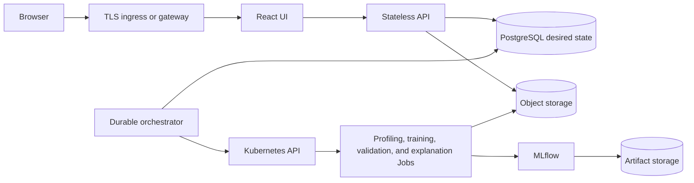

# Sceptre Local Development and Production Readiness

> **Current status:** the provider-neutral Helm chart is the
> supported local Kubernetes and compatibility-test distribution. It is not yet
> a production-certified deployment. Shared non-production use is possible when
> the controls in this guide are supplied by the cluster owner. Internet-facing,
> regulated, or availability-critical production is blocked until the launch
> gates below are satisfied.

A successful `helm install` proves that the application can be packaged and run
on Kubernetes. It does not by itself prove high availability, security,
recoverability, large-dataset safety, or production capacity.

## 1. Purpose and Sources of Truth

This document separates three environments that were previously mixed together:

1. A local product installation for an analyst, developer, or evaluator.
2. A shared non-production installation for integration and acceptance testing.
3. A production-qualified installation with explicit operational ownership and
   evidence.

Use the following documents together:

- [Main README: local Kubernetes quick start](../../README.md#quick-start-on-local-kubernetes)
  is the Windows and Linux installation guide for a complete local Sceptre
  release.
- [Helm chart guide](../../infra/helm/sceptre/README.md) documents chart values,
  image import, external services, GPU profiles, exposure, and upgrades.
- [Kubernetes portability contract](../architecture/kubernetes-portability.md)
  describes the implemented provider-neutral scheduling, RBAC, storage, and
  capability boundary.
- This document defines the promotion contract and the evidence required before
  calling an environment production ready.

### Terminology

- **Local Kubernetes installation** means Sceptre runs inside a Kubernetes
  cluster on one workstation. `http://127.0.0.1:8080` is only the browser address
  created by `kubectl port-forward`.
- **Host-process development** means Vite and/or FastAPI run directly on the
  developer machine for a short edit-test loop. It is not a complete deployment
  model.
- **Production ready** describes a specific application version in a specific
  environment after its required controls and tests pass. It is not an
  application-wide label conferred by Helm.
- **Operator-owned** means the Kubernetes or platform operator must provide and
  validate the capability; the Sceptre chart does not install it.

## 2. Environment Model

| Concern | Local analyst/development | Shared non-production | Production |
| --- | --- | --- | --- |
| Purpose | Learn, develop, and evaluate the complete workflow | Integration, user acceptance, upgrade rehearsal, and realistic workload tests | Approved business workloads with an agreed availability and recovery policy |
| Cluster | Single workstation; one or more local nodes | Shared conformant cluster with namespace isolation | Supported, resilient multi-node cluster with a documented upgrade policy |
| Access | Loopback port-forward over HTTP | Private ingress with TLS and controlled users | Managed TLS ingress or gateway, DNS, authentication, authorization, and traffic policy |
| Values | One local image-distribution profile plus a Git-ignored local secret override | Environment-specific non-secret values and centrally delivered Secrets | Reviewed, version-controlled non-secret production values and externally managed Secrets |
| Images | Locally built and imported images; `pullPolicy: Never` is acceptable | Registry-hosted versioned images | Registry-hosted images pinned by immutable digest, scanned, and signed according to organization policy |
| Data services | Bundled single-replica PostgreSQL, SeaweedFS, and MLflow | Bundled services only for disposable testing; external services for persistent shared data | HA or managed PostgreSQL, object storage, and MLflow with tested backup and recovery |
| Persistence | Local PVCs; retention is convenience, not backup | Explicit retention and backup policy for any important test data | Encryption, retention, backup, point-in-time or equivalent recovery, and restore evidence |
| Scale | One user or a small trusted group; CPU-first | Quotas, metrics, bounded concurrency, and production-like tests | Measured capacity, multi-node failure tolerance, alerts, and documented scaling limits |
| Data | Synthetic, public, or safely de-identified | Synthetic or approved non-production copies | Data classified and governed for the environment |
| Readiness result | Functional local installation | Qualified shared test environment | All launch gates pass with an owner and dated evidence |

### Promotion rules

- Promote the same tested image digests; do not rebuild images per environment.
- Select actively supported LTS or stable runtime lines no more than two major
  releases behind current, and pin the exact patch release or immutable digest.
- Keep local cluster profiles local. `values-local.yaml`, `values-k3d.yaml`,
  `values-kind.yaml`, `values-minikube.yaml`, and `values-microk8s.yaml` change
  image distribution and must never be used as a production base.
- Keep credentials out of values files and source control. Values may name
  existing Secrets, but they must not contain secret material.
- Use a separate release namespace, database, object-store prefix or bucket, and
  MLflow tracking boundary for each environment.
- Do not copy local PVCs into production. Promote immutable datasets and model
  artifacts through an approved, traceable process.
- Do not interpret `ENVIRONMENT=production` as automatic hardening. In the
  current application it only changes a small number of API behaviors; the chart
  does not presently expose this setting correctly.

## 3. What the Current Release Actually Provides

### Implemented baseline

The current compatibility baseline includes:

- A React/Vite UI served by Nginx and a separately containerized FastAPI API.
- One provider-neutral chart at [`infra/helm/sceptre`](../../infra/helm/sceptre)
  with thin local-cluster and accelerator profiles.
- API, UI, MLflow, CPU training, NVIDIA/RAPIDS training, Intel training, and
  generic inference image definitions.
- Bundled single-replica PostgreSQL, SeaweedFS, and MLflow for local use, with
  external PostgreSQL, S3-compatible object storage, and MLflow configuration.
- Revision-specific Alembic migration Jobs, fresh-database bootstrap, a
  13-table schema verifier, and API startup gating on a complete schema.
- Namespace-scoped RBAC, Kubernetes training and analysis Jobs, resource
  requests and limits, adaptive deadlines, job status/log reporting, and
  optional CPU/RAM telemetry.
- CPU-first execution with optional NVIDIA or Intel extended resources and
  cluster-supplied device plugins.
- Optional UI and per-model ingress, optional TLS Secret references, optional
  ResourceQuota and LimitRange, and ClusterIP Services by default.
- Functional React workflows for upload progress, target selection, on-demand
  profiling, training, progressive leaderboards, external validation, SHAP,
  registry promotion, fallback selection, drift analysis, inference deployment,
  deployment status, stopping, and cleanup.
- Model endpoint URLs that remain hidden until the configured exposure mechanism
  reports a usable endpoint.
- An evaluation-stage centralized model-metrics view that aggregates authorized
  deployments, deployment-linked production metrics, drift history, retraining
  lineage, revisioned monitoring policy, and versioned JSON/HTML governance
  snapshots. Monitoring Job resource floors and optional API HPA configuration
  provide bounded scale controls.

The current drift workflow remains analyst initiated. When its registered model
has been deployed, new drift runs attach to that deployment and appear in the
centralized history. Sceptre does not yet supply a scheduled durable monitoring
worker, automatic privacy-controlled inference/ground-truth collection, a
dedicated time-series store, alert delivery, or automatic retraining execution.

### Runtime images and responsibilities

| Current image | Current responsibility |
| --- | --- |
| `sceptre-ui` | React static application and same-origin API proxy |
| `sceptre-api` | HTTP API, authentication, profiling threads, admission, Kubernetes workload creation, and reconciliation |
| `sceptre-training-cpu` | CPU training and analysis Jobs |
| `sceptre-training-nvidia` | NVIDIA CUDA/RAPIDS training Jobs |
| `sceptre-training-intel` | Intel-enabled training Jobs |
| `sceptre-inference` | Generic model-serving Deployment |
| `sceptre-mlflow` | Bundled local MLflow server |
| `sceptre-seaweedfs` | Bundled local S3-compatible object storage, rebuilt from the pinned upstream release with security-fixed Go dependencies |

There is no separate orchestrator, durable queue service, model-builder image, or
worker control plane in the current release. Those are production target
boundaries, not current components.

### Helm and operator ownership

| Helm release owns | Cluster or platform operator owns |
| --- | --- |
| Sceptre UI, API, training configuration, inference configuration, and namespace RBAC | Kubernetes lifecycle, nodes, CNI, DNS, time synchronization, and control-plane availability |
| Bundled development PostgreSQL, SeaweedFS, and MLflow, when enabled | Production-grade database, object storage, MLflow, encryption, backup, and disaster recovery |
| Application schema migration and verification | Database creation and privileges for external services, plus pre-upgrade backups |
| ClusterIP Services and optional Ingress objects | Ingress/Gateway controller, certificates, public DNS, WAF, load balancer, and traffic policy |
| Resource requests/limits and optional namespace quota objects | Metrics Server, monitoring stack, node capacity, autoscaling, and cost controls |
| Optional GPU resource selection | Host drivers, device plugins, compatible nodes, GPU telemetry, and scheduling policy |
| Existing Secret references and imagePullSecret names | Secret manager/controller, rotation, registry authentication, image policy, scanning, and signing |

PVC retention annotations prevent an ordinary Helm uninstall from deleting some
claims. They do not provide replication, backup, encryption, or recovery.

## 4. Current Production Blockers

The following are code or operational gaps, not configuration suggestions.

| Area | Current baseline | Production implication |
| --- | --- | --- |
| Identity | Local email/password authentication includes registration, login, rotating refresh tokens, profile updates, password change, and SMTP-backed reset; self-registration creates verified users, browser tokens use `localStorage`, access tokens default to 24 hours, the log WebSocket accepts a bearer token in its URL, and authentication/reset endpoints have no abuse throttling | Production requires configured SMTP, an approved registration and verification policy, secure browser sessions with no bearer tokens in URLs, shorter access-token exposure, rate limits, and reviewed CSRF/XSS and credential-stuffing controls |
| Password reset — **critical** | For any `ENVIRONMENT` value other than the exact string `production`, the unauthenticated reset-request endpoint returns a valid reset token for the supplied existing email address; the UI offers that requester a direct continuation into password confirmation | Any user who can reach a local, staging, or misconfigured deployment can reset another user’s password and revoke their sessions; environment-name gating is not an acceptable control and the token must never be returned by the API |
| Authorization semantics | Project role checks are centralized, but an administrator can create an `OWNER` share link and stored membership `permissions` are not evaluated by authorization decisions | Define and enforce delegation ceilings, ownership-transfer rules, and any claimed fine-grained permissions; test concurrent share-link use limits |
| Dataset ingestion | The browser reports multipart progress, but Nginx permits 5 GB on upload routes, FastAPI calls `file.file.read()`, and CSV inspection retains unbounded distinct values and row fingerprints | The former 5 GB or 10 GB goal is not a supported current limit; enforce a small bounded limit until memory-safe resumable or direct-to-object-store upload and bounded inspection are implemented |
| Training memory | Training reads complete dataset objects before creating in-memory pandas structures | Raw file size is not a memory requirement; large-data claims require a bounded or distributed implementation and load evidence |
| Profiling durability | Profiling runs in a FastAPI-owned thread pool and incomplete jobs are resumed at API startup | API restarts and multiple API replicas do not provide safe exactly-once or leased execution |
| Scheduling | FastAPI performs admission and creates Kubernetes resources directly; capacity exhaustion is rejected instead of queued | There is no durable fair queue or separately scalable orchestrator |
| Failure domain | All selected candidates run in one training Job and process | One candidate or process failure can affect the complete tournament |
| Availability | API and UI default to one replica; bundled PostgreSQL, SeaweedFS, and MLflow are single replica; there are no PDBs or topology rules | A node or voluntary disruption can interrupt the control plane or data services |
| Network and workload security | No NetworkPolicy is installed; training Jobs do not set a restricted container security context, the GPU image remains root, and training receives platform database and shared object-store credentials | Namespace RBAC alone does not isolate traffic; a parser, dependency, or image compromise can cross tenant and data-service boundaries |
| Secrets | Defaults contain known JWT, PostgreSQL, and object-store credentials, and production mode does not reject them at startup or chart render | Default values are unsafe anywhere shared; production must fail closed on weak/default secrets and use workload-specific, least-privilege credentials |
| Serving security | Generic inference endpoints have no built-in authentication, authorization, rate limit, or request quota; enabling per-model ingress exposes those endpoints directly and bypasses the authenticated platform gateway | Keep model Services internal until every direct path has authentication, authorization, quotas, TLS, logging, abuse controls, and tenant isolation |
| Model artifact integrity | Inference downloads a model object and passes it directly to `joblib.load()` without checking the registered digest | Object-store tampering can become code execution; verify an expected immutable digest before deserialization and use read-only, prefix-scoped serving credentials |
| Application hardening | Readiness and inference handlers return raw exception text, while the UI proxy does not set a reviewed CSP, HSTS, clickjacking, MIME-sniffing, or referrer policy | Public responses can disclose internal details, and browser compromise has greater impact while tokens remain script-readable |
| Model delivery | A Dockerfile is generated as evidence, but no model builder scans, signs, pushes, resolves, or deploys a model-specific immutable image | Current one-click deployment is a functional baseline, not a governed supply-chain boundary |
| Observability | Health probes, run status, logs, optional resource telemetry, deployment-linked metric/drift history, a governance dashboard, and versioned audit evidence exist | Operator alert delivery, durable telemetry retention policy, platform SLOs, and on-call runbooks still require deployment-specific integration and validation |
| Recovery | Retained PVCs and migrations exist; backup/restore automation does not | Restore time, restore point, credential continuity, and rollback are unproven |
| Release safety | Unit/frontend/migration/render CI, image SBOM/provenance generation, and an actionable HIGH/CRITICAL container vulnerability gate exist, but CI has no dependency, secret, or SAST gate and third-party Actions are not commit-pinned | Live cluster upgrade, rollback, disaster recovery, security, performance, supply-chain, and multi-cluster qualification are incomplete |

Relevant implementation evidence:

- [Complete API upload buffering](../../apps/api/automl_api/api/routes/datasets.py)
- [Unbounded upload inspection](../../apps/api/automl_api/services/dataset_inspection.py)
- [Current authentication lifecycle](../../apps/api/automl_api/api/routes/auth.py)
- [Password-reset response schema](../../apps/api/automl_api/schemas/auth.py)
- [Password-reset browser flow](../../apps/ui/react_app/src/Auth.tsx)
- [Training log WebSocket authentication](../../apps/api/automl_api/api/routes/training.py)
- [Project role and share-link authorization](../../apps/api/automl_api/services/projects.py)
- [Browser session storage](../../apps/ui/react_app/src/api.ts)
- [Generic inference application](../../apps/api/automl_api/inference/app.py)
- [API-owned profiling lifecycle](../../apps/api/automl_api/services/profiling_jobs.py)
- [API startup profiling resumption](../../apps/api/automl_api/main.py)
- [Direct Kubernetes training control](../../apps/api/automl_api/services/kubernetes_training.py)
- [GPU training image](../../Dockerfile.training)
- [Current Helm defaults](../../infra/helm/sceptre/values.yaml)
- [Current RBAC boundary](../../infra/helm/sceptre/templates/rbac.yaml)
- [Current chart CI](../../.github/workflows/ci.yml)

## 5. Local Development and Evaluation

### Supported complete local path

Use the [main README quick start](../../README.md#quick-start-on-local-kubernetes).
It performs the complete local product installation:

1. Create or select a conformant local cluster.
2. Pull the versioned Sceptre images from Docker Hub.
3. Verify the cluster can reach the public image repository.
4. Generate a Git-ignored values file with random local credentials.
5. Install one Helm release and wait for bootstrap and migration Jobs.
6. Verify pods, Jobs, PVCs, and the Helm smoke test.
7. Port-forward the UI and open `http://127.0.0.1:8080`.

The chart creates the bundled data services and schema for a fresh local
installation. A developer should not manually create the 13 application tables.

### What localhost does and does not mean

| Item | Meaning |
| --- | --- |
| `kubectl port-forward service/sceptre-ui 8080:80` | Temporary browser access to a UI running in Kubernetes |
| `npm run dev` | UI-only Vite edit loop; it expects an API on `127.0.0.1:8000` |
| `compose.yaml` | PostgreSQL and database bootstrap convenience only; it is not the complete Sceptre stack |
| `.env.example` | Unsafe host-development defaults and variable reference; not a deployable production configuration |
| Local embedded object storage | Useful only for isolated API development; Kubernetes training Jobs cannot read files that exist only on the host |
| A local Helm profile | Image-import behavior for one local distribution; not a security or availability profile |

For end-to-end behavior, prefer the local Helm installation. Host-process
development is appropriate for focused code changes when the developer also
provides every dependency and a usable Kubernetes context.

### Local acceptance criteria

A local installation is successful when:

- the selected Kubernetes context and default StorageClass are correct;
- PostgreSQL, SeaweedFS, MLflow, API, and UI are ready;
- bootstrap and migration Jobs completed;
- `helm test sceptre -n sceptre` passes;
- registration and login work through the UI;
- upload progress is visible and upload returns to project overview;
- target selection immediately shows task type and target visualization;
- profiling starts only when the user requests it;
- a small CPU training run completes and logs metrics/artifacts to MLflow; and
- uninstall/reinstall behavior matches the intended PVC retention decision.

This proves local functionality only. It does not satisfy a production gate.

### Local data lifecycle

Retained PVCs survive a normal Helm uninstall, but deleting the cluster, resetting
Docker Desktop Kubernetes, or deleting PVCs destroys local data. Preserve the
same generated secret override when reconnecting to retained PostgreSQL and
SeaweedFS claims. Keep local `.env` and secret override files readable only by their
owner, for example mode `0600` on Linux. Use only disposable or separately
backed-up data locally.

## 6. Shared Non-Production

A shared development, integration, or acceptance environment is the bridge
between a workstation and production. At minimum:

- use registry-hosted versioned images, never local `pullPolicy: Never` profiles;
- replace all default credentials with centrally delivered existing Secrets;
- disable open self-registration unless the test explicitly covers it;
- keep the environment on private networking with TLS ingress and controlled
  identity;
- set ResourceQuota, LimitRange, concurrency, and training resource bounds;
- provide Metrics Server and central application/workload logs;
- use a separate database, object-store bucket/prefix, MLflow boundary, and
  namespace;
- establish data classification, expiry, and cleanup rules;
- back up any data that cannot be recreated;
- exercise schema migration, application upgrade, rollback decision-making, and
  restore before a production release;
- test the same ingress, storage, registry, GPU, and secret-delivery classes
  intended for production; and
- record known deviations so a non-production success is not mistaken for
  production evidence.

Bundled PostgreSQL, SeaweedFS, and MLflow are acceptable for disposable shared tests.
They are not a high-availability architecture.

## 7. Production Qualification Target

The following is an acceptance target, not a current performance claim:

- at least 15 concurrently active users;
- datasets around 10 GB without buffering complete uploads in browser or API
  memory;
- durable admission and fair queueing when compute is unavailable;
- four concurrent large compute workloads as an initial measured baseline, with
  additional work queued;
- reproducible models from immutable data, code, configuration, dependencies,
  and images;
- recovery after API, worker, node, database, and object-store disruptions; and
- one versioned Helm release composed of independently scalable runtime
  responsibilities.

Fifteen simultaneous 10 GB in-memory training Jobs are not implied. Feature
expansion and estimator choice can make working memory many times larger than
the raw file. Capacity must be measured with representative datasets and model
selections.

### Target production control boundary

The present API owns HTTP handling, profiling, admission, and Kubernetes
reconciliation. The production target separates those responsibilities:



Required properties of the target boundary:

- PostgreSQL is authoritative for workflow state.
- Object storage is authoritative for datasets and large artifacts.
- API and UI processes do not own durable background work.
- Work is leased, idempotent, recoverable, and queued instead of rejected solely
  because a worker is temporarily unavailable.
- API and orchestrator use separate service accounts and least-privilege
  permissions.
- Training and inference receive workload-specific, narrowly scoped data access.
- Inference traffic is authenticated, authorized, rate-limited, monitored, and
  isolated from the control plane.
- Model promotion and deployment remain explicit governed actions; leaderboard
  rank does not automatically approve production use.

## 8. Production Configuration Contract

There is intentionally no `values-production.yaml` in the repository today.
Shipping one would imply that unresolved organization-specific decisions and
current blockers can be solved by defaults. A production values file must be
created and reviewed for the destination environment after the blockers are
closed.

### Values that production must define

| Concern | Required production decision |
| --- | --- |
| Images | Reachable authenticated registry and immutable digest for every Sceptre runtime image |
| API/UI scale | Replica, disruption, and placement policy proven safe by multi-replica tests |
| PostgreSQL | `postgresql.enabled=false`, external connection Secret, TLS, HA, backup, restore, and migration privileges |
| Object storage | `seaweedfs.enabled=false`, pre-provisioned bucket, TLS endpoint, existing Secret or future workload identity, retention, versioning, and recovery |
| MLflow | `mlflow.enabled=false` with an external protected tracking service and durable artifact store |
| Authentication | Open registration and verification policy, approved account provisioning, secure token/session policy, identity integration, and login/registration/reset throttling |
| Exposure | UI ingress/gateway class, trusted certificate, DNS, proxy limits/timeouts, security headers, error redaction, and request protection |
| Model serving | Internal-only ClusterIP unless an authenticated gateway and endpoint policy are ready |
| Resources | API/UI requests, training resource classes, namespace quotas, node pools, and bounded concurrency |
| Storage | Explicit StorageClass only for any remaining PVC-backed component; encryption and recovery validated |
| Capabilities | Metrics, ingress, GPU, PriorityClass, and read-only cluster observation enabled only when installed and approved |

### Secret contract

Prefer existing Secrets populated by an external secret-management process:

| Reference | Required keys |
| --- | --- |
| `auth.existingSecret` | `JWT_SECRET_KEY` |
| `platform.existingSecret` | `DATABASE_URL` and, only when bundled MLflow is used, `MLFLOW_DATABASE_URL` |
| `externalObjectStore.existingSecret` | Configured access-key and secret-key fields |
| `global.imagePullSecrets` | Registry credentials in Kubernetes pull-secret format |

Current external object storage uses an S3-compatible static-key adapter. It
does not yet provide native Azure Blob/GCS adapters, cloud workload identity,
session-token handling, or chart-managed custom CA mounts. Do not claim those
capabilities until their implementation and tests exist.

Production startup and Helm validation must reject missing, known-default, or
insufficiently strong JWT and configured database, object-store, and SMTP
credentials. Merely placing a default value in a Kubernetes Secret does not make
it secret.

Pre-create the production bucket and grant only the required object operations.
The current health check attempts to create the bucket when it is absent, so
bucket existence and least-privilege behavior must be verified with the exact
credentials used by Sceptre.

### Identity and environment mode

`auth.simpleAuthEnabled=false` disables self-registration; it does not configure
OIDC, SSO, MFA, user provisioning, rate limiting, or a secure browser session
mechanism. The chart now defaults `ENVIRONMENT` to `production`, which suppresses
development API documentation and reset-token responses. That string comparison
is too fragile to protect an account-recovery credential: the current
`reset_token_for_dev` response permits cross-user account takeover in every
non-production environment and in production if the environment is misspelled.

Remove `reset_token_for_dev` from the response schema and browser flow in every
runtime mode. A reset token may leave the server only through the account
owner’s verified recovery channel. If that channel is unavailable, return the
same generic response without exposing a token or reset continuation. Disable
local-password reset for identities that are not allowed to authenticate with a
local password. Reset requests must remain indistinguishable for existing and
unknown accounts, be rate-limited, and avoid placing reusable credentials in
proxy logs, referrers, or browser history.

Production mode also does not validate secrets or harden sessions. Production
identity therefore remains an implementation and security-review gate.

### Exposure

- Keep UI, API, dependencies, and model Services as ClusterIP by default.
- Port-forwarding is a local diagnostic method, not production ingress.
- Terminate trusted TLS at an approved ingress or gateway and encrypt upstream
  database, object-store, and MLflow connections.
- Apply reviewed CSP, HSTS, clickjacking, MIME-sniffing, and referrer policies,
  and return stable public errors without raw dependency or infrastructure text.
- Rate-limit login, registration, password reset, uploads, and prediction paths
  at the edge, with application-level quotas where tenant identity matters.
- Configure upload size, streaming, timeout, and body-buffering behavior at every
  proxy only after the API ingestion path is memory safe.
- Do not expose a generated inference Service until endpoint authentication,
  authorization, request limits, tenant isolation, logging, and abuse controls
  pass.
- Verify the registered SHA-256 digest before deserializing every model artifact;
  serving identities must have read-only access only to their approved prefix.
- Continue to hide endpoint links until Kubernetes and the configured exposure
  mechanism report a usable endpoint.

## 9. Database, Migrations, Upgrade, and Rollback

### Fresh local database

For bundled PostgreSQL, the chart:

1. creates the `automl` database and bootstraps the `mlflow` database;
2. runs `alembic upgrade head` in a revision-specific Job;
3. verifies the Alembic head and all registered application tables; and
4. prevents the API from serving until verification passes.

### External database

The platform operator must create the database, network policy, TLS trust,
credentials, and backup policy before installation. The migration identity must
be able to create and alter application schema objects. Runtime and migration
credentials should be separated in the production target even though the
current chart uses one database Secret.

### Upgrade procedure

For every shared persistent or production-like environment:

1. Record the current chart version, image digests, Alembic revision, values
   commit, and dependency versions.
2. Complete and verify a database backup and object/artifact recovery point.
3. Render the proposed release and inspect image, RBAC, Secret reference,
   Service, Ingress, resource, and migration changes.
4. Rehearse the upgrade against a restored non-production copy.
5. Apply the Helm upgrade and wait for migration Jobs.
6. Verify the schema, API readiness, UI proxy, MLflow connectivity, object-store
   access, and a representative workflow.
7. Hold or roll forward if a schema change is not backward compatible. A Helm
   rollback does not reverse a database migration.

Example inspection commands:

```bash
helm lint infra/helm/sceptre
helm template sceptre infra/helm/sceptre \
  --namespace sceptre \
  --values path/to/environment-values.yaml \
  > /tmp/sceptre-rendered.yaml

helm upgrade --install sceptre infra/helm/sceptre \
  --namespace sceptre \
  --create-namespace \
  --values path/to/environment-values.yaml \
  --wait --wait-for-jobs --timeout 20m

kubectl -n sceptre get deployments,statefulsets,pods,jobs,pvc
kubectl -n sceptre logs job/sceptre-migrate-RELEASE_REVISION
kubectl -n sceptre rollout status deployment/sceptre-api
helm test sceptre -n sceptre
```

The exact generated resource prefix can change with release/name overrides.
Discover the migration Job with `kubectl -n sceptre get jobs` rather than
copying a guessed name into automation.

### Backup and recovery evidence

PVC retention is not a backup. Before production, prove:

- automated PostgreSQL backups and point-in-time or approved equivalent recovery;
- object and MLflow artifact versioning/retention appropriate to the business;
- encrypted backups with independent credentials and lifecycle policy;
- restoration into a clean environment;
- consistency between database metadata, dataset objects, MLflow artifacts, and
  registered models;
- credential and encryption-key recovery;
- documented RPO and RTO achieved during a timed exercise; and
- restore and disaster-recovery runbooks executable by the on-call team.

## 10. Production Launch Gates

Each gate needs a named owner, evidence location, test date, application/chart
version, environment, result, and accepted exception expiry. “Configured” is not
evidence; a test result is.

| Gate | Required evidence | Current status |
| --- | --- | --- |
| Packaging | Reproducible images, commit-pinned CI Actions, Helm render/install, digest manifest, SBOM, dependency/secret/SAST/container scans, and signature verification | **Blocked** |
| Identity | Approved identity, account lifecycle, no reset token in any API response or log in any runtime mode, verified recovery-channel delivery, cross-user reset denial, rejection of default secrets, secure browser sessions, abuse throttling, role-delegation constraints, and authorization tests | **Blocked** |
| Ingestion | Resumable or direct memory-bounded upload through all proxies with interruption/retry tests | **Blocked** |
| Durable work | Leased persistent queue/orchestrator, idempotency, restart recovery, and multi-replica correctness | **Blocked** |
| Availability | Multi-node placement, safe replicas, PDBs, dependency HA, and node/disruption tests | **Blocked** |
| Data protection | Encryption, least privilege, automated backups, successful clean restore, and RPO/RTO evidence | **Blocked** |
| Kubernetes security | Restricted non-root workload posture, service-account and data-credential isolation, NetworkPolicies, admission policy, and RBAC review | **Blocked** |
| Serving security | Authenticated and authorized inference, rate/request limits, tenant isolation, model-digest verification before deserialization, and safe endpoint lifecycle | **Blocked** |
| Platform observability | Central logs/metrics/traces, platform dashboards, alerts, SLOs, audit export, and actionable runbooks | **Blocked** |
| Model observability and governance | Deployment-anchored performance/drift timelines, governed retraining, versioned governance reports, monitoring-scale tests, scoped roles, and audit evidence defined in Section 15 | **Blocked** |
| Capacity | Representative 10 GB and concurrency tests with CPU, memory, disk, object-store, DB, and queue measurements | Unqualified |
| Upgrade/recovery | Backward-compatible migration rehearsal, rollback decision test, dependency failure test, and DR exercise | Partial |
| Model governance | Immutable lineage, approval, external validation, explainability, scan/sign/deploy evidence, monitoring, and rollback policy | Partial |

No internet-facing or regulated production launch may proceed while a **Blocked**
gate remains. A lower-risk internal deployment still needs an explicit security
and data-owner decision; renaming it “production” does not remove the gaps.

### Functional acceptance journey

At minimum, a release candidate must prove:

1. Registration policy, login, refresh, logout, authorization, project
   isolation, and recovery-channel-only password reset behave as configured;
   requesting another user’s reset never reveals a token or permits takeover.
2. Upload shows real transfer progress, persists the exact object, and returns to
   project overview without starting profiling.
3. Selecting a target immediately shows the inferred task and appropriate target
   visualization; profiling starts only on explicit user action.
4. Feature profiling renders numeric, categorical, and text diagnostics without
   blocking the API control plane.
5. Every selected model appears in the leaderboard as pending, running,
   succeeded, or failed with stable unique ranks and phase/resource progress.
6. Successful candidates, metrics, parameters, artifacts, and registered models
   are visible and consistent in MLflow.
7. SHAP results are bound to the selected run and model and refresh without a
   manual browser reload.
8. External validation and drift accept uploaded comparison data only after
   schema compatibility checks.
9. Deployment requires the intended approval state, reports its real phase, and
   reveals no endpoint before readiness and exposure succeed.
10. Backup, restore, upgrade, workload retry, cleanup, and failure diagnostics
    preserve or remove state exactly as policy specifies.
11. A deployed model records operational and model-monitoring evidence against
    its deployment and immutable model version, raises a test drift alert,
    creates a governed retraining proposal, and produces a reproducible
    governance report without crossing project authorization boundaries.

### Reliability and failure tests

Test at least:

- API restart during upload, profiling, training, validation, and deployment;
- duplicate user requests and controller retries;
- worker eviction, node loss, unschedulable resources, deadline, and OOM;
- PostgreSQL failover/unavailability and recovery;
- object-store and MLflow latency, denial, and outage;
- ingress/gateway and certificate failure;
- login/reset/upload/prediction abuse at configured rate and size limits;
- reset requests for existing and unknown accounts produce indistinguishable
  public responses, and a requester cannot reset another user’s password;
- reset tokens never appear in API responses, application/proxy logs, referrers,
  or browser history in local, shared, or production modes;
- Metrics Server and GPU telemetry absence;
- GPU resource unavailable with expected CPU fallback or explicit rejection;
- stale Kubernetes resources versus database state;
- migration failure before API rollout;
- restore into an empty namespace/cluster;
- model endpoint failure with rollback or safe traffic removal;
- tampered model artifact rejection before deserialization;
- compromised training or inference workload containment without cross-project
  database or object-store access;
- monitoring-store latency or outage, stale/missing inference telemetry, delayed
  labels, duplicate monitoring windows, failed alert delivery, and safe backfill;
- drift-job retry and scheduler overlap without duplicate metrics, alerts, or
  retraining proposals;
- governance-report regeneration, evidence cutoff, integrity verification, and
  denial of cross-project or unauthorized export.

## 11. Validation Commands and Evidence

The repository CI currently supplies useful compatibility evidence, not
production certification:

```bash
ruff check apps packages alembic scripts tests
pytest tests/ -v --tb=short --cov --cov-fail-under=40
python -m compileall apps packages alembic scripts tests

npm --prefix apps/ui/react_app ci
npm --prefix apps/ui/react_app test -- --run
npm --prefix apps/ui/react_app run lint
npm --prefix apps/ui/react_app run build

helm lint infra/helm/sceptre
for profile in infra/helm/sceptre/values*.yaml; do
  helm template sceptre infra/helm/sceptre \
    --namespace sceptre \
    --values "$profile" \
    > /dev/null
done
helm template sceptre infra/helm/sceptre \
  --namespace sceptre \
  --values infra/helm/sceptre/examples/values-external.yaml \
  > /dev/null
helm template sceptre infra/helm/sceptre \
  --namespace sceptre \
  --values infra/helm/sceptre/examples/values-capabilities.yaml \
  > /dev/null
```

Production qualification must add live-cluster tests for the selected Kubernetes
minor, CNI, CSI, ingress/gateway, registry, secret delivery, external services,
and accelerator profiles. Run install, upgrade, failure, rollback-decision,
backup, restore, load, and security tests on the same classes of infrastructure
used in production.

Retain at least:

- chart package and rendered manifest;
- immutable image digest manifest, SBOM, dependency/secret/SAST/container scan,
  and signature results;
- values commit with Secret names but no secret values;
- database migration and schema verification results;
- functional and authorization reports;
- load-test dataset description and capacity report;
- backup and restore timestamps;
- security review and penetration-test findings;
- dashboards, alert tests, SLO report, and runbook exercise;
- model lineage, approval, validation, explainability, and deployment evidence;
  and
- release approval with owners and exception expiries.

## 12. Prioritized Readiness Roadmap

### P0: production launch blockers

- Make runtime environment explicit in Helm and suppress every development-only
  response in production; reject default or weak secrets before startup.
- Remove `reset_token_for_dev` from the API and UI in every environment; deliver
  single-use reset tokens only through the verified recovery channel and leave
  reset unavailable when that channel is not configured.
- Implement approved identity and secure browser sessions; rate-limit identity,
  upload, and prediction paths.
- Replace API-buffered uploads with bounded inspection and resumable or direct
  object-store ingestion.
- Move profiling and workload reconciliation into durable leased execution and
  prove multiple API replicas safe.
- Separate API, orchestrator, training, and inference identities and credentials.
- Add production Pod security, NetworkPolicies, PDBs, topology placement, and
  safe replica controls.
- Keep model Services internal, verify model digests before deserialization, and
  expose inference only through an authenticated, authorized gateway.
- Qualify external HA data services, backup/restore, encryption, and least
  privilege.
- Add dependency, secret, SAST, and container scanning; pin third-party CI
  Actions and verify release signatures.
- Add central telemetry, alerts, audit export, SLOs, and runbooks.
- Establish the deployment-anchored monitoring event schema, privacy and
  retention controls, versioned thresholds, audit events, and governance-report
  integrity contract in Section 15.

### P1: scale and governed delivery

- Isolate candidates or add recoverable candidate checkpoints.
- Build, scan, sign, push, and deploy immutable model-specific artifacts.
- Add canary/traffic policy, automated health rollback, endpoint quotas, and
  prediction monitoring.
- Add the centralized model dashboard, scheduled drift Jobs, governed retraining
  proposals, auditor views, and versioned JSON/HTML/PDF governance reports.
- Measure the target dataset/concurrency envelope and define resource classes,
  queue fairness, and cost limits.
- Add live install/upgrade/restore/security/performance qualification to release
  CI.

### P2: extended portability

- Qualify managed-cloud and on-premises profiles with TLS external PostgreSQL.
- Add workload-identity and native object-store adapters where required.
- Add custom CA, private registry, offline bundle, and air-gapped procedures.
- Qualify at least one ingress and one Gateway API implementation if both are
  declared supported.
- Publish a support matrix for Kubernetes minors, CNIs, CSIs, GPUs, and external
  service versions.

## 13. Definition of Production Ready

Sceptre is production ready for a named environment only when:

- all P0 blockers are closed or replaced by formally approved equivalent
  controls;
- every launch gate passes with current evidence;
- the exact release has completed install, upgrade, failure, recovery, security,
  and representative load qualification;
- the restore exercise meets the approved RPO and RTO;
- operations, security, data, and model-risk owners approve the release;
- monitoring, alerts, escalation, rollback, and disaster-recovery runbooks are
  active; and
- the model observability and governance gate in Section 15 passes for every
  environment in which that capability is claimed; and
- no local-only image, credential, port-forward, bundled single-replica data
  service, or unprotected model endpoint remains in the production path.

None of the current local Helm profiles satisfies this definition. Local Sceptre
is ready for development and evaluation; production readiness remains a measured
environment-specific promotion decision.

## 14. Production Capability Modes

A production capability mode is an environment-scoped contract, not a UI toggle
or an application-wide marketing label. Each mode must publish one of these
states for the exact release and environment:

| State | Meaning |
| --- | --- |
| `unavailable` | Required implementation or controls are absent; the UI must not imply that the capability is production ready |
| `evaluation` | The workflow can be tested with approved non-production data, but its production gate has not passed |
| `qualified` | The capability gate passed with owners, dated evidence, limits, runbooks, and an exception record |
| `suspended` | A previously qualified mode was withdrawn because evidence expired, a control failed, or an incident requires review |

Capability state must be visible to operators and must fail closed. Enabling a
feature flag, installing a metrics backend, or naming an environment
`production` cannot move a mode to `qualified`. Evidence has an expiry date and
must be renewed after material architecture, dependency, data-contract, or risk
changes.

The centralized model observability and governance mode defined below is in
`evaluation` in the current release. The dashboard, deployment metric ingestion,
revisioned configuration, drift linkage, and governance snapshots form a usable
vertical slice, but the production gate and durable scheduled execution remain
open.

## 15. Centralized Model Observability and Governance Mode

### 15.1 Objective, scope, and personas

This mode provides a production-capable, centralized view of deployed-model
health, performance, drift, retraining, and lifecycle evidence across projects.
It is subject to the same availability, security, privacy, recovery, and audit
standards as the rest of the platform.

The intended personas are:

- **Analysts and project viewers:** see authorized project/deployment metrics,
  explanations, alerts, validation, and governance reports. Analysts may propose
  retraining but cannot approve their own production promotion.
- **Project owners:** configure deployment monitoring within operator-defined
  bounds, acknowledge alerts, and approve project-scoped workflow decisions.
- **Platform administrators:** see authorized cross-project summaries, manage
  resource envelopes and global policies, and approve sensitive production
  actions according to separation-of-duty policy.
- **Audit/compliance readers:** have read-only access to approved reports,
  lineage, audit events, and exports without access to raw inference payloads by
  default.

The dashboard must support an administrator-scoped global view and
project-scoped views. A global view is never implemented by bypassing project
authorization; it uses an explicit privileged role and records access/export
events.

### 15.2 Deployment-anchored identity and lineage

For every deployed model, Sceptre must treat the deployment attempt as the
operational anchor and the immutable model version as the lineage anchor. Every
monitoring or governance record carries, at minimum:

- `project_id`;
- `deployment_run_id`, unique for one deployment attempt;
- `model_version_id`, resolving to an immutable registry/model artifact;
- `environment` and endpoint or traffic-policy identity; and
- creation time plus the creating service/user identity.

The following must attach to both `deployment_run_id` and `model_version_id`:

- performance and prediction metrics over time;
- operational metrics correlated to the serving workload;
- drift Jobs, windows, baselines, outputs, and alerts;
- monitoring configuration and every configuration revision;
- retraining triggers, work items, runs, comparisons, approvals, promotions,
  rollbacks, and rejections;
- explainability, external-validation, fairness, and leakage evidence included
  in governance decisions; and
- governance report records, exports, and evidence manifests.

IDs must never be silently reused. A redeployment, promotion to another
environment, canary, or rollback creates a distinct deployment record and a
timeline relationship to its predecessor. Stopping a deployment freezes its
history; it does not delete or re-parent evidence. Aggregation by model version
is allowed only after deployment-specific records remain recoverable.

Required attachment invariants:

1. Every monitoring write is authorized against the record's `project_id` and
   verifies that the deployment and model version agree.
2. A metric, artifact, alert, or report without a resolvable deployment is
   rejected or quarantined; there are no floating monitoring records.
3. Idempotency keys prevent scheduler overlap, retries, or at-least-once message
   delivery from duplicating a monitoring window, alert, retraining proposal, or
   report generation.
4. Database records point to immutable object/MLflow artifacts by digest or
   version, not only by a mutable path or display name.
5. Deletion and retention preserve referential and audit integrity while meeting
   approved privacy and legal-erasure policy.

### 15.3 Monitoring configuration contract

Monitoring configuration is versioned per deployment and contains:

- enabled operational, data-quality, performance, prediction, and drift metrics;
- schedule, event or label source, baseline dataset/model version, analysis
  window, minimum sample size, and segment definitions;
- warning/critical thresholds, directionality, consecutive-window rule,
  hysteresis, cooldown, and missing-data behavior;
- alert destination, severity, owner, acknowledgement deadline, and escalation
  policy;
- retraining proposal conditions and approval policy;
- data capture, sampling, redaction, retention, residency, and access policy;
- monitoring Job resource class, deadline, retry policy, and priority; and
- configuration author, approval, effective time, expiry, and reason for change.

Threshold changes are prospective and auditable. Historical charts and reports
must resolve the threshold revision effective for each window rather than
rewriting history with the newest value. Configuration must be validated against
operator-defined bounds so one project cannot request unsafe frequency,
retention, cardinality, or compute.

### 15.4 Metrics and monitoring-data contract

The platform must distinguish three evidence classes:

| Evidence | Examples | Preferred source |
| --- | --- | --- |
| Operational | request count, latency distribution, errors, saturation, CPU/RAM/GPU, pod restarts | OpenTelemetry/Prometheus-compatible service telemetry |
| Model behavior | prediction distribution, abstention, confidence, class balance, feature/schema quality | privacy-controlled inference event pipeline and monitoring store |
| Measured performance | accuracy, F1, ROC-AUC, calibration, RMSE, MAE, business outcome | predictions joined to trustworthy delayed ground truth |

Training metrics in MLflow are not production performance metrics. MLflow
remains the source for experiment parameters, training/evaluation metrics, and
artifacts; it must not be the only store for high-volume deployment telemetry.
A production design normally uses a metrics system for operational series and a
time-series/analytical monitoring store for model windows and evidence, with
PostgreSQL retaining authoritative configuration and lifecycle state.

Every aggregated model metric records:

- project, deployment, model version, metric name and metric schema version;
- window start/end, event time and computation time, timezone, sample count,
  missing/late count, and optional approved segment;
- value, unit, aggregation/statistical method, threshold revision, and status;
- baseline/reference identity where applicable; and
- computation Job, code/image version, input snapshot, and artifact lineage.

Metric labels must have bounded cardinality. User IDs, raw feature values,
request IDs, and unrestricted model/project names must not become Prometheus
labels. Detailed evidence belongs in access-controlled storage with retention
limits.

Performance is `unknown`, not healthy, until sufficient trusted ground truth is
available. The UI must show label coverage, label delay, window completeness,
last successful computation, and telemetry freshness so missing data cannot look
like good model health.

### 15.5 Privacy, security, and inference evidence

Monitoring does not grant permission to retain every inference request. Before
collection, the data owner must approve:

- whether raw features, transformed features, predictions, labels, or only
  aggregates may be stored;
- purpose, lawful/approved use, data classification, residency, sampling,
  minimization, redaction/tokenization, retention, and deletion behavior;
- field-level access and whether auditors can see only aggregates;
- encryption and key ownership in transit, at rest, and in backups; and
- controls preventing secrets, free-text PII, or protected attributes from
  appearing in logs, traces, metrics labels, alerts, or exported reports.

Inference events need an opaque join key and event time so delayed outcomes can
be attached without exposing identity in monitoring metrics. The collection path
must validate schema fingerprints, tolerate late/out-of-order events, quarantine
malformed data, deduplicate retries, and measure its own loss and lag. Reported
monitoring results must state when sampling or redaction changes their meaning.

### 15.6 Centralized dashboard behavior

The React UI, backed by RBAC-enforcing FastAPI aggregation endpoints, must offer:

- a privileged cross-project summary and authorized project/deployment views;
- filters for environment, project, deployment status, model/version, task,
  owner, alert severity, and time range;
- time series for appropriate task performance metrics, operational latency,
  throughput/errors/resources, prediction behavior, and feature/global drift;
- visible thresholds, configuration revisions, data completeness, stale-data
  warnings, degradation events, and uncertainty/sample size;
- a single event timeline for retraining, model/version deployment, canary or
  champion-challenger decisions, approval, rollback, threshold changes, drift
  alerts, acknowledgement, and incident response; and
- drill-down into the exact run, model version, external validation, SHAP or
  other explanation, drift artifact, alert, and governance report.

Charts must not compare incompatible metric definitions, task types, segments,
baselines, or time windows. Expensive cross-project queries require bounded time
ranges, pagination/downsampling, query limits, caching where safe, and tests that
authorization is applied before aggregation. Exported dashboard data carries the
same classification, authorization, and audit requirements as the UI.

### 15.7 Drift Jobs and alert lifecycle

Scheduled drift work is a first-class durable workflow. A drift execution record
contains `drift_job_id`, project/deployment/model IDs, monitoring-config revision,
baseline ID, current window, schedule and actual start/end, resource class,
status, retry/attempt, code/image version, metrics, artifacts, and failure
diagnostics.

Each drift definition must document:

- reference dataset/window and why it is appropriate;
- feature/schema and prediction drift methods, bins/categories, distance or
  statistical tests, and task-specific interpretation;
- minimum sample and missing/new-category behavior;
- warning/critical thresholds, consecutive windows, multiple-comparison control,
  seasonal/segment expectations, and false-positive review; and
- limitations: drift does not by itself prove performance degradation or
  causality.

External comparison uploads must pass column, semantic-type, target-presence,
schema fingerprint, privacy, and supported-size validation before computation.
Scheduled production checks must use an approved data source rather than depend
on an analyst uploading a file.

Alert state follows a recorded lifecycle such as `open`, `acknowledged`,
`investigating`, `resolved`, or `suppressed`. Deduplication, suppression windows,
ownership, escalation, delivery attempts, acknowledgement, resolution evidence,
and threshold changes are auditable. Alert delivery failure is itself monitored.

### 15.8 Governed retraining

A threshold breach creates a retraining proposal or work item; it must not
silently promote a replacement model. The proposal references the triggering
deployment, windows, alerts, configuration revision, intended dataset cutoff,
and approval policy.

The retraining workflow must enforce:

- cooldown, deduplication, budget, per-project/global concurrency, and loop
  prevention so repeated windows cannot create a retraining storm;
- immutable data/code/configuration/dependency lineage and the same leakage,
  validation, fairness, explainability, and security checks required for a new
  model;
- champion-challenger comparison against the deployed model using approved
  metrics, segments, holdouts, and business constraints;
- explicit authorized approval before production promotion, with
  separation-of-duty where policy requires it; and
- canary/traffic decision, rollback criteria, rejection reason, and outcome
  attached to both the source deployment and replacement deployment.

An organization may approve narrowly defined automatic rollback or traffic
removal for safety, but automatic training is never equivalent to automatic
production approval.

### 15.9 Scalable and fair execution

Scaling must preserve deployment attachment, authorization, idempotency, quota,
and audit guarantees:

- Kubernetes Jobs/CronJobs or durable orchestrator work items execute bounded
  drift/report computations. Jobs scale through queue depth, controlled
  parallelism, resource classes, and, if adopted, a Job-aware controller such as
  KEDA—not through an HPA attached directly to a completed Job.
- HPA may scale long-running API, event-collector, scheduler, or monitoring-worker
  Deployments using suitable CPU/memory or custom queue/latency metrics.
- Larger CPU/memory/GPU resource classes are operator-defined and exposed through
  Helm values. GPU is used only when the selected algorithm/runtime supports it;
  resource choice must not change metric semantics or reproducibility silently.
- Namespace and project quotas, priority classes, maximum concurrency, deadlines,
  retries, backoff, and preemption policy prevent monitoring or retraining from
  starving inference and control-plane workloads.
- Backpressure must degrade safely: queued or stale monitoring is clearly shown,
  ingestion is bounded, and unavailable capacity never causes evidence to be
  attached to the wrong deployment or dropped without a signal.

Capacity evidence includes sustained and burst inference telemetry, scheduler
overlap, queue backlog, Job fan-out, cross-project fairness, data-store query
load, report generation, HPA/worker scale-up and scale-down, cost/resource
envelopes, and recovery after worker/node/store failure.

### 15.10 Governance report contract

Governance reports are generated per deployment while retaining the immutable
model-version lineage. A report is a versioned evidence snapshot with an
`evidence_cutoff_at`; new monitoring evidence creates a new report version and
never mutates an already approved/exported report.

Each report includes, where applicable:

- report/project/deployment/model IDs, environment, endpoint, owners, approvers,
  dates, intended use, prohibited uses, limitations, risk classification, and
  current lifecycle state;
- source/code revision, dependency and image digests, model artifact digest,
  registry history, approval, deployment, canary, promotion, rollback, and
  retirement history;
- immutable training/validation dataset versions, provenance, collection/time
  windows, classification, consent/approved purpose, quality and sampling;
- preprocessing, imputation, encoding, scaling, text handling, feature
  engineering/selection, feature catalog, and excluded columns with reasons;
- algorithms, search/tuning strategy, parameters, resource/runtime details,
  split/holdout method, task-appropriate metrics, uncertainty, and external
  validation;
- global and approved representative local explanations, explanation method and
  limitations, plus bias/fairness evaluations and protected-group policy where
  lawful and applicable;
- data, feature, target, temporal, split, and duplicate leakage checks, results,
  mitigations, residual risks, and approval of accepted exceptions;
- monitoring configuration revisions, data/label coverage, metric and drift
  methods, thresholds, alert/response history, retraining decisions, incidents,
  and evidence through the report cutoff; and
- open risks, exceptions with owner/expiry, monitoring/SLO status, rollback and
  retirement plan, and final approvals.

Delivery formats are machine-readable versioned JSON (and optionally YAML) plus
accessible human-readable HTML and PDF. The canonical JSON schema is versioned.
Every format records generator version, generation time, evidence cutoff,
content/evidence-manifest digests, and signature/attestation where policy
requires it. PDF/HTML is rendered from the same canonical snapshot and verified
against its digest; it is not an independently edited source of truth.

Generating a report does not certify legal or regulatory compliance. The report
states missing/not-applicable evidence explicitly and requires the named model
risk, security, data, operations, and compliance owners appropriate to the
environment.

The Operations UI provides **Governance & audit** actions to generate a report,
view current and historical versions, verify integrity, and download authorized
formats. Generation and export are audit events.

The Results UI also provides a candidate-scoped evaluation artifact for every
leaderboard model. Its printable HTML and canonical JSON include target-profile
evidence, the executable feature-processing branch, leakage exclusions,
training-pipeline state, algorithm mathematics, metrics/diagnostics, normalized
global SHAP magnitude, and a directional sample waterfall when model-specific
SHAP evidence exists. Missing evidence is explicit and never borrowed from a
different model. This point-in-time download is useful for review, but it is not
yet a signed, retained, versioned governance snapshot and therefore does not
satisfy the production gate by itself.

### 15.11 Access control and auditability

Add an explicit read-only audit/compliance role rather than overloading platform
admin. Effective permissions must cover global summary, project/deployment
details, raw monitoring evidence, configuration changes, alert actions,
retraining proposal/approval, governance generation, integrity verification, and
export. Sensitive actions require recent authentication or equivalent controls
where organizational policy demands it.

At minimum, immutable or tamper-evident audit events capture:

- actor/service identity, effective role, project/deployment/model IDs, action,
  object ID/version, event and receipt time, request/correlation ID, source, and
  outcome;
- before/after digest or safe structured change for monitoring configuration,
  threshold, suppression, approval, promotion, rollback, and retention changes;
- alert acknowledgement/resolution, retraining trigger/decision, report
  generation/integrity verification/export, and privileged dashboard/export
  access; and
- denied attempts and policy failures without logging tokens, secrets, or raw
  protected data.

Audit storage has independent retention, access, backup, clock-synchronization,
integrity, and export controls. Application administrators must not be able to
silently alter audit history. Audit queries and exports are themselves audited.

### 15.12 API and persistence boundary

The target API keeps every deployment-specific route under the existing project
and deployment URL boundary:

```text
GET   /projects/{project_id}/operations/deployments/{deployment_run_id}/monitoring/metrics
GET   /projects/{project_id}/operations/deployments/{deployment_run_id}/monitoring/drift
GET   /projects/{project_id}/operations/deployments/{deployment_run_id}/monitoring/config
PUT   /projects/{project_id}/operations/deployments/{deployment_run_id}/monitoring/config
GET   /projects/{project_id}/operations/deployments/{deployment_run_id}/monitoring/alerts
POST  /projects/{project_id}/operations/deployments/{deployment_run_id}/retraining/proposals
GET   /projects/{project_id}/operations/deployments/{deployment_run_id}/governance/reports
POST  /projects/{project_id}/operations/deployments/{deployment_run_id}/governance/reports
GET   /projects/{project_id}/operations/deployments/{deployment_run_id}/governance/reports/{report_id}
```

The public contract uses opaque IDs, pagination, bounded time ranges, explicit
timezone/window semantics, consistent problem responses, and idempotency keys on
write/generation operations. An administrator-only aggregate endpoint may power
the global dashboard, but returned records retain their deployment identity and
are filtered before aggregation.

The conceptual persistence model separates:

- deployment and immutable model-version lineage;
- versioned monitoring configuration;
- inference/label evidence or privacy-preserving aggregates;
- metric windows and drift executions;
- alerts and alert events;
- retraining proposals, runs, approvals, and deployment outcomes;
- governance report snapshots and evidence manifests; and
- append-only audit events.

PostgreSQL remains authoritative for configuration and workflow state. A
time-series/analytical backend stores monitoring windows at the required scale;
object storage holds large immutable evidence/report artifacts; MLflow retains
training/model artifacts. Cross-store references require reconciliation,
backup/restore ordering, orphan detection, and consistency tests.

### 15.13 Availability and operational runbooks

Define SLOs and alerts for the monitoring system itself: collection acceptance,
event loss/duplication, ground-truth join coverage, processing lag, schedule
lateness, Job success, query latency, dashboard freshness, alert delivery, report
generation, and audit-write success. If audit persistence required for a
critical action is unavailable, that action fails closed unless an approved
break-glass procedure records equivalent evidence.

Required runbooks cover:

- triaging performance, drift, stale-data, collection, and alert-delivery alarms;
- acknowledging/suppressing alerts and changing thresholds with approval;
- investigating data quality, schema, late-label, seasonal, or segment changes;
- backfilling idempotently after store/worker outage;
- proposing, approving, rejecting, promoting, canarying, and rolling back
  retraining outcomes;
- restoring and reconciling database, monitoring series, MLflow, object, report,
  and audit evidence;
- rotating monitoring credentials/keys and responding to monitoring-data
  exposure; and
- generating, verifying, exporting, revoking/superseding, and delivering a
  governance report to an authorized auditor or regulator.

Every runbook has an owner, prerequisite access, last exercise date, expected
time, escalation path, and evidence output.

### 15.14 Production readiness gate: observability and governance

This mode is `qualified` only when all of the following evidence exists for the
named environment and exact release:

- a centralized dashboard displays operational health, task-appropriate model
  performance, data/label coverage, drift, alerts, retraining, deployment, and
  rollback timelines for representative production-like deployments;
- every dashboard metric, drift execution, alert, retraining record, and report
  resolves to the correct project, deployment run, model version, configuration
  revision, and evidence window;
- delayed/missing labels, stale/lost telemetry, incompatible metric definitions,
  and insufficient samples are shown as unknown/incomplete rather than healthy;
- drift thresholds, baseline choice, statistical method, alert lifecycle,
  acknowledgement, response, suppression, and retraining proposal are tested;
- monitoring Jobs, queue/backpressure, quotas, and long-running worker/API HPA
  behavior are load-tested without starvation, cross-project leakage, duplicate
  work, or lost attachment;
- at least one production-like deployment has a versioned JSON and HTML/PDF
  governance report covering data, preprocessing, training/tuning, validation,
  explainability, fairness where applicable, drift, alerts, leakage, approvals,
  incidents, limitations, and monitoring evidence through a declared cutoff;
- report schema, evidence/artifact digests, signature/attestation if required,
  regeneration, history, authorization, retention, and integrity verification
  are tested;
- analyst, owner, administrator, and audit/compliance permissions are verified,
  including negative cross-project, raw-evidence, configuration, approval, and
  export tests;
- critical actions and denied attempts appear in tamper-evident, queryable,
  exportable audit records with tested retention and recovery;
- privacy, minimization, sampling, redaction, label-join, retention, deletion,
  residency, encryption, and high-cardinality controls pass data/security review;
- monitoring-store failure, worker/node failure, scheduler overlap, duplicate
  requests, delayed/out-of-order events, alert-delivery failure, backup, clean
  restore, and cross-store reconciliation exercises pass approved objectives;
  and
- the alert, threshold, retraining, monitoring outage/backfill, governance export,
  incident, rollback, and audit-delivery runbooks have owners and dated exercise
  evidence.

Record the gate owner, application/chart/image versions, Kubernetes and
dependency versions, environment, test date, evidence links, result, capacity
limits, residual risks, approved exceptions and expiries, and next review date.
Only then may Sceptre claim centralized model observability and governance
readiness for that environment.

### 15.15 Incremental delivery without premature claims

Implement the mode in evidence-producing increments:

1. **Foundation:** deployment/model lineage invariants, versioned monitoring
   configuration, privacy-controlled event/label contract, monitoring store,
   operational metrics, RBAC, and audit events.
2. **Model monitoring:** project/deployment dashboard, scheduled idempotent drift
   Jobs, data/label coverage, alerts, resource classes, quotas, backpressure, and
   load/recovery tests.
3. **Governed response:** retraining proposals and approvals,
   champion-challenger/canary/rollback timeline, centralized administrator view,
   auditor role, signed/versioned governance reports, exports, and full gate
   exercise.

Earlier increments may be labelled `evaluation`; they do not reduce the gate or
permit a `qualified` claim.

## 16. External References

- [Kubernetes production environment guidance](https://kubernetes.io/docs/setup/production-environment/)
- [Kubernetes application security checklist](https://kubernetes.io/docs/concepts/security/application-security-checklist/)
- [Kubernetes security checklist](https://kubernetes.io/docs/concepts/security/security-checklist/)
- [Kubernetes supported releases](https://kubernetes.io/releases/)
- [Kubernetes encryption at rest](https://kubernetes.io/docs/tasks/administer-cluster/encrypt-data/)
- [Helm chart tests](https://helm.sh/docs/topics/chart_tests/)
